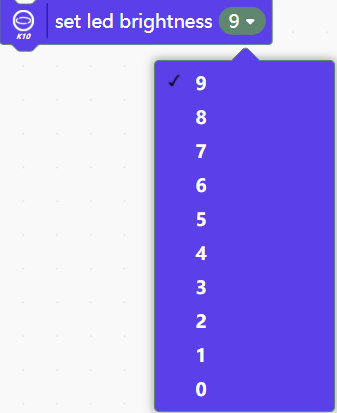

## **Image display**
|      |                                                              |
| ---- | ------------------------------------------------------------ |
| Block |  |
| Description | Used to set the screen display direction, there are 4 display directions, the number indicates the number of degrees the screen rotates counterclockwise, each display direction corresponds to a different coordinate range.
Setting the screen orientation can only be set during initialization, and will not take effect in other locations.

 |
| Block |  |
| Description | Show/Disable Camera. Use this command to display or not display the camera screen on the K10 screen. |
| Block |  |
| Description | Sets the background color of the screen. If not set, the background color of the screen defaults to white.   |
| Block |  |
| Description | Display the cached contents on the screen.

When using display-related commands (e.g., text, shapes, pictures), this "show cached contect" block has to be added to display the content.
But the clear screen command clears the screen immediately, this "show cached content" may not be used.
 |
| Block |  |
| Description | Immediately clears pictures, text, lines, and graphics displayed on the screen.
The camera screen cannot be cleared by this block. To turn off the camera screen, use the “Turn off camera screen” block.
The camera display cannot be cleared by this block. To turn off the camera display, use the "Disable camera show" block. |
| Block |  |
| Description | Display the local picture at the specified location (coordinates), you can set the display size of the picture on the k10 display by adjusting the width and height of the image size.
The image size must be within 240x320 pixels, too large an image will be a serious waste of memory.
If too many pictures are loaded, the storage limit of K10 will be exceeded and an error will be reported as “not enough memory” when burning.K10 has a total of 16MB of code storage space, depending on the complexity of the code, it will affect the size of the space available for caching photos.
Locally loaded images do not support transparent background images, to display transparent background images please load via TF card.
 |
| Block |   |
| Description | Display pictures in TF memory card at specified location (coordinates), support to display png, jpg and bmp format pictures.
This block can display pictures with transparent backgrounds.
bmp only supports images with 16-bit color bit depth, this format is mainly used to display images taken by K10, png or jpg format is recommended.
Do not modify the image format by directly modifying the suffix, otherwise it may cause display abnormality. |
| Block | |
| Description | Save the current frame captured by the camera and store it in the TF card.
Start taking pictures instantly board the upper right corner of the indicator light will light up, the start of photography is recommended to keep the screen stationary 0.5S, this 0.5S will feel obvious screen picture lag, at this time the system is caching the pictures captured, 0.5S after the cache can be free to move the lens, at this time the system will gradually write the cached pictures to the TF card. Until the indicator light in the upper right corner goes out, indicating that the picture has been successfully saved to the TF card, you can start the next picture shooting.
When you take a picture with K10, only bmp format is supported. When displaying photos taken with K10, only bmp format is supported. |

## **Text display**
|      |                                                              |
| ---- | ------------------------------------------------------------ |
| Block |  |
| Discription | Display text of the specified color starting from the leftmost side of the first line on the K10 screen.
The K10 supports a total of 13 lines of text display when in portrait orientation.
This command can quickly complete the text display, if you need to adjust the position, please use the text display command that can set the coordinates.
This command forces an autoclear operation, see another block below for what autoclear does. |
| Block |  |
| Discription | Clears the display of text on the certain line.                                     |
| Block |  |
| Discription | Display the text at the specified position (coordinates), the font size refers to the pixels occupied by the character font, there are two choices 24x24 and 16x16.
Fill in up to 512 English letters or 256 Chinese characters at a time.
Line Character Count indicates that line feeds are automatically performed based on the set number of characters in the text. When calculating the number of line breaks, Chinese, English letters and punctuation will be counted as one word. The maximum number of supported line breaks is 49, and the default is no line breaks when it is set to 50.
Whether or not to auto-clear indicates whether or not the previous text should be cleared first to re-display the new text. When auto-clear is enabled, it will automatically clear all the content after the coordinates to the background color, including the already displayed text, lines, and images. Please refer to the example below for more details on how to use this feature. |

## **Lines and shapes display**
|      |                                                              |
| ---- | ------------------------------------------------------------ |
| Block |  |
| Discription | Displays dots of the specified color at the specified position (coordinates) on the screen, and the size of the dots cannot be modified.   |
| Block |  |
| Discription | Sets the width of the lines and borders in pixels.
If this block is not called, the default line width/border width is 1 |
| Block | |
| Discription | Draws a line segment of the specified color according to the start point coordinates (X1, Y1) and end point coordinates (X2, Y2). |
| Block |  |
| Discription | Draws a circle with the specified radius based on the center coordinates (X, Y). Also, you can set whether the circle is solid (filled/unfilled), border and fill color. |
| Block |  |
| Discription | Draws a rectangle starting at the upper-left corner of the rectangle at the specified position (coordinates). You can set the width and height of the rectangle, the border color, and the fill color. |

## **QR Code Display**
|      |                                                              |
| ---- | ------------------------------------------------------------ |
| Block |  |
| Discription | Convert text and URLs into QR codes to be displayed on the K10 screen.                  |
| Block |  | |
| Discription | Clear the QR code display on the screen.
The "Clear Screen" block does not work on QR code, to clear the QR code display, you need to call the "clear QR code" block. |

## **On board sensor**
|      |                                                              |
| ---- | ------------------------------------------------------------ |
| Block | |
| Discription | An interrupt is triggered when the on-board key A/B is pressed/released.
Infinite loops and long delays should not be used in interrupts, and the code in the interrupt should be as short as possible to ensure system stability. |
| Block |  |
| Discription | detect the status of onboard button A/B (pressed/released). 
 When the camera/AI function is enabled, it is recommended to use the key interrupt to determine the key press. |
| Block | |
| Discription | Detects the current attitude of the main control panel as tilted forward/tilted backward/tilted left/tilted right/screen up/screen down, a total of 6 types of attitude detection. |
| Block |  |
| Discription | Read the temperature (in Celsius or Fahrenheit) or humidity data (relative humidity) of the current environment via the on-board light sensor. |
| Block |  |
| Discription | Get the ambient light from the onboard light sensor in Lux.                        |
| Block |  |
| Discription | Get the value of the on-board acceleration sensor (X-direction, Y-direction, Z-direction or intensity) in milligravity (m-g). By placing the board vertically (in the direction of gravity) in the direction of the arrow in the figure below, the value read is positive and similar to the acceleration of gravity (mm/s2).
 |

## **LED control**
There are three RGB LEDs on the underside of the back of the K10, use the serial number to specify which RGB LED to control. The serial numbers and the locations of the RGB LEDs are shown below. 

|      |                                                              |
| ---- | ------------------------------------------------------------ |
| Block |  |
| Discription | Control the RGB LEDs of the specified LED number to display the specified color.                    |
| Block |  |
| Discription | Turn off the RGB LEDs of the specified LED number              |
| Block |   |
| Discription | Use the principle of mixing the three primary colors of light (red, green and blue) to set the color of the RGB LED lights.      |
| Block |   |
| Discription | Set the brightness of the RGB LEDs, you can choose the brightness from 0-9, a total of 10 steps, where 0 is the off state.
After setting the brightness, call the display command again to make the set brightness take effect. |
| Block |   |
| Discription | Reads the current brightness of the RGB LED light, the data range is 0-9, 0 means the light was off.    |

## **Audio**

|      |                                                              |
| ---- | ------------------------------------------------------------ |
| Block |  |
| Discription | Play built-in music in the background.                          |
| Block |  |
| Discription | Stop playing the built-in playback music. This command can only be used to stop playing the built-in music    |
| Block |  |
| Discription | Plays note sounds of a specified pitch, and you can set the number of beats to play.               |
| Block | |
| Discription | Play the specified audio file from the TF memory card in the background, currently only supports two-channel stereo audio in wav format, otherwise there will be noise or playback acceleration issues. |
| Block |  |
| Discription | Stop playing TF card audio.                                       |
| Block |  |
| Discription | Record audio for a specified long period of time, name it and save it on a TF memory card, save the audio format as wav.
During recording, the indicator light in the upper right corner will light up. |

## **AI-Face recognition**
|      |                                                              |
| ---- | ------------------------------------------------------------ |
| Block |   |
| Discription | The block is used to switch between machine vision algorithm modes and to superimpose the recognition frame on the screen. Among them, four algorithm modes can be selected: face detection, cat and dog detection, motion detection and QR code recognition. 
 Only for face detection and cat face detection, the recognition frame is superimposed. Detection requires the screen to be vertical (Type-C port facing up), horizontal screen will not be detected|
| Block |  |
| Discription | In the corresponding algorithmic mode, it is used to determine whether a face/cat/dog/movement/QR code is detected or not. |
| Block |  |
| Discription | Get the key point data of the detected face, containing 14 items such as length, width, centre point coordinates, left and right eye coordinates, nose coordinates, left side of mouth coordinates, right side of mouth coordinates and so on. |
| Block |  |
| Discription | Learning faces, used to collect and learn recognised faces, after successful learning it will automatically assign an ID number to the face, ID number starts from 1, up to 48 faces can be learned. 
 No need to relearn after power off K10. |
| Block |   |
| Discription | Recognise faces that have been learned.                         |
| Block |  |
| Discription | Determine whether recognition is complete.                                       |
| Block |  |
| Discription | Get the recognised face ID, used to read the face ID number after successful recognition. 
 This instruction, after successful recognition, will only fetch the ID number of the recognised face once, and after fetching it once, the instruction will perform a reset operation (the value changes to -1). |
| Block |  |
| Discription | Forgets the assigned face ID that has been learnt.                                   |
| Block |  |
| Discription | Forget all learned face IDs.                                     |
| Block |  |
| Discription | Get the key point data of the detected cat face containing length, width, centre point x, centre point y. |

## **AI-QR code recognition**
|      |                                                              |
| ---- | ------------------------------------------------------------ |
| Block |   |
| Discription | Get the result of QR code recognition. 
The QR code recognition mode, unlike face and dog and cat detection, does not show a recognition box in the screen when the QR code is recognised.|

## **AI-Motion detection**
|      |                                                              |
| ---- | ------------------------------------------------------------ |
| Block |   |
| Discription | Sets the motion detection sensitivity, the larger the setting value, the more sensitive the detection of motion, the range is 0-100.
If you do not set the sensitivity when using motion detection, the default is 50.|

## **AI-Speech recognition**
|      |                                                              |
| ---- | ------------------------------------------------------------ |
| Block |   |
| Discription | Set the working length of continuous/single recognition and recognition language after waking up from speech recognition, and the unit of waking up length is milliseconds (ms).|
| Block |  |
| Discription | Add speech recognition command word ID and command word, command word ID setting range is 0-199, command word is filled in with a single time, the words are separated by space, and the command word is preferred to be 2~5 syllables. |
| Block |  |
| Discription | Used to judge the current state of the speech recognition mode. 
This command is used to execute commands such as animation playback or text display when waking up, don't use it nested with ‘command word detected’. |
| Block |  |
| Discription | Used to determine whether the command word with the specified ID is recognised after waking up the K10. |

## **AI-Speech synthesis**
Speech synthesis function can only support Chinese. 

|      |                                                              |
| ---- | ------------------------------------------------------------ |
| Block |   |
| Discription | Set the speech rate of voice playback, the larger the value, the faster the speech rate. The minimum speed is 0, the maximum speed is 5. If you don't set it, the default is 2.|
| Block |  |
| Discription | Speech synthesis of specified text can be achieved using commas for tone spacing. |

## **Serial port**
|      |                                                              |
| ---- | ------------------------------------------------------------ |
| Block |   |
| Discription | Serial port output content. Line feed/non-line feed can be set, and the form of output content can be string, raw data, hexadecimal number.|
| Block |  |
| Discription | Detects whether the serial port has data to read. |
| Block |  |
| Discription | Read the data at the serial port. |
| Block |  |
| Discription | Reads an integer/decimal/string from the serial port.|
| Block |   |
| Discription | Retains a specified number of decimal places and handles decimal numbers sent or received through the serial port to the specified number of digits.        |
| Block |  |
| Discription | Sets the baud rate for serial port 0 (Hardware Serial).    |
| Block |  |
| Discription | Set the Rx (receive) and Tx (transmit) pins and baud rate for serial port 1 (Software Serial).|

