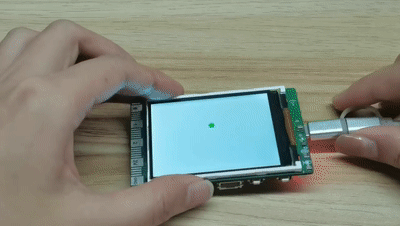

## **Display-Set Back Ground Color**
Setting the background color of the K10 screen<br/>
````c++ title="Screen Display"
#include "unihiker_k10.h"

UNIHIKER_K10 k10;
uint8_t screen_dir=2;

void setup() {
	k10.begin();
	k10.initScreen(screen_dir);
	k10.creatCanvas();
}
void loop() {
	k10.setScreenBackground(0xFFFFFF);
	delay(2000);
	k10.setScreenBackground(0xFF0000);
	delay(2000);
	k10.setScreenBackground(0x00FF00);
	delay(2000);
	k10.setScreenBackground(0x0000FF);
	delay(2000);
	k10.setScreenBackground(0x000000);
	delay(2000);
}
````
{: width="250px"}

## **Display-Electronic photo album**
Format the TF card to FAT32 and install it on K10. Press button A on the K10 to take a picture and button B to display it.<br/>
Note: TF card is need to run this example.
````c++ title="Electronic photo album"
#include "unihiker_k10.h"

void onButtonAPressed();
void onButtonBPressed();

UNIHIKER_K10 k10;
uint8_t      screen_dir=2;

void setup() {
	k10.begin();
	k10.initScreen(screen_dir);
	k10.initBgCamerImage();
	k10.setBgCamerImage(false);
	k10.creatCanvas();
	k10.buttonA->setPressedCallback(onButtonAPressed);
	k10.initSDFile();
	k10.buttonB->setPressedCallback(onButtonBPressed);
	k10.setBgCamerImage(true);
}
void loop() {
}

void onButtonAPressed() {
	k10.photoSaveToTFCard("S:/photo.bmp");
}
void onButtonBPressed() {
	k10.canvas->canvasDrawImage(0, 0, "S:/photo.bmp");
}
````
{: width="250px"}


## **Display-Showing text**
````c++ title="Showing text"
#include "unihiker_k10.h"

UNIHIKER_K10 k10;
uint8_t screen_dir=2;

void setup() {
	k10.begin();
	k10.initScreen(screen_dir);
	k10.creatCanvas();
	k10.setScreenBackground(0xFFFFFF);
	k10.canvas->canvasText("UNIHIKER", 1, 0x0000FF);
	k10.canvas->updateCanvas();
	delay(1000);
	k10.canvas->canvasText("UNIHIKER", 2, 0xFF0000);
	k10.canvas->updateCanvas();
	delay(1000);
	k10.canvas->canvasText("UNIHIKER", 3, 0x00FF00);
	k10.canvas->updateCanvas();
	delay(1000);
	k10.canvas->canvasText("UNIHIKER", 4, 0x000000);
	k10.canvas->updateCanvas();
	delay(1000);
}
void loop() {
}
````
{: width="250px"}

## **Display-Draw Point**
````c++ title="Draw Point"
#include "unihiker_k10.h"

uint32_t rgbToColor(uint8_t r, uint8_t g, uint8_t b);

UNIHIKER_K10 k10;
uint8_t screen_dir=2;

void setup() {
	k10.begin();
	k10.initScreen(screen_dir);
	k10.creatCanvas();
	k10.setScreenBackground(0x000000);
}
void loop() {
	for (int index = 0; index < 50; index++) {
		k10.canvas->canvasPoint((random(0, 240+1)), (random(0, 320+1)), rgbToColor(round((random(128, 255+1))), round((random(128, 255+1))), round((random(128, 255+1)))));
		k10.canvas->updateCanvas();
	}
	k10.canvas->canvasClear();
}

uint32_t rgbToColor(uint8_t r, uint8_t g, uint8_t b)
{
  return (uint32_t)((((uint32_t)r<<16) | ((uint32_t)g<<8)) | (uint32_t)b);
}
````
{: width="300px"}

## **Display-Draw Line**
Drawing funnels on K10:<br/>
````c++ title="Draw funnel"
#include "unihiker_k10.h"

volatile float startX, endX;

UNIHIKER_K10 k10;
uint8_t screen_dir=2;

void setup() {
	k10.begin();
	k10.initScreen(screen_dir);
	k10.creatCanvas();
	k10.canvas->canvasSetLineWidth(1);
	startX = 0;
	endX = 240;
}
void loop() {
	while (!(startX==240)) {
		k10.canvas->canvasLine(startX, 0, endX, 320, 0xFF0000);
		k10.canvas->updateCanvas();
		startX += 3;
		endX -= 3;
	}
}
````
{: width="250px"}<br/>
Meteor shower on K10:<br/>
````c++ title="Meteor shower"
#include "unihiker_k10.h"

volatile float startX, startY, length, endX, endY;

uint32_t rgbToColor(uint8_t r, uint8_t g, uint8_t b);

UNIHIKER_K10 k10;
uint8_t      screen_dir=2;

void setup() {
	k10.begin();
	k10.initScreen(screen_dir);
	k10.creatCanvas();
	k10.setScreenBackground(0x000000);
	k10.canvas->canvasSetLineWidth(1);
}
void loop() {
	k10.canvas->canvasClear();
	for (int index = 0; index < 15; index++) {
		startX = (random(0, 240+1));
		startY = (random(0, 180+1));
		length = (random(0, 40+1));
		endX = (startX + length);
		endY = (startY + length);
		k10.canvas->canvasLine(startX, startY, endX, endY, rgbToColor(round((random(128, 255+1))), round((random(128, 255+1))), round((random(128, 255+1)))));
	}
	k10.canvas->updateCanvas();
	delay(500);
}

uint32_t rgbToColor(uint8_t r, uint8_t g, uint8_t b)
{
  return (uint32_t)((((uint32_t)r<<16) | ((uint32_t)g<<8)) | (uint32_t)b);
}
````
{: width="250px"}


## **Display-Draw Circle**
````c++ title="Draw Circle"
#include "unihiker_k10.h"

UNIHIKER_K10 k10;
uint8_t screen_dir=2;

void setup() {
	k10.begin();
	k10.initScreen(screen_dir);
	k10.creatCanvas();
	k10.canvas->canvasCircle(120, 120, 40, 0xFFCC33, 0xFFCC33, true);
	k10.canvas->canvasCircle(160, 160, 40, 0xFFCC33, 0xFFCC33, true);
	k10.canvas->canvasCircle(120, 200, 40, 0xFFCC33, 0xFFCC33, true);
	k10.canvas->canvasCircle(80, 160, 40, 0xFFCC33, 0xFFCC33, true);
	k10.canvas->canvasCircle(120, 160, 40, 0xFFFF00, 0xFFFF00, true);
	k10.canvas->updateCanvas();
}
void loop() {
}
````
{: width="250px"}

## **Display-Draw Rectangle**
````c++ title="Draw Rectangle"
#include "unihiker_k10.h"

volatile float offset, x, y, color;

uint32_t rgbToColor(uint8_t r, uint8_t g, uint8_t b);

UNIHIKER_K10 k10;
uint8_t      screen_dir=2;

void setup() {
	k10.begin();
	k10.initScreen(screen_dir);
	k10.creatCanvas();
	k10.setScreenBackground(0x000000);
}
void loop() {
	for (int index = 0; index < 8; index++) {
		x = (80 - (offset / 2));
		y = (100 - (offset / 2));
		color = rgbToColor(round((random(50, 255+1))), round((random(50, 255+1))), round((random(50, 255+1))));
		k10.canvas->canvasRectangle(x,y, (80 + offset), (100 + offset), color, 0x0000FF, false);
		k10.canvas->updateCanvas();
		delay(10);
		offset = (offset + 20);
	}
	k10.canvas->canvasClear();
	offset = 0;
}

uint32_t rgbToColor(uint8_t r, uint8_t g, uint8_t b)
{
  return (uint32_t)((((uint32_t)r<<16) | ((uint32_t)g<<8)) | (uint32_t)b);
}
````
{: width="250px"}

## **Display-QR Code**
````c++ title="QR Code"
#include "unihiker_k10.h"

UNIHIKER_K10 k10;
uint8_t screen_dir=2;

void setup() {
	k10.begin();
	k10.initScreen(screen_dir);
	k10.creatCanvas();
	k10.canvasDrawCode("https://www.unihiker.com");
	k10.canvas->updateCanvas();
}
void loop() {
}
````


## **On board sensor-Button**
Normal form:<br/>
````c++ title="Button"
#include "unihiker_k10.h"

UNIHIKER_K10 k10;
uint8_t screen_dir=2;

void setup() {
	k10.begin();
	k10.initScreen(screen_dir);
	k10.creatCanvas();
}
void loop() {
	if ((k10.buttonA->isPressed())) {
		k10.canvas->canvasRectangle(10, 100, 110, 100, 0xFF6666, 0x0000FF, true);
		k10.canvas->updateCanvas();
	}
	else if ((k10.buttonB->isPressed())) {
		k10.canvas->canvasCircle(180, 150, 50, 0xFF6666, 0x0000FF, true);
		k10.canvas->updateCanvas();
	}
	else if ((k10.buttonAB->isPressed())) {
		k10.canvas->canvasClear();
		k10.canvas->updateCanvas();
	}
}
````
Interrupt form:<br/>
````c++ title="Button"
#include "unihiker_k10.h"

void onButtonAPressed();
void onButtonBPressed();
void onButtonABPressed();

UNIHIKER_K10 k10;
uint8_t      screen_dir=2;

void setup() {
	k10.begin();
	k10.buttonA->setPressedCallback(onButtonAPressed);
	k10.initScreen(screen_dir);
	k10.creatCanvas();
	k10.buttonB->setPressedCallback(onButtonBPressed);
	k10.buttonAB->setPressedCallback(onButtonABPressed);
}
void loop() {

}

void onButtonAPressed() {
	k10.canvas->canvasRectangle(10, 100, 110, 100, 0xFF6666, 0x0000FF, true);
	k10.canvas->updateCanvas();
}
void onButtonBPressed() {
	k10.canvas->canvasCircle(180, 150, 50, 0xFF6666, 0x0000FF, true);
	k10.canvas->updateCanvas();
}
void onButtonABPressed() {
	k10.canvas->canvasClear();
	k10.canvas->updateCanvas();
}
````
{: width="250px"}


## **On board sensor-Accelerate sensors**
Note: TF card is need to run this example, and the arrow pictures need to store in the TF card.
Display screen tilt:<br/>
````c++ title="Accelerate sensors"
#include "unihiker_k10.h"
UNIHIKER_K10 k10;
uint8_t      screen_dir=2;

void setup() {
	k10.begin();
	k10.initScreen(screen_dir);
	k10.creatCanvas();
	k10.initSDFile();
}
void loop() {
	if ((k10.isGesture(TiltForward))) {
		k10.canvas->canvasDrawImage(0, 0, "S:/forward.png");
		k10.canvas->updateCanvas();
	}
	else if ((k10.isGesture(TiltBack))) {
		k10.canvas->canvasDrawImage(0, 0, "S:/back.png");
		k10.canvas->updateCanvas();
	}
	else if ((k10.isGesture(TiltLeft))) {
		k10.canvas->canvasDrawImage(0, 0, "S:/left.png");
		k10.canvas->updateCanvas();
	}
	else if ((k10.isGesture(TiltRight))) {
		k10.canvas->canvasDrawImage(0, 0, "S:/right.png");
		k10.canvas->updateCanvas();
	}
	k10.canvas->canvasRectangle(0, 0, 240, 320, 0xFFFFFF, 0xFFFFFF, true);
	k10.canvas->updateCanvas();
}
````
{: width="250px"}<br/>
Pedo meter:<br/>
````c++ title="Pedo meter"
#include "unihiker_k10.h"

volatile float step;

UNIHIKER_K10 k10;
uint8_t screen_dir=2;

void setup() {
	k10.begin();
	k10.initScreen(screen_dir);
	k10.creatCanvas();
	step = 0;
	k10.canvas->canvasText((String("Pedometer: ") + String(step)), 1, 0x0000FF);
	k10.canvas->updateCanvas();
}
void loop() {
	if (((k10.getStrength())>1050)) {
		step += 1;
		k10.canvas->canvasText((String("Pedometer: ") + String(step)), 1, 0x0000FF);
		k10.canvas->updateCanvas();
		delay(1000);
	}
}
````
{: width="250px"}

## **On board sensor-Accelerate ball**
````c++ title="Accelerate ball"
#include "unihiker_k10.h"

volatile float accx, accy, moveX, moveY;

UNIHIKER_K10 k10;
uint8_t screen_dir=2;

void setup() {
  k10.begin();
  k10.initScreen(screen_dir);
  k10.creatCanvas();
  k10.setScreenBackground(0xFFFFFF);
}
void loop() {
  accx = (k10.getAccelerometerX());
  accy = (k10.getAccelerometerY());
  moveX = (120 + (accx / 3));
  moveY = (160 + (accy / 3));
  k10.canvas->canvasCircle(moveX, moveY, 8, 0x00FF00, 0x00FF00, true);
  k10.canvas->updateCanvas();
  k10.canvas->canvasCircle(moveX, moveY, 9, 0xFFFFFF, 0xFFFFFF, true);
}
````
{: width="250px"}

## **On board sensor-RGB control**
````c++ title="RGB control"
#include "unihiker_k10.h"

volatile float mind_n_brightness;

UNIHIKER_K10 k10;

void setup() {
	k10.begin();
	mind_n_brightness = 0;
	k10.rgb->brightness(round(mind_n_brightness));
	k10.rgb->write(-1, 0x0000FF);
}
void loop() {
	while (!(mind_n_brightness==9)) {
		k10.rgb->brightness(round(mind_n_brightness));
		k10.rgb->write(-1, 0x0000FF);
		delay(200);
		mind_n_brightness += 1;
	}
	while (!(mind_n_brightness==0)) {
		k10.rgb->brightness(round(mind_n_brightness));
		k10.rgb->write(-1, 0x0000FF);
		delay(200);
		mind_n_brightness -= 1;
	}
}
````
{: width="250px"}

## **Audio-Play build-in music**
Press button A to play the music “BIRTHDAY” in the background; press button B to play the alphabet song (1155661)<br/>
````c++ title="Play build-in music"
#include "unihiker_k10.h"

void onButtonAPressed();
void onButtonBPressed();

UNIHIKER_K10 k10;
Music music;

void setup() {
	k10.begin();
	k10.buttonA->setPressedCallback(onButtonAPressed);
	k10.buttonB->setPressedCallback(onButtonBPressed);
}
void loop() {
}

void onButtonAPressed() {
	music.playMusic(DADADADUM);
}
void onButtonBPressed() {
	music.stopPlayTone();
	music.playTone(131,  8000);
	music.playTone(131,  8000);
	music.playTone(196,  8000);
	music.playTone(196,  8000);
	music.playTone(220,  8000);
	music.playTone(220,  8000);
	music.playTone(196,  8000);
}
````

## **Audio-Record and play**
Press button A to record 3 seconds of audio and store it to the TF card; press button B to play the recorded audio.<br/>
Note: TF card is need to run this example
````c++ title="Record and play*"
#include "unihiker_k10.h"

UNIHIKER_K10 k10;
uint8_t screen_dir=2;
Music music;

void setup() {
	k10.begin();
	k10.initScreen(screen_dir);
	k10.creatCanvas();
	k10.initSDFile();
	k10.canvas->canvasText("Press A to record......", 5, 10, 0x0000FF, k10.canvas->eCNAndENFont16, 50, true);
	k10.canvas->updateCanvas();
}
void loop() {
	if ((k10.buttonA->isPressed())) {
		k10.canvas->canvasText("Recording", 5, 10, 0x0000FF, k10.canvas->eCNAndENFont16, 50, true);
		k10.canvas->updateCanvas();
		music.recordSaveToTFCard("S:/sound.wav", 3);
		k10.canvas->canvasText("Record complete", 5, 10, 0x0000FF, k10.canvas->eCNAndENFont16, 50, true);
		k10.canvas->updateCanvas();
	}
	else if ((k10.buttonB->isPressed())) {
		k10.canvas->canvasText("Playing......", 5, 10, 0x0000FF, k10.canvas->eCNAndENFont16, 50, true);
		k10.canvas->updateCanvas();
		music.playTFCardAudio("S:/sound.wav");
		delay(3000);
		k10.canvas->canvasText("Play complete", 0, 0, 0x0000FF, k10.canvas->eCNAndENFont16, 50, true);
		k10.canvas->updateCanvas();
	}
}
````

## **AI-Face detection**
Turn on the camera, detect the face, and display the detected face length and width, as well as center point x and center point y coordinates, on the K10 screen<br/>
````c++ title="Face detection**"
#include "unihiker_k10.h"
#include "AIRecognition.h"

UNIHIKER_K10  k10;
uint8_t screen_dir=2;
AIRecognition ai;

void setup() {
	k10.begin();
	k10.initScreen(screen_dir);
	ai.initAi();
	k10.initBgCamerImage();
	k10.setBgCamerImage(false);
	k10.creatCanvas();
	ai.switchAiMode(ai.NoMode);
	k10.setBgCamerImage(true);
	ai.switchAiMode(ai.Face);
}
void loop() {
	if (ai.isDetectContent(AIRecognition::Face)) {
		k10.canvas->canvasText((String("Face Length") + String(ai.getFaceData(AIRecognition::Length))), 0, 0, 0x0000FF, k10.canvas->eCNAndENFont16, 50, true);
		k10.canvas->canvasText((String("Face Width ") + String(ai.getFaceData(AIRecognition::Length))), 0, 16, 0x0000FF, k10.canvas->eCNAndENFont16, 50, true);
		k10.canvas->canvasText((String("Face Center X") + String(ai.getFaceData(AIRecognition::CenterX))), 0, 32, 0x0000FF, k10.canvas->eCNAndENFont16, 50, true);
		k10.canvas->canvasText((String("Face Center Y") + String(ai.getFaceData(AIRecognition::CenterY))), 0, 32, 0x0000FF, k10.canvas->eCNAndENFont16, 50, true);
		k10.canvas->updateCanvas();
	}
	delay(1000);
}
````
 

## **AI-Face recognition**
Press button A to learn the face and green LED on; press button B to recognize the face and blue LED on, and display the recognized face ID on the K10 screen<br/>
````c++ title="Face recognition**"
#include "unihiker_k10.h"
#include "AIRecognition.h"

String ID;

void onButtonAPressed();
void onButtonBPressed();

UNIHIKER_K10  k10;
uint8_t screen_dir=2;
AIRecognition ai;

void setup() {
	k10.begin();
	k10.initScreen(screen_dir);
	ai.initAi();
	k10.initBgCamerImage();
	k10.setBgCamerImage(false);
	k10.creatCanvas();
	ai.switchAiMode(ai.NoMode);
	k10.buttonA->setPressedCallback(onButtonAPressed);
	k10.buttonB->setPressedCallback(onButtonBPressed);
	k10.setBgCamerImage(true);
	ai.switchAiMode(ai.Face);
}
void loop() {
	if (ai.isRecognized()) {
		ID = ai.getRecognitionID();
		k10.canvas->canvasText((String("Face ID: ") + String(ID)), 0, 0, 0x0000FF, k10.canvas->eCNAndENFont24, 50, true);
		k10.canvas->canvasText(ID, 0, 40, 0x0000FF, k10.canvas->eCNAndENFont24, 50, true);
		k10.canvas->updateCanvas();
	}
	delay(1000);
}

void onButtonAPressed() {
	k10.rgb->write(-1, 0x00FF00);
	ai.sendFaceCmd(ENROLL);
}
void onButtonBPressed() {
	k10.rgb->write(-1, 0x0000FF);
	ai.sendFaceCmd(RECOGNIZE);
}
````
{: width="250px"}

## **AI-Dog/Cat recognition**
Turn on the camera, when the camera detects the detection of the cat, the length and width of the cat's face, as well as the coordinates of the center point x and center point y, are displayed on the K10 screen.<br/>
````c++ title="AI-Dog/Cat recognition**"
#include "unihiker_k10.h"
#include "AIRecognition.h"

UNIHIKER_K10  k10;
uint8_t screen_dir=2;
AIRecognition ai;

void setup() {
	k10.begin();
	k10.initScreen(screen_dir);
	ai.initAi();
	k10.initBgCamerImage();
	k10.setBgCamerImage(false);
	k10.creatCanvas();
	ai.switchAiMode(ai.NoMode);
	k10.setBgCamerImage(true);
	ai.switchAiMode(ai.Cat);
}
void loop() {
	if (ai.isDetectContent(AIRecognition::Cat)) {
		k10.canvas->canvasText((String("Face Length: ") + String(ai.getCatData(AIRecognition::Length))), 0, 0, 0x0000FF, k10.canvas->eCNAndENFont16, 50, true);
		k10.canvas->canvasText((String("Face Width: ") + String(ai.getCatData(AIRecognition::Width))), 0, 20, 0x0000FF, k10.canvas->eCNAndENFont16, 50, true);
		k10.canvas->canvasText((String("Face X: ") + String(ai.getCatData(AIRecognition::CenterX))), 0, 40, 0x0000FF, k10.canvas->eCNAndENFont16, 50, true);
		k10.canvas->canvasText((String("Face Y:  ") + String(ai.getCatData(AIRecognition::CenterY))), 0, 60, 0x0000FF, k10.canvas->eCNAndENFont16, 50, true);
		k10.canvas->updateCanvas();
	}
}
````
{: width="250px"}

## **AI-Movement Detection**
````c++ title="Movement Detection**"
#include "unihiker_k10.h"
#include "AIRecognition.h"

UNIHIKER_K10  k10;
uint8_t screen_dir=2;
AIRecognition ai;

void setup() {
	k10.begin();
	k10.initScreen(screen_dir);
	ai.initAi();
	k10.initBgCamerImage();
	k10.setBgCamerImage(false);
	k10.creatCanvas();
	ai.switchAiMode(ai.NoMode);
	k10.setBgCamerImage(true);
	ai.switchAiMode(ai.Move);
	ai.setMotinoThreshold(50);
	k10.rgb->write(-1, 0x0000FF);
}
void loop() {
	if (ai.isDetectContent(AIRecognition::Move)) { 
		k10.rgb->write(-1, 0xFF0000);
	}
	else {
		k10.rgb->write(-1, 0x0000FF);
	}
}
````
{: width="300px"}

## **AI-QR Code Scanner**
You can generate your own QR code through some free [QR code generation sites](https://www.qr-code-generator.com/). <br/>
Note: TF card is need to run this example, and the Album Cover picture needs to be stored in TF card.
Below is the "Album cover" QR code we generated
````c++ title="QR Code Scanner**"
#include "unihiker_k10.h"
#include "AIRecognition.h"

UNIHIKER_K10  k10;
uint8_t screen_dir=2;
AIRecognition ai;

void setup() {
	k10.begin();
	k10.initScreen(screen_dir);
	ai.initAi();
	k10.initBgCamerImage();
	k10.setBgCamerImage(false);
	k10.creatCanvas();
	ai.switchAiMode(ai.NoMode);
	k10.initSDFile();
	k10.setBgCamerImage(true);
	ai.switchAiMode(ai.Code);
}
void loop() {
	if (ai.isDetectContent(AIRecognition::Code)) {
		if ((ai.getQrCodeContent()==String("Album cover"))) {
			k10.canvas->canvasDrawImage(0, 0, "S:/AlbumCover.png");
			k10.canvas->updateCanvas();
		}
	}
}
````
{: width="300px"}
{: width="200px"}

## **AI-Speech recognition**
Wake up the voice recognition through the wake-up command "Hi,Telly", and then through the command word "Light on", "Light off" to control the on-board RGB ELD lights on K10 to turn on and off. <br/>
````c++ title="Speech recognition**"
#include "asr.h"
#include "unihiker_k10.h"
// Create an object
UNIHIKER_K10 k10;
ASR          asr;
uint8_t      screen_dir=2;


// Main program start
void setup() {
	k10.begin();
	asr.asrInit(CONTINUOUS, CN_MODE, 6000);
	while(asr._asrState == 0){delay(100);}
	k10.initScreen(screen_dir);
	k10.creatCanvas();
	asr.addASRCommand(0+1, "lights on");
	asr.addASRCommand(1+1, "lights off");
}
void loop() {
	if (asr.isWakeUp()) {
		k10.canvas->canvasText("Wake up mode", 0, 0, 0x0000FF, k10.canvas->eCNAndENFont16, 50, true);
		k10.canvas->updateCanvas();
	}
	else {
		k10.canvas->canvasText("Sleep mode", 0, 0, 0x0000FF, k10.canvas->eCNAndENFont16, 50, true);
		k10.canvas->updateCanvas();
	}
	if (asr.isDetectCmdID(0+1)) {
		k10.rgb->brightness(round(9));
		k10.rgb->write(-1, 0xFF0000);
	}
	else if (asr.isDetectCmdID(1+1)) {
		k10.rgb->brightness(round(0));
		k10.rgb->write(-1, 0xFF0000);
	}
}
````
{: width="400px"}

## **GPIO**
Since the camera and display take up a lot of GPIOs on the ESP32 chip, we only left two full-function GPIOs (digital input/output, analogue input, PWM output) at P0,P1.
The GPIOs out of Edge Connector are all led from the on-board GPIO expansion chip, and only have digital input/output function.<br/>
````c++ title="Digital input/output**"
void setup() {
	pinMode(P0, OUTPUT);
	pinMode(P1, INPUT);
	Serial.begin(9600);
	digitalWrite(P0, HIGH);
}
void loop() {
	Serial.println((digitalRead(P1)));
}
````

````c++ title="Analog input/ PWM output**"
void setup() {
	Serial.begin(9600);
	analogWrite(P0, map(512, 0, 1023, 0, 255));
}
void loop() {
	Serial.println((analogRead(P1)));
}
````

````c++ title="Digital input/output(Extended GPIO)**"
#include "unihiker_k10.h"

UNIHIKER_K10 k10;

void setup() {
	k10.begin();
	Serial.begin(9600);
	digital_write(eP2, HIGH);
}
void loop() {
	Serial.println((digital_read(eP3)));
}
````


