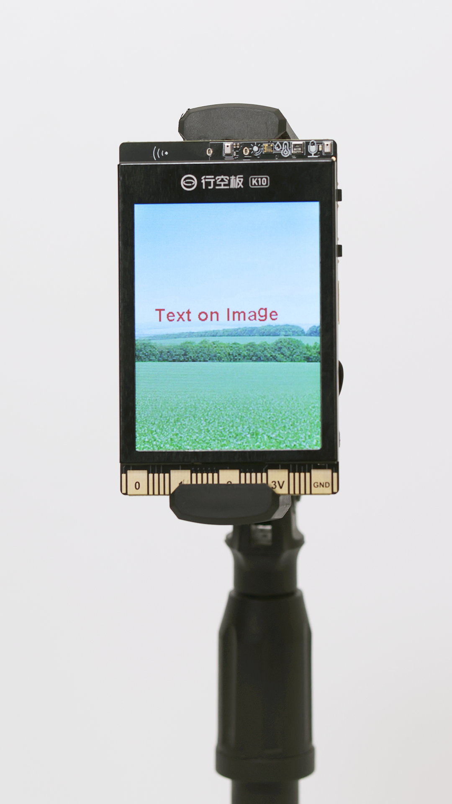
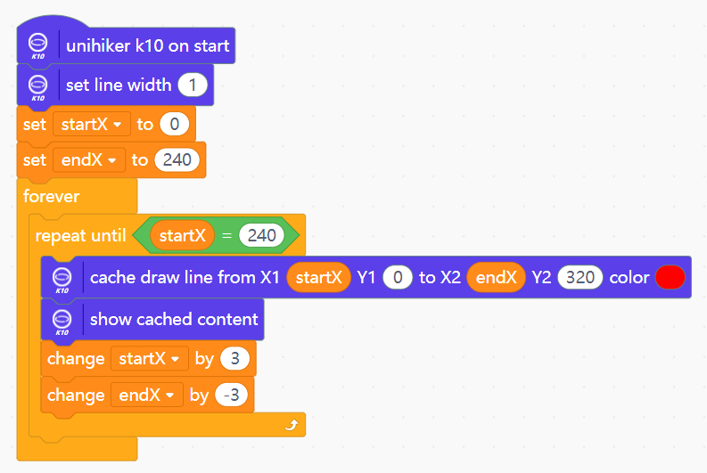
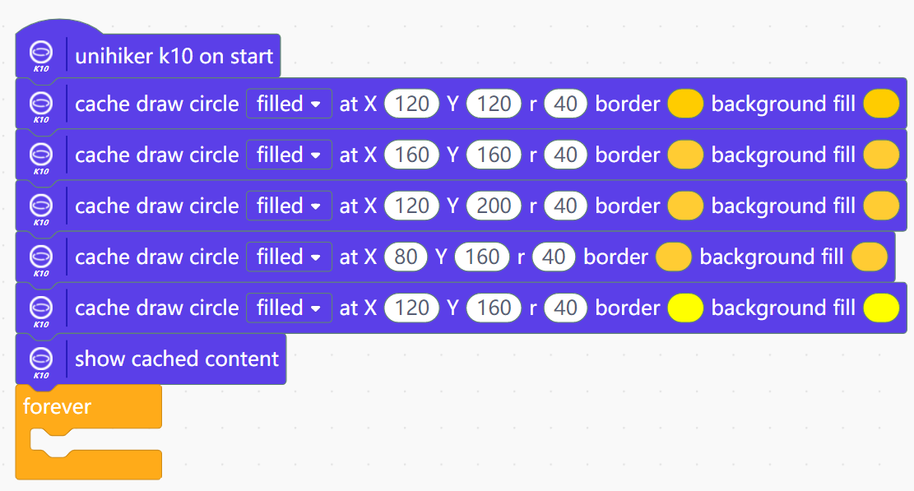
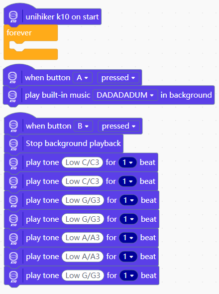

## **Display-Set Back Ground Color**
Setting the background color of the K10 screen 
 
 

## **Display-Show local picture**
Showing local picture 
 
 

## **Display-Electronic photo album**
Format the TF card to FAT32 and install it on K10. Press button A on the K10 to take a picture and button B to display it. 
 
 

## **Display-Showing text**
 
 

## **Display-Text on image**
When displaying text over an image, turn auto-clear off and use a constant refresh of the image to overwrite the old content 
 
 

## **Display-Draw Point**
 
 

## **Display-Draw Line**
 
 

## **Display-Draw Circle**
 

## **Display-Draw Rectangle**
 

## **Display-QR Code**
 

## **On board sensor-Button**
Normal way: 

Interrupt way: 

## **On board sensor-Accelerate sensors**
 
 

## **On board sensor-Accelerate ball**
 
 

## **On board sensor-LED control**
 
 

## **Audio-Play build-in music**
Press button A to play the music “BIRTHDAY” in the background; press button B to play the alphabet song (1155661) 
 

## **Audio-Record and play**
Press button A to record 3 seconds of audio and store it to the TF card; press button B to play the recorded audio. 
 

## **AI-Face detection**
Turn on the camera, detect the face, and display the detected face length and width, as well as center point x and center point y coordinates, on the K10 screen 
 
 

## **AI-Face recognition**
Press button A to learn the face and green LED on; press button B to recognize the face and blue LED on, and display the recognized face ID on the K10 screen 
 

## **AI-Dog/Cat recognition**
Turn on the camera, when the camera detects the detection of the cat, the length and width of the cat's face, as well as the coordinates of the center point x and center point y, are displayed on the K10 screen. 
 

## **AI-QR Code Scanner**
 

## **AI-Speech recognition**
Wake up the voice recognition through the wake-up command "Hi,Telly", and then through the command word "Light on", "Light off" to control the on-board RGB ELD lights on K10 to turn on and off.  
 

## **AI-Speech synthesis**
The speech synthesis function only supports Chinese. 
 

## **Serial port-Serial print**
 
 

## **Serial port-Serial receive**
 
 

## **GPIO-Digital input**
Connect a button to P0 and the value of the serial monitor will change when the button is pressed. 
 
 

## **GPIO-Analog input**
Read the analog value on P0, and serial output. 
 
 

## **GPIO-Digital output**
Connect an LED on P0, then out put high level on P0 to set the LED on. 
 
