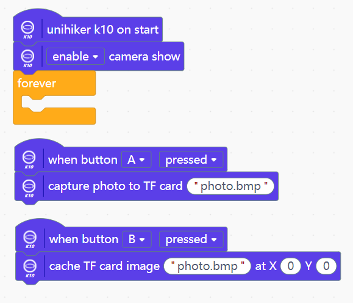
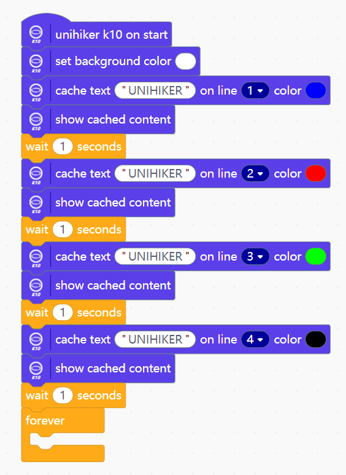
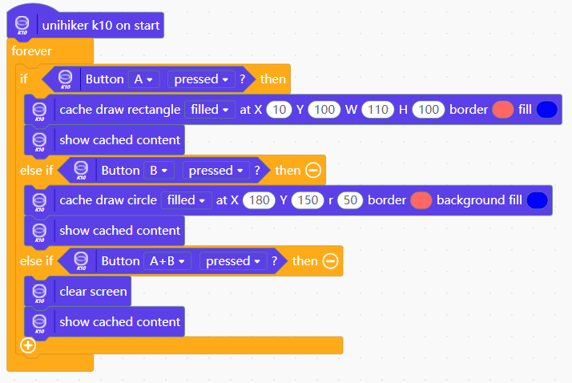
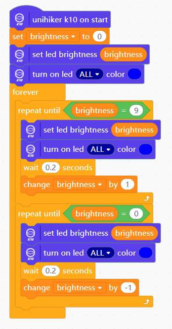
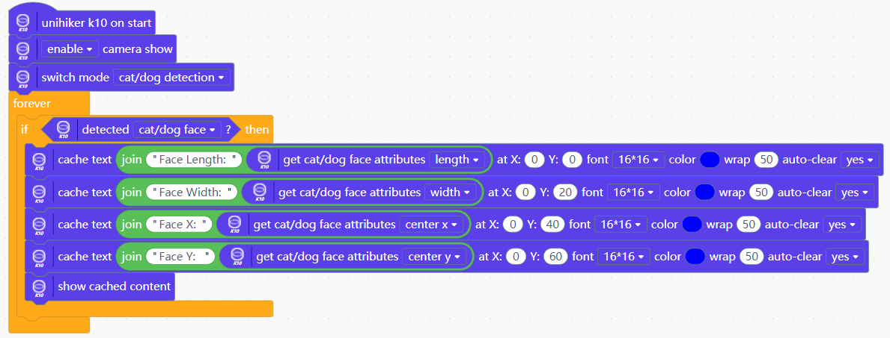
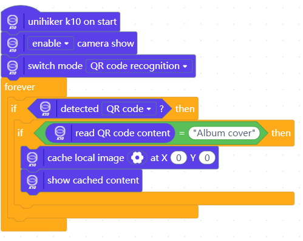
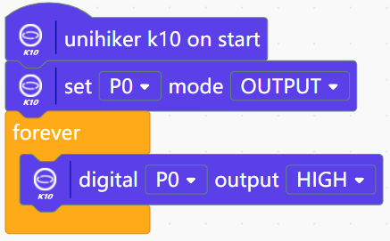

## **Display-Set Back Ground Color**
Setting the background color of the K10 screen 
{: width="250px"}
{: width="250px"}

## **Display-Show local picture**
Showing local picture 
{: width="300px"}
{: width="250px"}

## **Display-Electronic photo album**
Format the TF card to FAT32 and install it on K10. Press button A on the K10 to take a picture and button B to display it. 
{: width="300px"}
{: width="250px"}

## **Display-Showing text**
{: width="300px"}
{: width="250px"}

## **Display-Text on image**
When displaying text over an image, turn auto-clear off and use a constant refresh of the image to overwrite the old content 
 
{: width="300px"}

## **Display-Draw Point**
 
{: width="300px"}

## **Display-Draw Line**
Drawing funnels on K10: 
{: width="400px"}
{: width="250px"} 
Meteor shower on K10: 

{: width="250px"}

## **Display-Draw Circle**
{: width="400px"}
{: width="250px"}

## **Display-Draw Rectangle**
 
{: width="250px"}

## **Display-QR Code**
 

## **On board sensor-Button**
Normal way: 

Interrupt way: 

{: width="250px"}

## **On board sensor-Accelerate sensors**
Display screen tilt: 
{: width="350px"} 
{: width="250px"} 
Pedo meter: 
![image.[ng]](img/example_mindplus/exampleMindplus43.png){: width="400px"}
{: width="250px"}

## **On board sensor-Accelerate ball**
{: width="350px"}
{: width="250px"}

## **On board sensor-RGB control**
{: width="250px"}
{: width="250px"}

## **Audio-Play build-in music**
Press button A to play the music “BIRTHDAY” in the background; press button B to play the alphabet song (1155661) 
 

## **Audio-Record and play**
Press button A to record 3 seconds of audio and store it to the TF card; press button B to play the recorded audio. 
 

## **AI-Face detection**
Turn on the camera, detect the face, and display the detected face length and width, as well as center point x and center point y coordinates, on the K10 screen 
 
 

## **AI-Face recognition**
Press button A to learn the face and green LED on; press button B to recognize the face and blue LED on, and display the recognized face ID on the K10 screen 

{: width="250px"}

## **AI-Dog/Cat recognition**
Turn on the camera, when the camera detects the detection of the cat, the length and width of the cat's face, as well as the coordinates of the center point x and center point y, are displayed on the K10 screen. 

{: width="250px"}

## **AI-Movement Detection**

{: width="300px"}

## **AI-QR Code Scanner**
You can generate your own QR code through some free [QR code generation sites](https://www.qr-code-generator.com/).  
Below is the "Album cover" QR code we generated
{: width="400px"}
{: width="300px"}
{: width="200px"}

## **AI-Speech recognition**
Wake up the voice recognition through the wake-up command "Hi,Telly", and then through the command word "Light on", "Light off" to control the on-board RGB ELD lights on K10 to turn on and off.  
 
{: width="400px"}

## **Serial port-Serial print**
 
 

## **Serial port-Serial receive**
 
 

## **GPIO-Digital input**
Connect a button to P0 and the value of the serial monitor will change when the button is pressed. 
 
 

## **GPIO-Analog input**
Read the analog value on P0, and serial output. 
 
 

## **GPIO-Digital output**
Connect an LED on P0, then out put high level on P0 to set the LED on. 
 
