## **Display - Show picture**
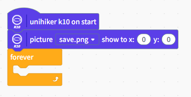

## **Display - Show camera**
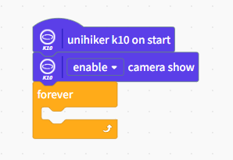

## **Display - Set Background Color**
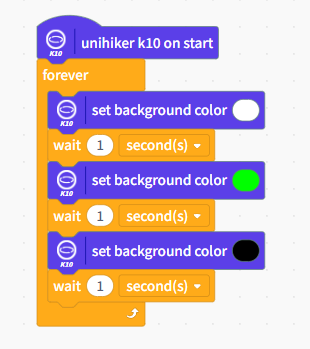

## **Display - Show text in line**
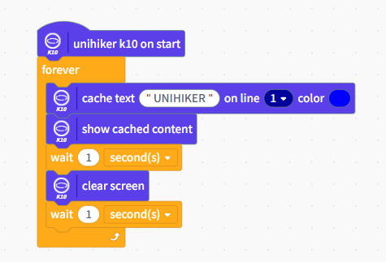

## **Display - Show text in coordinate**
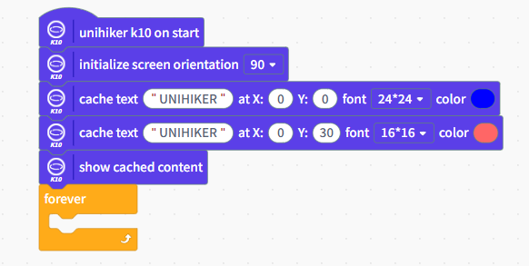

## **Display - Draw point**
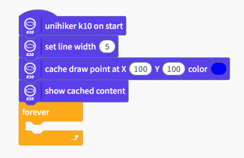

## **Display - Draw circle**
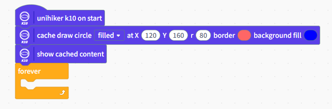

## **Display - Draw Rectangle**
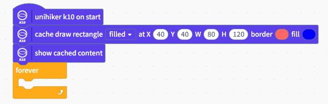

## **On board Sensor - Button (Interrupt)**
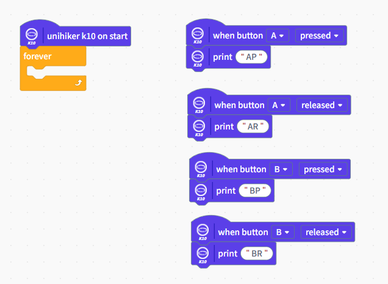

## **On board Sensor - Button (Normal)**
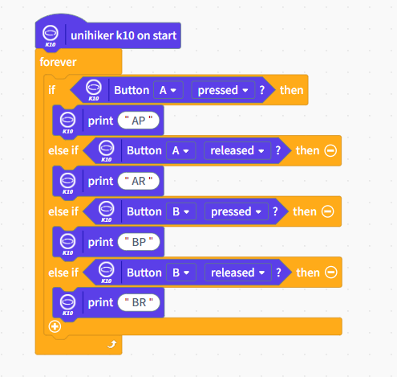

## **On board Sensor - On-board Temperature & Humidity Sensor**
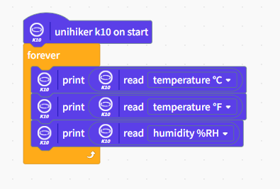

## **On board Sensor - On board light sensor**
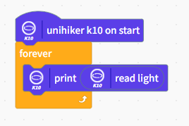

## **On board Sensor - On board Acceleration sensor**
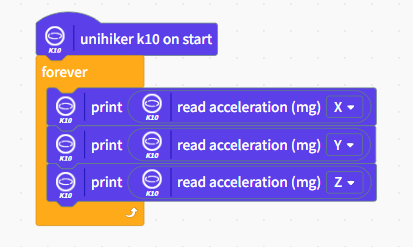

## **On board Sensor - On board RGB light**
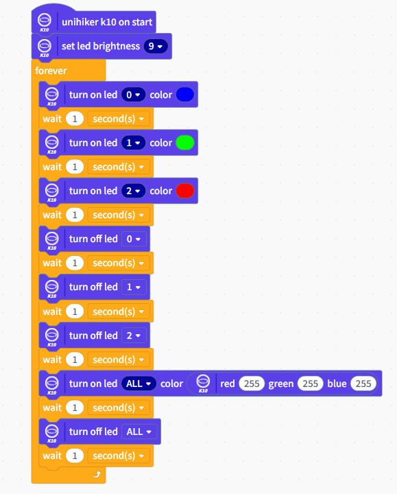

## **On board Sensor - TF card & UUID**
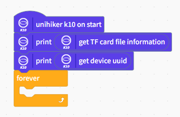

## **On board Sensor - Record & Play(Store in TF card)**
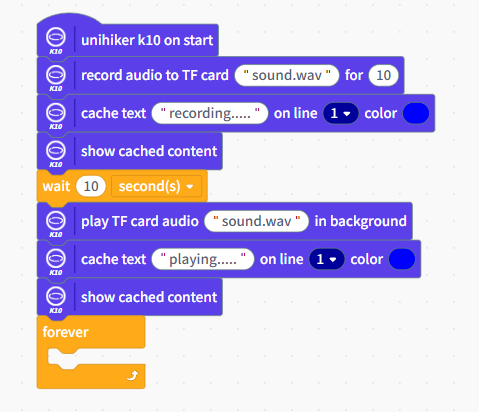

## **On board Sensor - Record & Play(Store in K10)**
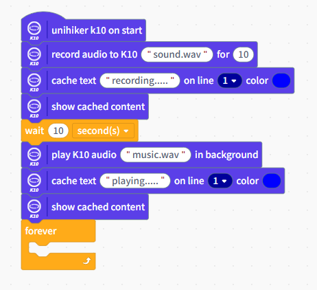

## **Communication - WiFi**
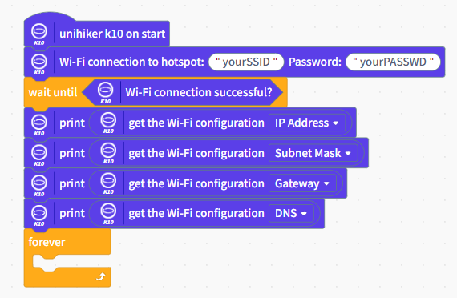

## **Communication - MQTT**
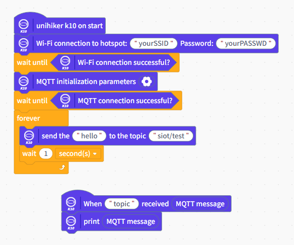

## **Communication - Bluetooth HID**
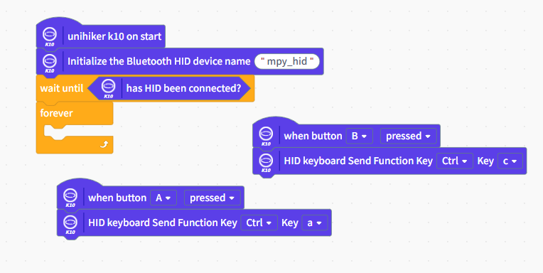

## **Peripheral Sensor - Servo**
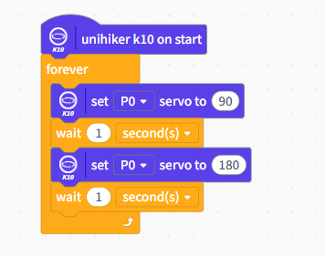

## **Peripheral Sensor - RGB light strip**
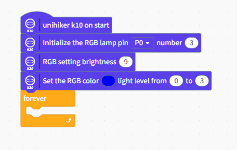

## **Peripheral Sensor - DHT11/DHT22**
Automatically detect whether the connection on P0/P1 is to DHT11 or DHT22
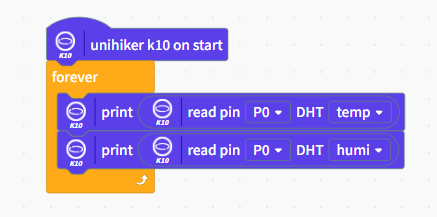

## **Peripheral Sensor - DS18B20**
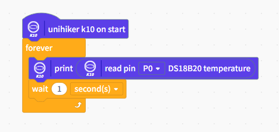

## **Peripheral Sensor - TRIG-ECHO Ultrasonic sensor**
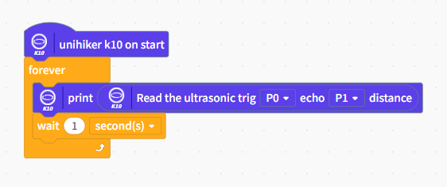

## **Peripheral Sensor - Weight sensor(KIT0176)**
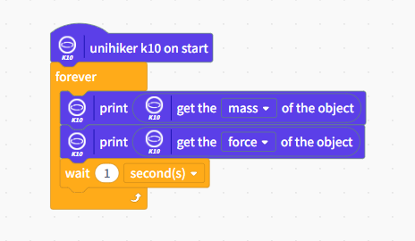
