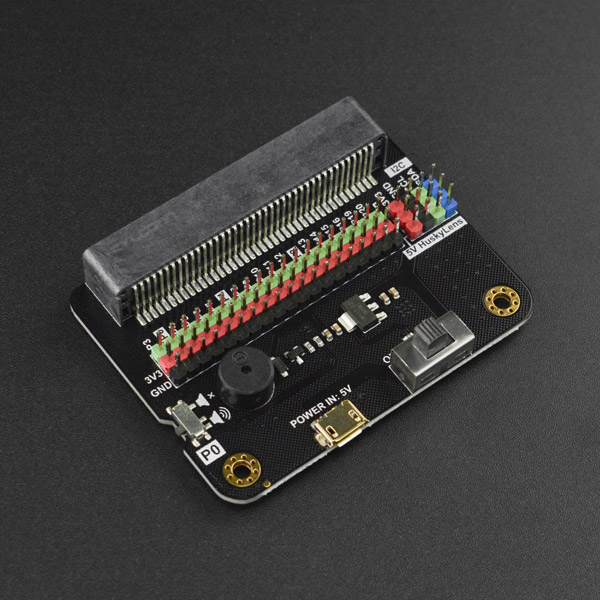

## **Expansion board**
UNIHIKER K10 and Micro:bit share the same pinout on edge connector, So UNIHIKER K10 is compatible with some micro:bit expansion boards.

The K10 is not compatible with the [DFR1136 M10 Dual Motor Driver I/O Expansion Board](https://www.dfrobot.com/product-2852.html). When the K10 is used with this expansion board, it can only use the GPIO and I2C interfaces of the expansion board, but not the motor driver, RGB, IR transceiver and other functions of the expansion board.

### **MBT0008 - IO Extender for micro:bit / UNIHIKER M10 / K10**#

[MBT0008](https://www.dfrobot.com/product-1867.html) 
Fully compatible with K10, available in the official extension library

### **DFR0548 - micro:Driver - Driver Expansion Board for micro:bit / UNIHIKER M10 / K10**

[DFR0548](https://www.dfrobot.com/product-1738.html) 
Fully compatible with K10, available in the official extension library

### **MBT0005 - micro: IO-BOX Expansion Board with On-board Li-ion Battery Power**
[MBT0005](https://www.dfrobot.com/product-1847.html) 
The RGB lights on the expansion board cannot be controlled.

### **DFR1231 - Robotics & Power IO Extender for UNIHIKER K10 / micro:bit**
[DFR1231](https://www.dfrobot.com/product-2963.html) 

### **DFR1216 - Multi Function Expansion Board for UNIHIKER K10 and micro:bit**
[DFR1216](https://www.dfrobot.com/product-2974.html) 

## **Case**

### **FIT1020 - UNIHIKER K10 Protector Plastic Case**
[FIT1020](https://www.dfrobot.com/product-3004.html) 
