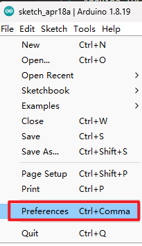
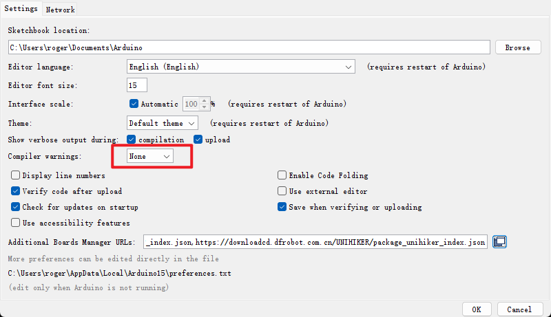
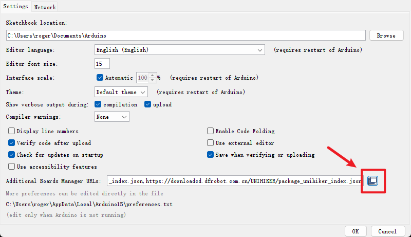
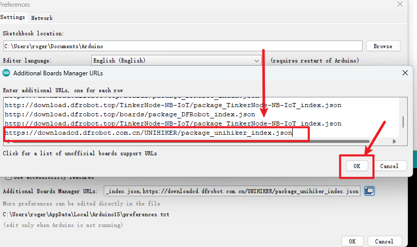
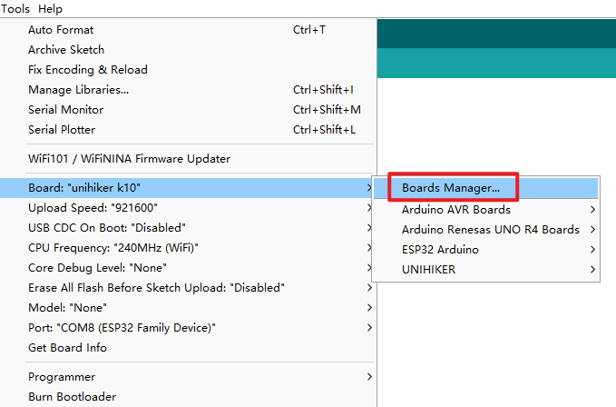
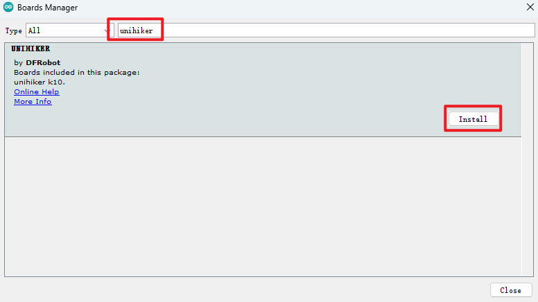
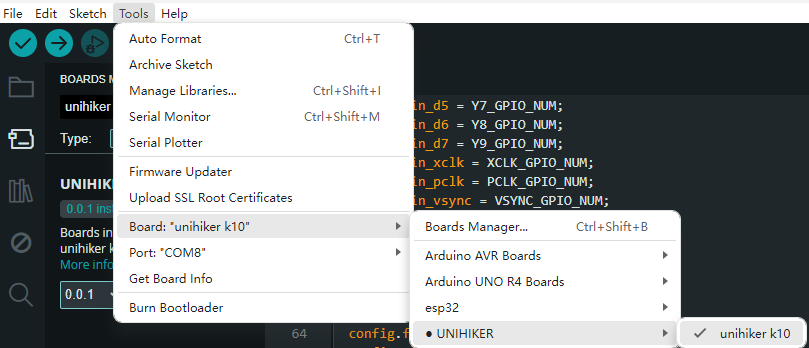

## **UNIHIKER K10 with Arduino IDE**
In this tutorial, we will guide you through the process of downloading Arduino IDE and installing UNIHIKER K10 sdk on your computer.

### **Arduino IDE**
Arduino IDE is an open source programming software which supports a large number of MCU dev boards. it provides an easy and fast C++ programming experience.
Note: The current version of the Arduino IDE SDK is a beta version and only supports Arduino IDE 1.8.19.

| **Download** |  |
| --- | --- |
| **Download from Arduino** | [Arduino IDE](https://www.arduino.cc/en/software/) |

Note: UNIHIKER K10 currently only support Arduino IDE 1.8.19 or below. We will add support for Arduino IDE V2.x in subsequent releases.

## **Arduino IDE SDK**

SDK URL:
https://downloadcd.dfrobot.com.cn/UNIHIKER/package_unihiker_index.json 
Open "File->Preference" in Arduino IDE 
 

Set "Compiler warnings" as none 
 

Click here to add SDK URL 
 

Copy and paste the URL in the box, then click OK to save 
 

Open "Tools->Board->Boards Manager" 

Serach unihiker and install the SDK 

UNIHIKER K10 will appear in your Arduino IDE 

Note:The Arduino IDE SDK for UNIHIKER K10 is still in beta, there may be some API bugs. if you find a bug, you can send an email to UNIHIKER team and we will fix it as soon as possible.
unihiker@dfrobot.com
We will update to the official version in the near future.