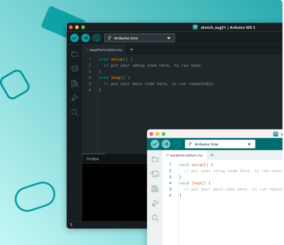
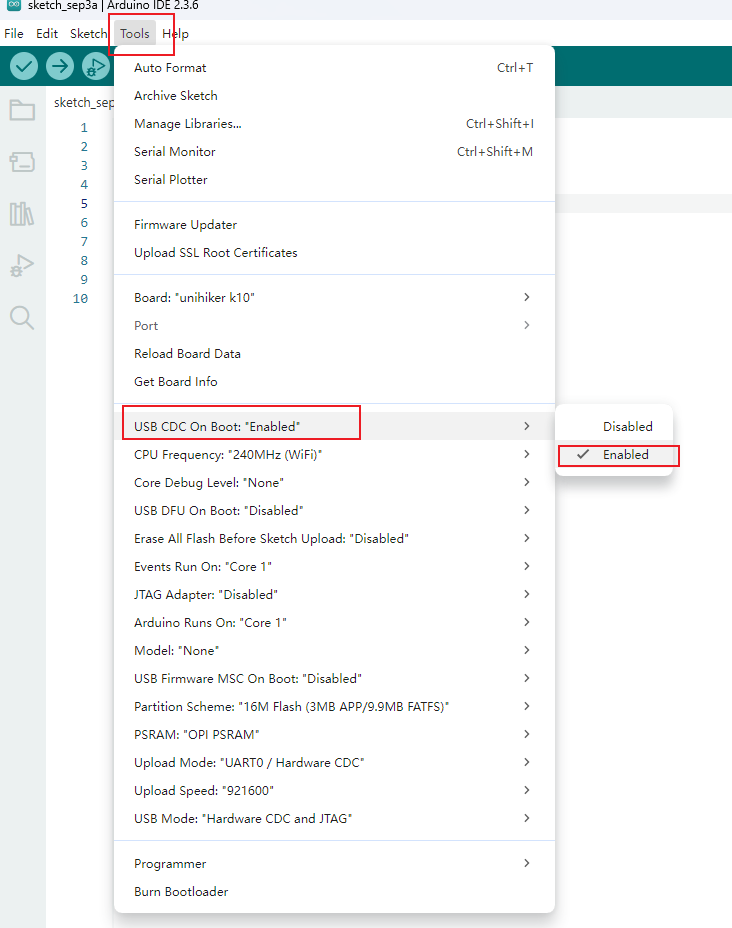
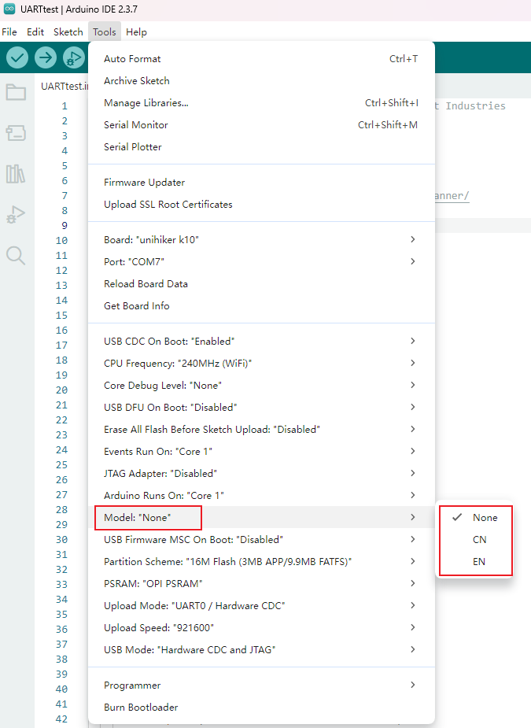

## **UNIHIKER K10 with Arduino IDE**
The Arduino IDE is a software tool used for programming, compiling, and uploading code to microcontroller boards. It provides a simple and user-friendly interface that allows developers to write, edit, and debug code using the Arduino programming language (based on C/C++).
In this tutorial, we will guide you through the process of downloading Arduino IDE and installing UNIHIKER K10 BSP on your computer. 

### **Download Arduino IDE**
| **Download** |  |
| --- | --- |
| **Download from Arduino** | [Download](https://www.arduino.cc/en/software/) |

!!! Note 
    UNIHIKER K10 is now fully support all versions of Arduino IDE since BSP version 0.0.2

### **Install Arduino IDE BSP**

- BSP URL: https://downloadcd.dfrobot.com.cn/UNIHIKER/package_unihiker_index.json 

- Open "File->Preference" in Arduino IDE 
 

- Set "Compiler warnings" as none 
 

- Click here to add SDK URL 
 

- Copy and paste the URL in the box, then click OK to save 
 

- Open "Tools->Board->Boards Manager" 

- Serach unihiker and install the SDK 

!!! Note 
    When installing BSP in Arduino IDE V2.3.x, you may encounter the following error: 
    **Failed to install platformUNIHIKER:0.0.x 4 DEADLINE EXCEEDED net/http:request cancelled  (Client timeout or contect cancellation while reading body)** 
    
    You can refer to this [Arduino Forum Topic](https://forum.arduino.cc/t/ide-2-3-7-now-gives-error-4-deadline-exceeded/1422321/2) for a solution.

- UNIHIKER K10 will appear in your Arduino IDE 

!!! Note 
    The Arduino IDE BSP for UNIHIKER K10 is still in beta, there may be some bugs. if you find a bug, you can send an email to UNIHIKER team and we will fix it as soon as possible. 
    Email: unihiker@dfrobot.com

### **Serial Setup**
Like any other ESP32-S3 based dev board. The serial of Unihiker K10 is not automatically mapped to the USB-C port by default. 
Enable **Tools->USB CDC on Boot** before uploading Arduino code. Then you can view data in the Serial Monitor.

### **Voice Recgonition Model Setup**
The UNIHIKER K10’s voice recognition feature relies on the device’s built-in voice recognition model. Due to the large size of the model, only one language model can be flashed to the K10 at a time—the English and Chinese models cannot be flashed simultaneously.
You can select the model to flash via **Arduino IDE → Tools → Model**. When you choose either the English (EN) or Chinese (CN) model and upload your program, the selected model will be flashed to the K10 together with your main program.

UNIHIKER K10 units sold in mainland China come with the Chinese recognition model pre-installed, while units sold in other regions come with the English recognition model pre-installed.
If you do not need to change the pre-installed model, simply select **"None"** for the Model option.

## **Arduino Example**
Click to the [Arduino Example](../Examples/examples_arduinoide.md).
