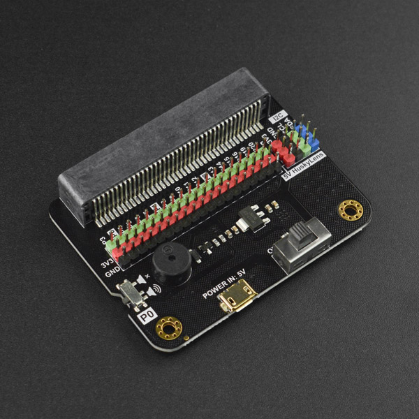
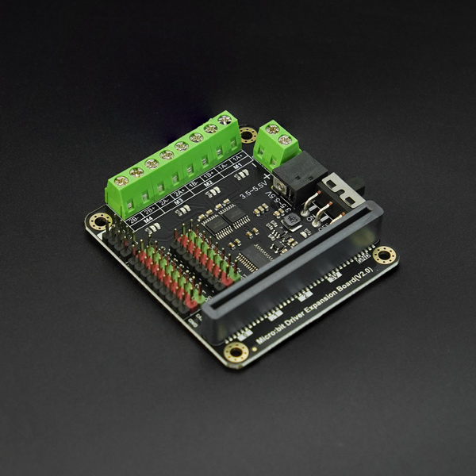

## **Expansion board compatible list**
K10 is compatible with some micro:bit expansion boards, K10 should be plugged in the micro:bit side when using it.

The K10 is not compatible with the DFR1136 M10 Dual Motor Driver I/O Expansion Board. When the K10 is used with this expansion board, it can only use the IO and I2C interfaces of the expansion board, but not the motor driver, RGB, IR transceiver and other functions of the expansion board.

## **MBT0008 - IO Extender for micro:bit / UNIHIKER M10 / K10**

[MBT0008](https://www.dfrobot.com/product-1867.html) 
Fully compatible with K10, available in the official extension library

## **DFR0548 - micro:Driver - Driver Expansion Board for micro:bit / UNIHIKER M10 / K10**

[DFR0548](https://www.dfrobot.com/product-1738.html) 
Fully compatible with K10, available in the official extension library

## **MBT0005 - micro: IO-BOX Expansion Board with On-board Li-ion Battery Power**

[MBT0005](https://www.dfrobot.com/product-1847.html) 
Fully compatible with K10, available in the official extension library

