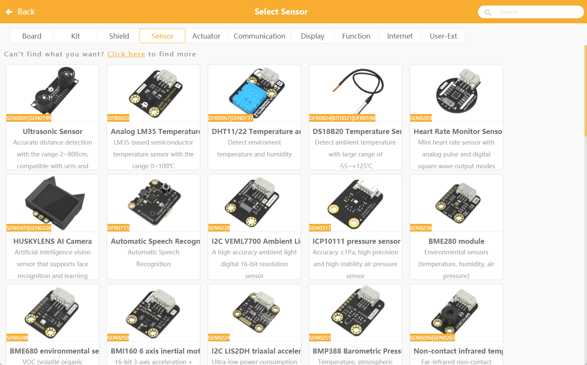
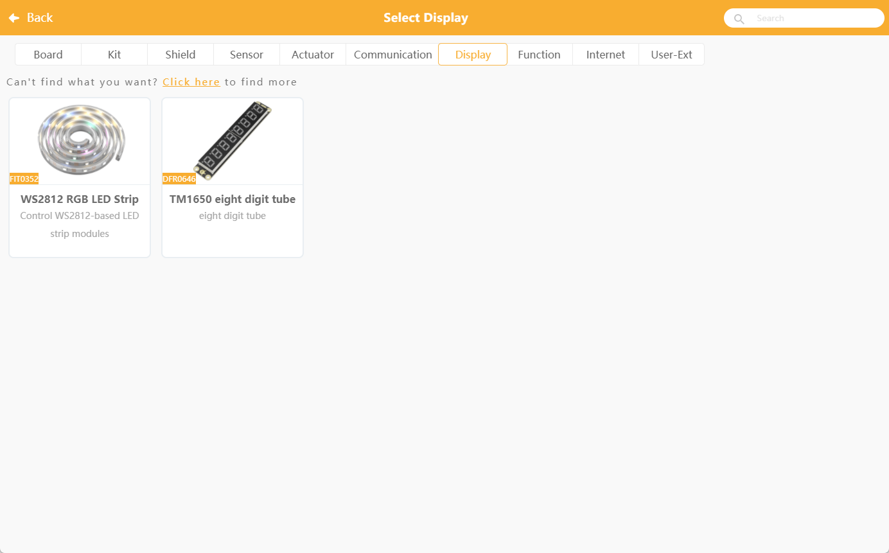
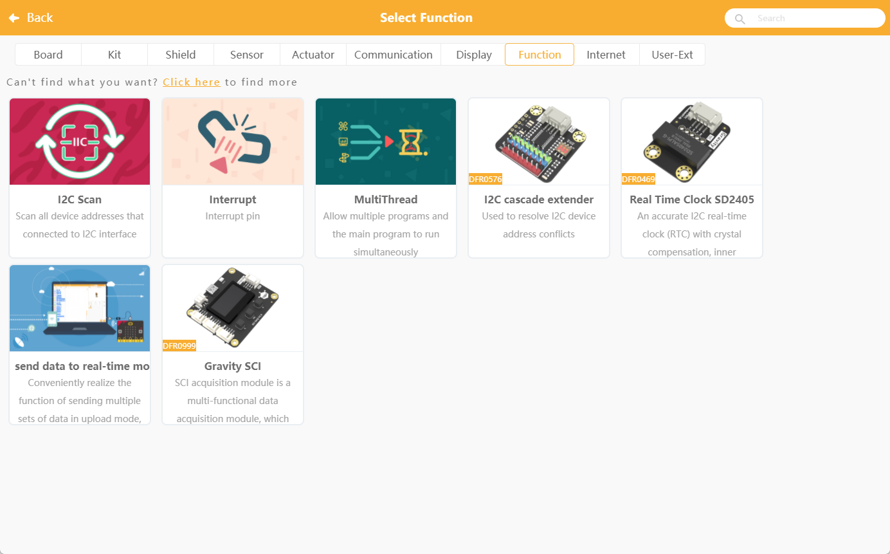

## **UNIHIKER K10 with Mindplus(Mind+)**
Mind+ is a software designed for teenagers that supports AI and IoT functions by integrating with popular mainboards and open-source hardware. It offers an easy programming experience through graphical building blocks and advanced languages like Python, C, and C++.
In this tutorial, we will guide you through the process of downloading and installing Mindplus on your computer. 

!!! Note 
    Mind+ is only support windows for now. 
    MacOS/GNU Linux users can code on K10 via Arduino IDE or MicroPython. 
    We will actively update the IDE and SDK for K10 in the near future.

### **Download**
| **Download channel** |  |
| --- | --- |
| **Download from Mind+:** | [Download](https://mindplus.cc/download-en.html) |
| **Download from Google Drive:** | [Download](https://drive.google.com/drive/folders/1yiKYmkbPPsy_453x77djwkAXjnhWeNgS?usp=sharing) |
UNIHIKER K10 only support Mind+ version V1.8.1 or above.

### **Code**
- Open Mind+ and switch to "Offline" mode. 

- Click "Extension", in the extension page, click "Board", select "UNIHIKER K10", click "Back". Click "Back" to finish loading. 

- Connect the USB-C port of K10 to the USB port of your computer, click “Connect Device” in mind+, find the corresponding K10 device and click it to complete the device connection. 

- Cache text “Hello UNIHIKER K10” in different colors on line 2, line 4 and line 6 of K10 respectively. Then show cached content. 

- Click "Upload" and wait for the program to finish uploading. 

- After the program is successfully uploaded, the K10 screen displays the text "Hello, UNIHIKER" in different colors.

## **Factory Program**
After uploading other programs, the factory program will be overwritten, if you want to re-experience the factory program, you can follow the process below: 

- Download [factory program](https://img.dfrobot.com.cn/wikicn/62b2fb5caa613609f271523c/90d9a709be69b96c37cadd2af0337b0e.zip) 
- Unzip the program and open it with Notepad/VSCode etc. and copy the entire contents. 
- Paste it into the manual editing area of Mind+. 
 
- Select the K10 and upload the code.

For more UNIHIKER K10 programming tips for Mind+, please visit [Mind+ Example](../Examples/examples_mindplus.md).

## **Mind+ Example**
Click to the [Mind+ Example](https://www.unihiker.com/wiki/K10/Examples/examples_mindplus/).

## **Supported Sensors**
At present, K10 only opens up some of the commonly used sensors, and the compatibility of more sensors will be iterated in subsequent versions.

### Offical library

#### Sensor

| SKU             | Part name                    | Mind+ Minimum Version Requirements             |
| --------------- | --------------------------- | ------------------------ |
| SEN0001         | [trig echo Ultrasonic sensor](https://www.dfrobot.com/product-53.html)  | V1.8.1 RC1.0 - K10 beta version 241012 |
| SEN0203         | [Digital/Analogue Heart Rate Sensor](https://www.dfrobot.com/product-1540.html)         | V1.8.1 RC1.0 - K10 beta version 2410122 |
| SEN0228         | [I2C VEML7700 Ambient Light Sensor](https://www.dfrobot.com/product-1620.html)   | V1.8.1 RC1.0 - K10 beta version 241012 |
| SEN0517         | [I2C ICP10111 Barometric Pressure Sensor](https://www.dfrobot.com/product-2525.html)     | V1.8.1 RC1.0 - K10 beta version 241012 |
| SEN0236         | [I2C BEM280 Environment Sensor](https://www.dfrobot.com/product-1606.html)       | V1.8.1 RC1.0 - K10 beta version 241012 |
| SEN0248         | [I2C BME680 Environmental Sensor](https://www.dfrobot.com/product-1697.html)       | V1.8.1 RC1.0 - K10 beta version 241012 |
| DFR0034         | [Analogue sound sensors](https://www.dfrobot.com/product-83.html)               | V1.8.1 RC1.0 - K10 beta version 241012 |
| SEN0291         | [I2C Digital Power Meter](https://www.dfrobot.com/product-1827.html)               | V1.8.1 RC1.0 - K10 beta version 241012 |
| SEN0321         | [I2C Ozone Sensor](https://www.dfrobot.com/product-2005.html)              | V1.8.1 RC1.0 - K10 beta version 241012 |
| KIT0176         | [I2C Weight Sensor](https://www.dfrobot.com/product-2289.html)               | V1.8.1 RC1.0 - K10 beta version 241012|
| DFR0067/SEN0137 | [DHT11/22 Temperature and Humidity Sensor](https://www.dfrobot.com/product-174.html)        | V1.8.1 RC1.0 - K10 beta version 241012 |
| SEN0206/SEN0263 | [I2C non-contact infrared temperature sensors](https://www.dfrobot.com/product-1495.html)    | V1.8.1 RC1.0 - K10 beta version 241012 |
| SEN0388 | [URM09- Trig Ultrasonic Distance Measuring Sensor](https://www.dfrobot.com/product-2172.html)    | V1.8.1 RC1.0 - K10 beta version 250103 |
| DFR0023 | [LM35 Linear Analogue Temperature Sensors](https://www.dfrobot.com/product-76.html)    | V1.8.1 RC1.0 - K10 beta version 2501033 |
| DFR0024/KIT0021/DFR0198 | [DS18B20 Temperature Sensor](https://www.dfrobot.com/product-164.html)    | V1.8.1 RC1.0 - K10 beta version 250103 |
| SEN0250 | [BMI160 6-axis inertial motion sensor](https://www.dfrobot.com/product-1716.html) | V1.8.1 RC1.0 - K10 beta version 2501033 |
| SEN0224 | [LIS2DH Triaxial Accelerometer](https://www.dfrobot.com/product-1573.html) | V1.8.1 RC1.0 - K10 beta version 2501033 |
| SEN0251 | [BMP388 Air Pressure Temperature Sensor](https://www.dfrobot.com/product-1792.html) | V1.8.1 RC1.0 - K10 beta version 2501003 |
| DFR0026 | [Analogue environmental sensors](https://www.dfrobot.com/product-1004.html) | V1.8.1 RC1.0 - K10 beta version 250103 |
| DFR0027 | [Digital Vibration Sensors](https://www.dfrobot.com/product-79.html) | V1.8.1 RC1.0 - K10 beta version 250103 |
| DFR0029 | [Digital Big Button Module](https://www.dfrobot.com/product-1098.html)          | V1.8.1 RC1.0 - K10 beta version 250103 |
| DFR0030 | [Digital Touch Sensor](https://www.dfrobot.com/product-78.html)          | V1.8.1 RC1.0 - K10 beta version 250103 |
| DFR0033 | [Gravity: Digital Magnetic Sensor](https://www.dfrobot.com/product-1792.html)    | V1.8.1 RC1.0 - K10 beta version 250103 |
| DFR0034 | [Analogue sound sensors](https://www.dfrobot.com/product-83.html)            | V1.8.1 RC1.0 - K10 beta version 250103 |
| DFR0051 | [Analogue Voltage Detection Module](https://www.dfrobot.com/product-90.html)        | V1.8.1 RC1.0 - K10 beta version 250103 |
| DFR0052 | [Analogue piezo-ceramic vibration sensors](https://www.dfrobot.com/product-399.html)  | V1.8.1 RC1.0 - K10 beta version 250103 |
| DFR0058 | [Analogue multi-turn rotation angle sensor](https://www.dfrobot.com/product-86.html)  | V1.8.1 RC1.0 - K10 beta version 250103 |
| DFR0061 | [JoyStick Module](https://www.dfrobot.com/product-349.html)        | V1.8.1 RC1.0 - K10 beta version 250103 |
| DFR0076 | [Flame Sensor](https://www.dfrobot.com/product-195.html)               | V1.8.1 RC1.0 - K10 beta version 250103 |
| DFR0063 | [Lithium Battery Meter](https://www.dfrobot.com/product-135.html)            | V1.8.1 RC1.0 - K10 beta version 250103 |
| DFR0553 | [16-bit AD converter module](https://www.dfrobot.com/product-1730.html)          | V1.8.1 RC1.0 - K10 beta version 250103 |
| SEN0114 | [Soil moisture sensors](https://www.dfrobot.com/product-599.html)          | V1.8.1 RC1.0 - K10 beta version 250103 |
| SEN0121 | [Steam sensor](https://www.dfrobot.com/product-798.htm)              | V1.8.1 RC1.0 - K10 beta version 250103 |
| SEN0315 | [PAJ7620U2 Gesture Recognition Sensor](https://www.dfrobot.com/product-2003.html) | V1.8.1 RC1.0 - K10 beta version 250103 |
| SEN0376 | [Alcohol Sensor](https://www.dfrobot.com/product-2186.html)              | V1.8.1 RC1.0 - K10 beta version 250103 |
| SEN0364 | [Visible Light Sensor](https://www.dfrobot.com/product-2131.html)          | V1.8.1 RC1.0 - K10 beta version 250103 |
| SEN0359 | [Fingerprint Sensor](https://www.dfrobot.com/product-2165.html)              | V1.8.1 RC1.0 - K10 beta version 250103 |
| SEN0514 | [ENS160 Air Quality Sensors](https://www.dfrobot.com/product-2526.html)    | V1.8.1 RC1.0 - K10 beta version 250103 |
| SEN0518 | [MAX30102 Heart Rate Oximetry Sensor](https://www.dfrobot.com/product-2529.html)  | V1.8.1 RC1.0 - K10 beta version 2501033 |
| SEN0536 | [Carbon dioxide sensors](https://www.dfrobot.com/product-2646.html)          | V1.8.1 RC1.0 - K10 beta version 250103 |
| SEN0540 | [LTRUV UV Sensor](https://www.dfrobot.com/product-2650.html)       | V1.8.1 RC1.0 - K10 beta version 250103 |
| SEN0575 | [Tipping Bucket Rainfall Sensor](https://www.dfrobot.com/product-2689.html)                | V1.8.1 RC1.0 - K10 beta version 250103 |
| SEN0334 | [SHT31-F Digital Temperature and Humidity Sensors](https://www.dfrobot.com/product-2014.html) | V1.8.1 RC1.0 - K10 beta version 250103 |
| SEN0322 | [I2C Oxygen Concentration Sensor](https://www.dfrobot.com/product-2052.html)       | V1.8.1 RC1.0 - K10 beta version 250103 |
| SEN0619 | [BMM350 TTriple-Axis Magnetometer Sensor](https://www.dfrobot.com/product-2874.html)    | V1.8.1 RC1.0 - K10 beta version 250103 |

#### Actuator
| SKU  | Part name                  | Mind+ Minimum Version              |
| ---- | -------------------- | ------------------------ |
| SER0006         | [180° Servo](https://www.dfrobot.com/product-255.html)         | V1.8.1 RC1.0 - K10 beta version 250103 |
| SER0043/SER0035 | [360° Servo](https://www.dfrobot.com/product-1579.html)    | V1.8.1 RC1.0 - K10 beta version 250103 |
| DFR0299         | [DFPlayer mini](https://www.dfrobot.com/product-1121.html) | V1.8.1 RC1.0 - K10 beta version 250103 |
| DFR0534         | [Gravity: MP3 Player Module](https://www.dfrobot.com/product-1741.html)      | V1.8.1 RC1.0 - K10 beta version 250103 |
| DFR0523         | [Gravity: Digital Peristaltic Pump](https://www.dfrobot.com/product-1698.html)   | V1.8.1 RC1.0 - K10 beta version 250103 |
| DFR0473         | [3.3V Relay](https://www.dfrobot.com/product-1572.html)     | V1.8.1 RC1.0 - K10 beta version 250103 |
| DFR0760         | [Gravity: Text to Speech Voice Synthesizer Module](https://www.dfrobot.com/product-2234.html)    | V1.8.1 RC1.0 - K10 beta version 250103 |

#### Communication

| SKU  | Function                 | Mind+ Minimum Version             |
| ---- | -------------------- | ------------------------ |
|      | Bluetooth HID Analogue Bluetooth Keyboard | V1.8.1 RC1.0 - K10 beta version|
| DFR0094           | [Infrared Receiver Module](https://www.dfrobot.com/product-351.html) | V1.8.1 RC1.0 - K10 beta version 250103 |
| DFR0231/DFR0231-H | [RFID/NFC Module](https://www.dfrobot.com/product-1917.html) | V1.8.1 RC1.0 - K10 beta version 250103 |
|                   | wireless broadcast     | V1.8.1 RC1.0 - K10 beta version 250103 |

#### Display

| SKU                     | Part name         | Mind+ Minimum Version             |
| ----------------------- | ------------ | ------------------------ |
| FIT0352/FIT0656/DFR0888 | [WS2812 RGB LED](https://www.dfrobot.com/product-2540.html) | V1.8.1 RC1.0 - K10 beta version 250103 |
| DFR0646 | [Gravity: 8-Digital LED Segment Display Module](https://www.dfrobot.com/product-1978.html) | V1.8.1 RC1.0 - K10 beta version 250103 |

#### Function

| SKU  | Function     | Mind+ Minimum Version              |
| ---- | -------- | ------------------------ |
|      | Pin Interrupt | V1.8.1 RC1.0 - K10 beta version 250103 |
|      | multi-threaded   | V1.8.1 RC1.0 - K10 beta version 250103 |
|          | I2C scanner          | V1.8.1 RC1.0 - K10 beta version 250103 |
| DFR0576  | [I2C Multiplexer](https://www.dfrobot.com/product-1780.html)       | V1.8.1 RC1.0 - K10 beta version 250103 |
| DFR0469  | [RTC SD2405](https://www.dfrobot.com/product-1600.html)       | V1.8.1 RC1.0 - K10 beta version 250103 |
|          | Cross-modal data transfer       | V1.8.1 RC1.0 - K10 beta version 250103 |
| DFR0999  | [Gravity SCl DAQ](https://www.dfrobot.com/product-2655.html) | V1.8.1 RC1.0 - K10 beta version 250103 |

#### Network

| SKU  | Function         | Mind+ Minimum Version              |
| ---- | ------------ | ------------------------ |
|      | WiFi         | V1.8.1 RC1.0 - K10 beta version 250103 |
|      | MQTT         | V1.8.1 RC1.0 - K10 beta version 250103 |
|      | NTP  | V1.8.1 RC1.0 - K10 beta version 250103 |
|      | UDP broadcast   | V1.8.1 RC1.0 - K10 beta version 250103 |
|          | HTTP      | V1.8.1 RC1.0 - K10 beta version 250103 |
|          | Weather  | V1.8.1 RC1.0 - K10 beta version 250103 |
|          | TinyWebDB | V1.8.1 RC1.0 - K10 beta version 250103 |

### User-extension

The compatibility of current sensors and small modules is still being optimized, and some of the sensors that have been optimized will first be opened for use through the **user extension** feature.
If you would like any **Gravity sensors** to be compatible with the K10, please contact us via email. We will get back to you as soon as possible. 
E-mail: unihiker@dfrobot.com
