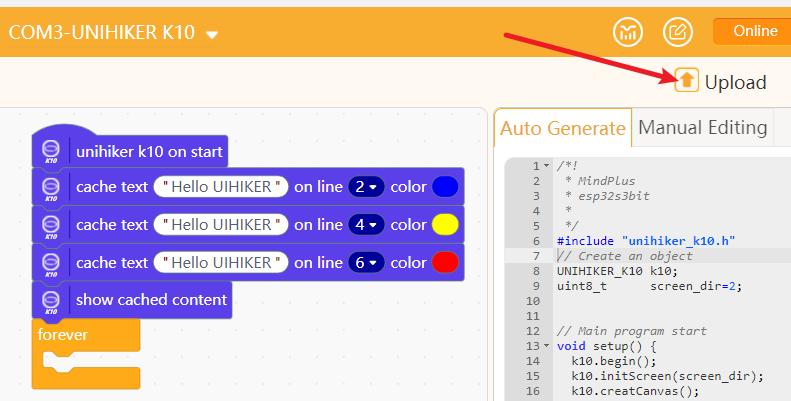

## **UNIHIKER K10 with Mindplus(Mind+)**
In this tutorial, we will guide you through the process of downloading and installing Mindplus on your computer.

### **Mindplus(Mind+)**
Mind+ is a software designed for teenagers that supports AI and IoT functions by integrating with popular mainboards and open-source hardware. It offers an easy programming experience through graphical building blocks and advanced languages like Python, C, and C++.

### **Download**
| **Download channel** |  |
| --- | --- |
| **Download from Mind+:** | [Download](https://mindplus.cc/download-en.html) |
| **Download from Google Drive:** | [Download](https://drive.google.com/drive/folders/1yiKYmkbPPsy_453x77djwkAXjnhWeNgS?usp=sharing) |
UNIHIKER K10 only support Mind+ version V1.8.1 or above.

### **Code**
- Open Mind+ and switch to "Offline" mode.

- Click "Extension", in the extension page, click "Board", select "UNIHIKER K10", click "Back". Click "Back" to finish loading.

- Connect the USB-C port of K10 to the USB port of your computer, click “Connect Device” in mind+, find the corresponding K10 device and click it to complete the device connection.

- Cache text “Hello UNIHIKER K10” in different colors on line 2, line 4 and line 6 of K10 respectively. Then show cached content.

- Click "Upload" and wait for the program to finish uploading.

- After the program is successfully uploaded, the K10 screen displays the text "Hello, UNIHIKER" in different colors.

## **Factory Programme**
After uploading other programmes, the factory programme will be overwritten, if you want to re-experience the factory programme, you can follow the process below: 
- Download [factory programme](https://img.dfrobot.com.cn/wikicn/62b2fb5caa613609f271523c/90d9a709be69b96c37cadd2af0337b0e.zip) 
- Unzip the programme and open it with Notepad/VSCode etc. and copy the entire contents. 
- Paste it into the manual editing area of Mind+. 
 
- Select the K10 and upload the code.

For more UNIHIKER K10 programming tips for Mind+, please visit [Mind+ Example](https://www.unihiker.com/wiki/K10/Examples/examples_mindplus/).