## **UNIHIKER K10 with MicroPython**
MicroPython is a Python interpreter that runs on microprocessors, enabling us to write Python scripts to control hardware. It is highly consistent with the standard Python interpreter (CPython) in terms of syntax and runs on microprocessors with limited resources.
In this tutorial, we will guide you through the process of downloading and installing MicroPython and it's IDE "Thonny" on your computer.<br/>


### **Download**

!!! Note 
    Before using micropython to program the UNIHIKER K10, the Micropython firmware has to be uploaded into the UNIHIKER K10.<br/>
    Flash Download Tool now only support on Windows. MacOS/GNU Linux user can flash firmware by [ESP LAUNCHPAD](https://igrr.github.io/esp-launchpad/).<br/>
    The MicroPython Firmware and Thonny support Windows/MacOS/GNU Linux.


| **Download** |  |
| --- | --- |
| **MicroPython Firmware:** | [Google Drive Download(V0.9.2)](https://drive.google.com/file/d/1jzlGrbEmur0Sg263MxGxotl6H2WHMf41/view?usp=drive_link)<br/>[Google Drive Download(V0.5)](https://drive.google.com/file/d/1jzlGrbEmur0Sg263MxGxotl6H2WHMf41/view?usp=drive_link) |
| **Flash Download Tool(Only support windows):** | [Click to download](https://dl.espressif.com/public/flash_download_tool.zip) |
| **ESP LaunchPad(Web Tool For All OS):** | [Click to visit](https://igrr.github.io/esp-launchpad/) |
| **Thonny** | [Click to download](https://thonny.org/) |

!!! Note 
    The current version (0.9.2) of AI features—including facial recognition, cat/dog recognition, and QR code recognition consumes significant hardware resources. Therefore, simultaneous use of AI and WiFi functionality is not supported at this time.

### **Flash MicroPython Firmware on Windows**
- Click to open the Flash Download Tool, then choose the ESP32-S3.<br/>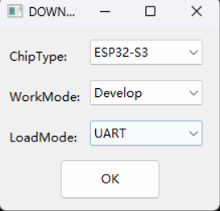

- Select the firmware and fill up the address with 0x00, then click on √.<br/>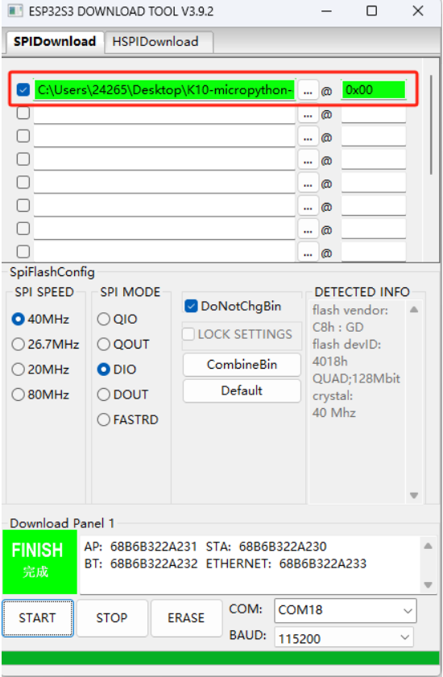

- Press and hold the BOOT button on the back of K10, connect the board to the computer and select the corresponding port in the software.<br/>
- First click "ERASE" to clear the flsh, and then click "START" to flash the firmware after ERASE step is successful.<br/>
- Press the RST reset button on the K10 board after the flash is completed.<br/>

### **Flash MicroPython Firmware on Mac/GNU Linux**
- Visit [ESP LAUNCHPAD](https://igrr.github.io/esp-launchpad/)
- Press and hold the BOOT button on the back of K10, connect the board to your Mac/PC then release BOOT button.
- Click "connect" to choose the port.
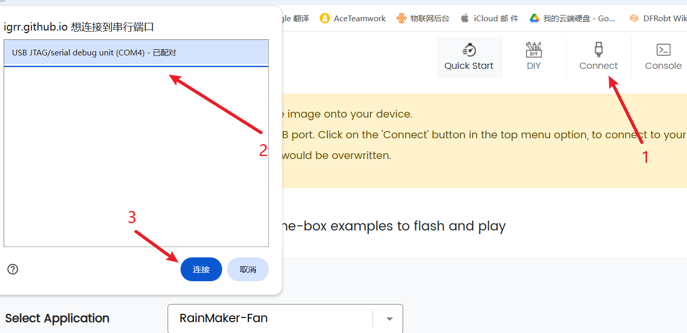
- Enter the "DIY" page and choose the .bin firmware which downloaded from Google Drive.
- Change the Flash Address into 0x00
- Click "Program" to flash firmware.
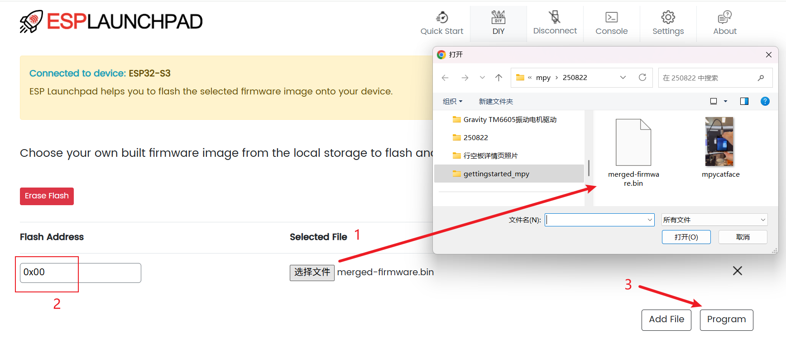

## **Coding**
- Open up Thonny as the MicroPython Editor.<br/>
- Select the ESP32 device in Thonny.<br/>
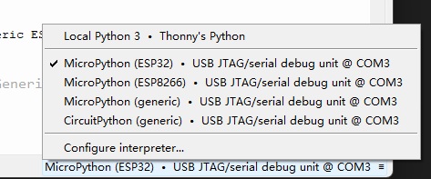

- Creat a new file and enter the code.<br/>
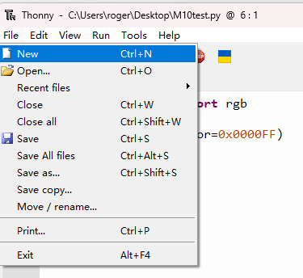

````python title="Screen Display"
from unihiker_k10 import screen
import time
from k10_base import Camera

camera = Camera()
camera.init()
screen.init(dir=2)
screen.show_camera(camera)
screen.show_bg(color=0xFFFF00)
screen.set_width(width=5)
screen.draw_line(x0=0,y0=0,x1=80,y1=80,color=0x0000FF)
screen.draw_point(x=100,y=10,color=0xFF0000)
screen.draw_rect(x=120,y=100,w=80,h=120,bcolor=0xFF6666,fcolor=0x0000FF)
screen.draw_rect(x=120,y=100,w=40,h=60,bcolor=0x012345)
screen.draw_circle(x=80,y=80,r=40,bcolor=0x00FF00,fcolor=0x0000FF)
screen.draw_circle(x=80,y=80,r=20,bcolor=0xFF0000)
screen.draw_text(text="Hello\n23",x=10,y=0,font_size=24,color=0xFF0000)
screen.draw_text(text="line\n456\nhgjh\n",line=2,font_size=24,color=0xFF0000)
screen.show_draw()
time.sleep(2)
screen.clear()

while True:
    time.sleep(1)
````

- CTRL+S to save to micropython device. Choose to save to This computer is also fine, but if the program save to local computer, the program will be lost after K10 was reboot, it is more suitable for saving to the computer when debugging.<br/>
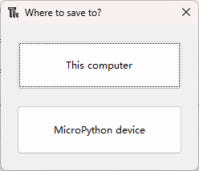

- Save the code and name as main.py
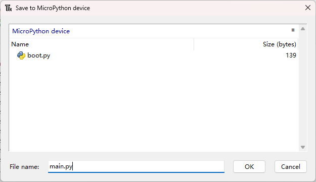

- Click to run the code
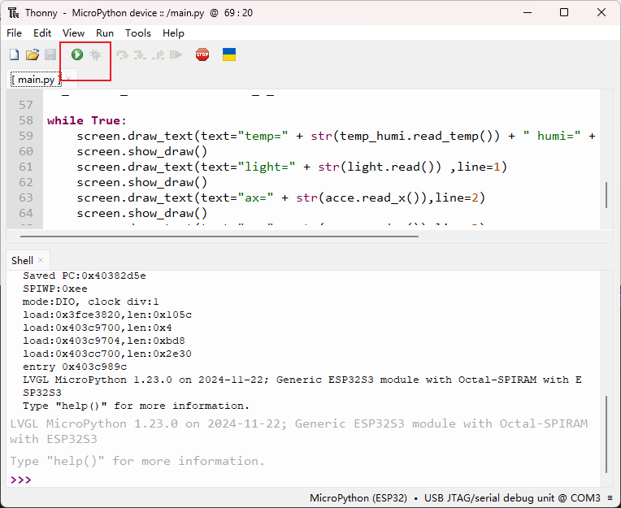

## **MicroPython Example**
Cklik to the [MicroPython Example](../Examples/examples_mpy.md).

## **Flash back to Arduino C firmware**
The original firmware for K10 is ArduinoC firmware, supports development in Arduino environments such as Mind+/Arduino IDE. If you want to switch back to Arduino development after using MicroPython, we offer the following two methods for you to flash the Arduino C firmware:<br/>
**Method 1**<br/>
Restore the device to the factory Arduino firmware in [Mind+](https://www.unihiker.com/wiki/K10/GettingStarted/gettingstarted_mindplus/).<br/>

!!! Note 
    Mind+ is only support windows for now.

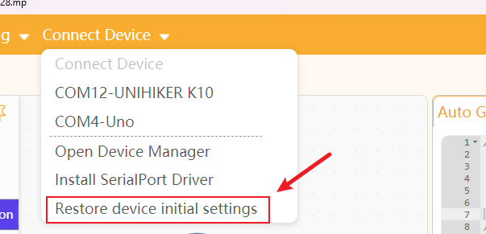

**Method 2**<br/>
For the MacOS/GNU Linux user the Arduino C firmware can be flash back by using the Arduino IDE.

- Download and configure Arduino IDE by following [this tutorial](../GettingStarted/gettingstarted_arduinoide.md).<br/>
- Choose the model as "EN".
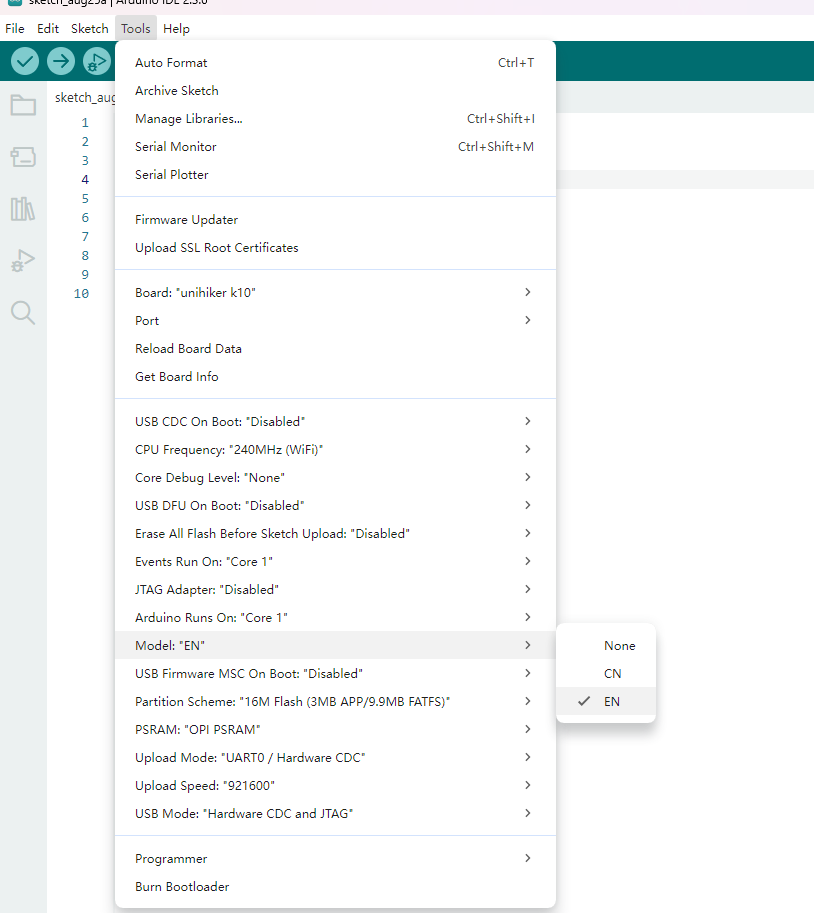
- Upload an empty program, like this one:
````c++ title="Empty program"
void setup() {
// put your setup code here, to run once:
}

void loop() {
// put your main code here, to run repeatedly:
}
````