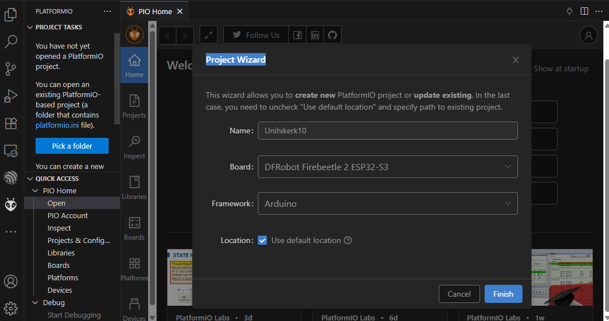
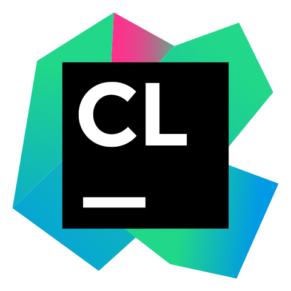
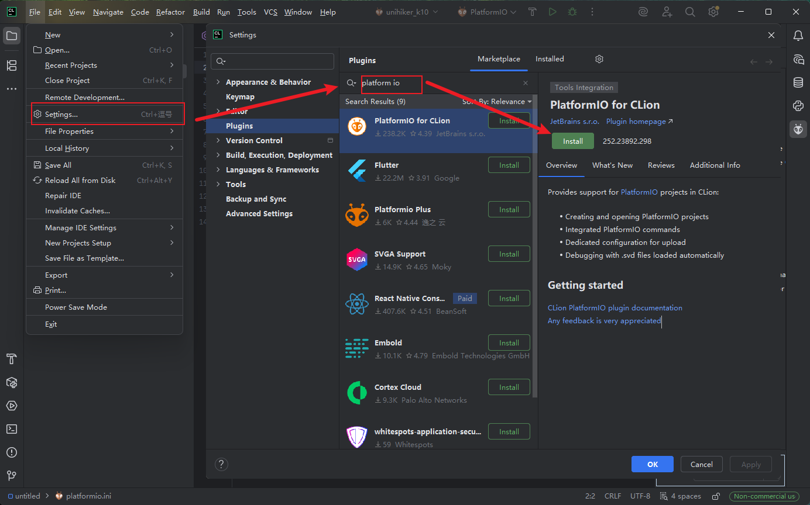

## **UNIHIKER K10 with Platform IO**
PlatformIO is a cross-platform, cross-architecture, multiple framework, professional tool for embedded systems engineers and for software developers who write applications for embedded products.
In this tutorial, we will guide you through the entire process of downloading, installing, and configuring PlatformIO on your computer.<br/>


## **Download Code Editor**
Platform IO is typically installed via code editor/IDE like VSCode or CLion. This tutorial will introduce how to configure Platform IO in these two IDEs.
If you are using another IDE, please refer to [this document](https://docs.platformio.org/en/latest/integration/ide/index.html) to learn how to configure Platform IO in your IDE.

| **Download** |  |
| --- | --- |
| **VSCode** | [Download](https://code.visualstudio.com/Download) |
| **CLion** | [Download](https://www.jetbrains.com/clion/) |

!!! Note 
    The following configuration needs to be performed only once. Once the Platform IO SDK for K10 is successfully configured, you can directly find DFRobot->Unihiker K10 in Platform IO IDE when creating new projects.

## **Install Platform IO extension/plug-in**
### Platform IO in VSCode
[Visual Studio Code](https://code.visualstudio.com/) is a lightweight but powerful source code editor which runs on your desktop and is available for Windows, macOS and Linux. It comes with built-in support for JavaScript, TypeScript and Node.js and has a rich ecosystem of extensions for other languages (such as C++, C#, Python, PHP, Go) and runtimes (such as .NET and Unity)


 {: width="240px"}

!!! Note 
    Please note that you do not need to install [PlatformIO Core(CLI)](https://docs.platformio.org/en/latest/core/index.html#piocore) separately if
    you are going to use [PlatformIO IDE for VSCode](https://docs.platformio.org/en/latest/integration/ide/vscode.html#ide-vscode). [PlatformIO Core(CLI)](https://docs.platformio.org/en/latest/core/index.html#piocore) is built into
    PlatformIO IDE and you will be able to use it within PlatformIO IDE Terminal.

    **Git:** If you are going to use Git for installing upstream development platforms, cloning
    external projects, installing library dependencies from a repository, please ensure
    that ``git --version`` command works from a system terminal. Otherwise, please
    install a [Git client](https://git-scm.com/book/en/v2/Getting-Started-Installing-Git).

    **Linux Users:** To ensure a smooth experience with PlatformIO, it is essential to have the
    [python3-venv](https://github.com/platformio/platformio-core-installer/issues/85) package installed on your system.

    **About Unihiker K10:** The Unihiker K10 cannot currently be selected directly in Platform IO. You must first create a Platform IO project using another random DFRobot board, then modify the ``platformio.ini`` file and download the SDK before you can begin development.

1. **Open** VSCode Package Manager
2. **Search** for the official ``platformio ide`` [extension](https://marketplace.visualstudio.com/items?itemName=platformio.platformio-ide)
3. **Install** PlatformIO IDE.<br/>


4. **Install Unihiker K10 SDK**
    - Click on “PlatformIO Home” button on the bottom [PlatformIO Toolbar](https://docs.platformio.org/en/latest/integration/ide/vscode.html#ide-vscode-toolbar)
    

    - Click on “New Project”, select a random DFRobot board and create new PlatformIO Project.
    

    - Open ``platformio.ini`` file, then copy and paste the following configure text in it. And use ``ctrl+s`` to save the configure file.<br/>
    Wait for the SDK download.
        ````bash title="platformio.ini"
        [env:unihiker]
        platform = https://github.com/DFRobot/platform-unihiker.git
        board = unihiker_k10
        framework = arduino
        build_flags = 
            -DARDUINO_USB_CDC_ON_BOOT=1
            -DARDUINO_USB_MODE=1
            -DModel=None
        ````

5. **Run test code on Unihiker K10**
Open ``main.cpp`` file from ``src`` folder and replace its contents with the next:
````c++ title="test code"
#include "unihiker_k10.h"

UNIHIKER_K10 k10;
uint8_t screen_dir = 2;

void setup() {
    k10.begin();
    k10.initScreen(screen_dir);
    k10.creatCanvas();
    k10.setScreenBackground(0xFFFFFF);
}

void loop() {
    // Draw a green circle on the screen
    k10.canvas->canvasCircle(120, 160, 10, 0x00FF00, 0x00FF00, true);
    k10.canvas->updateCanvas();
    delay(1000);
    
    // Clear the circle
    k10.canvas->canvasCircle(120, 160, 10, 0xFFFFFF, 0xFFFFFF, true);
    k10.canvas->updateCanvas();
    delay(1000);
}
````

    - Build your project with ``ctrl+alt+b`` hotkey
    - Connect your K10 to PC/Mac and upload code with ``ctrl+alt+u`` hotkey

### Platform IO in CLion
[CLion](https://www.jetbrains.com/clion/) is a cross-platform C/C++ IDE for GNU Linux, macOS, and Windows. CLion includes such features as a smart editor, code generation, code quality assurance, automated refactorings, on-the-fly code analysis, project manager, integrated version control systems and debugger.

Refer to the [CLion Documentation page](https://www.jetbrains.com/clion/features/) for more detailed information.

{: width="320px"}

!!! Note 
    **Step 1** is a temporary step and depends on [CLion #CPP-19412: Automatically install PlatformIO Core](https://youtrack.jetbrains.com/issue/CPP-19412). You may also skip Step 1 and proceed from Step 2 to install the Platform IO IDE and  CLion.

    **About Unihiker K10:** The Unihiker K10 cannot currently be selected directly in Platform IO. You must first create a Platform IO project using another random DFRobot board, then modify the ``platformio.ini`` file and download the SDK before you can begin development.

    **Other plug-in**: It is also recommend to install [Ini](https://plugins.jetbrains.com/plugin/6981-ini) plugin that provides syntax highlighting, formatting, code folding, and viewing structure for [“platformio.ini” (Project Configuration File)](https://docs.platformio.org/en/latest/projectconf/index.html#projectconf).

1. **Install** PlatformIO Core (CLI). See [Installation](https://docs.platformio.org/en/latest/core/installation/index.html#core-installation) guide.

2. **[Download](https://www.jetbrains.com/clion/download/?section=windows)**, install and open CLion IDE

3. **Install** official [PlatformIO for CLion](https://plugins.jetbrains.com/plugin/13922-platformio-for-clion) plugin.<br/>
Open **File > Settings.. > Plugins** and go to the "Marketplace" tab. Search for ``PlatformIO`` and click the "Install" button.


4. **Restart** CLion IDE after the plug-in is successfully installed.

5. **Setting Up** the Project
    - Please open “New Project” wizard, select board and framework, and create a new PlatformIO project. Please USE ONLY Latin characters (a-z) in a project name to avoid further issues with project compilation. Numbers and some symbols are allowed depending on different OS:
    

    - Open ``platformio.ini`` file, then copy and paste the following configure text in it. And use ``ctrl+s`` hot key to save the configure file.<br/>
    Wait for the SDK download.
        ````bash title="platformio.ini"
        [env:unihiker]
        platform = https://github.com/DFRobot/platform-unihiker.git
        board = unihiker_k10
        framework = arduino
        build_flags = 
            -DARDUINO_USB_CDC_ON_BOOT=1
            -DARDUINO_USB_MODE=1
            -DModel=None
        ````

6. **Run** test code on Unihiker K10
    - Once the SDK download complete, then the Platform IO in CLion is ready to go. 
    - Open ``main.cpp`` file from ``src`` folder and replace its contents with the next:

    ````c++ title="test code"
    #include "unihiker_k10.h"

    UNIHIKER_K10 k10;
    uint8_t screen_dir = 2;

    void setup() {
        k10.begin();
        k10.initScreen(screen_dir);
        k10.creatCanvas();
        k10.setScreenBackground(0xFFFFFF);
    }

    void loop() {
        // Draw a green circle on the screen
        k10.canvas->canvasCircle(120, 160, 10, 0x00FF00, 0x00FF00, true);
        k10.canvas->updateCanvas();
        delay(1000);
    
        // Clear the circle
        k10.canvas->canvasCircle(120, 160, 10, 0xFFFFFF, 0xFFFFFF, true);
        k10.canvas->updateCanvas();
        delay(1000);
    }
    ````

    - Build your project and upload code with ``ctrl+F5`` hotkey.

### Serial Setup
Like any other ESP32-S3 based dev board. The serial of Unihiker K10 is not automatically mapped to the USB-C port by default.<br/>
Although we have already included the configuration of serial port mapping in the above-mentioned ``platformio.ini`` configuration file, but from the second project, the settings related to the serial port in ``platformio.ini`` need to be set up manully.<br/>
Before uploading the code, please copy and paste the following Settings about the serial port at the end of ``platformio.ini``. Then you can see the data output by the serial port in your code in the serial monitor.<br>

````bash title="platformio.ini"
build_flags = 
            -DARDUINO_USB_CDC_ON_BOOT=1
            -DARDUINO_USB_MODE=1
            -DModel=None
````

The ``platformio.ini`` should look like this:


## **Platform IO Example**
Cklik to the [Platform IO Example](../Examples/examples_arduinoide.md).