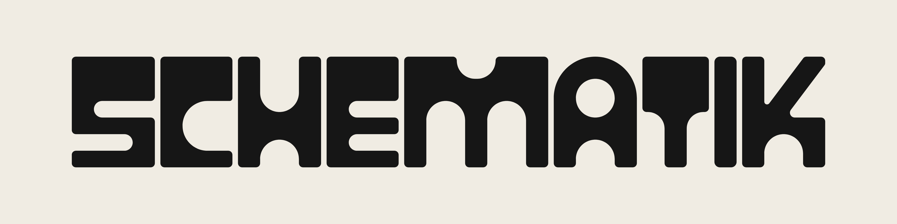
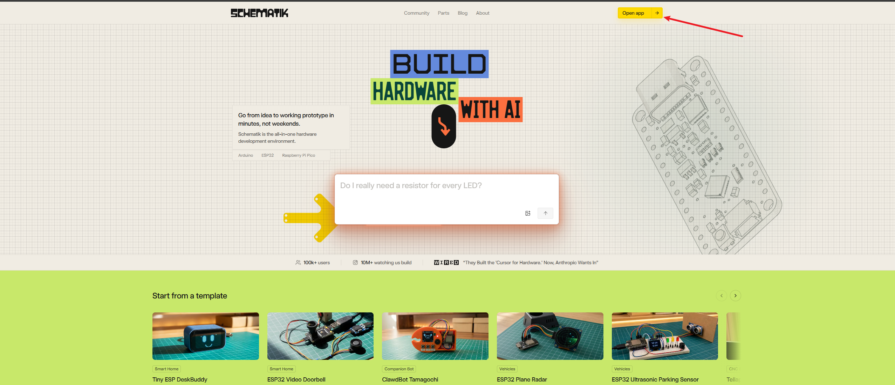
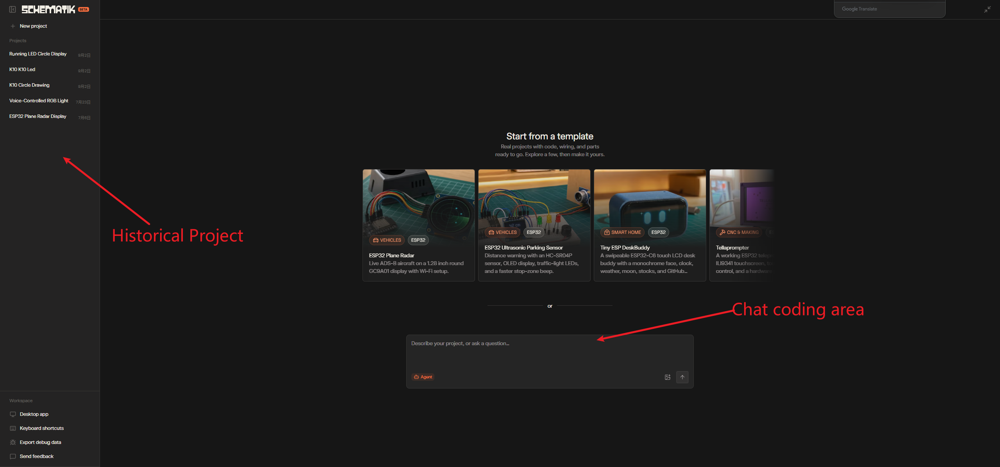
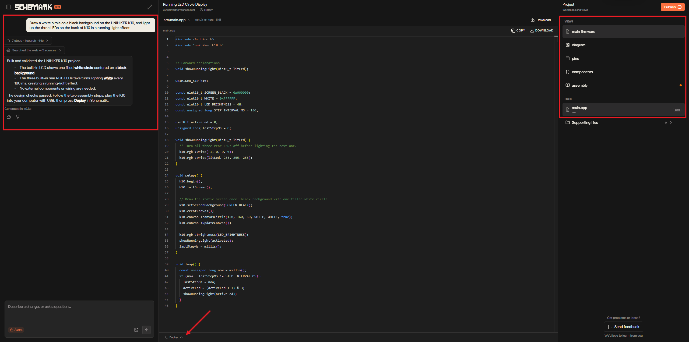
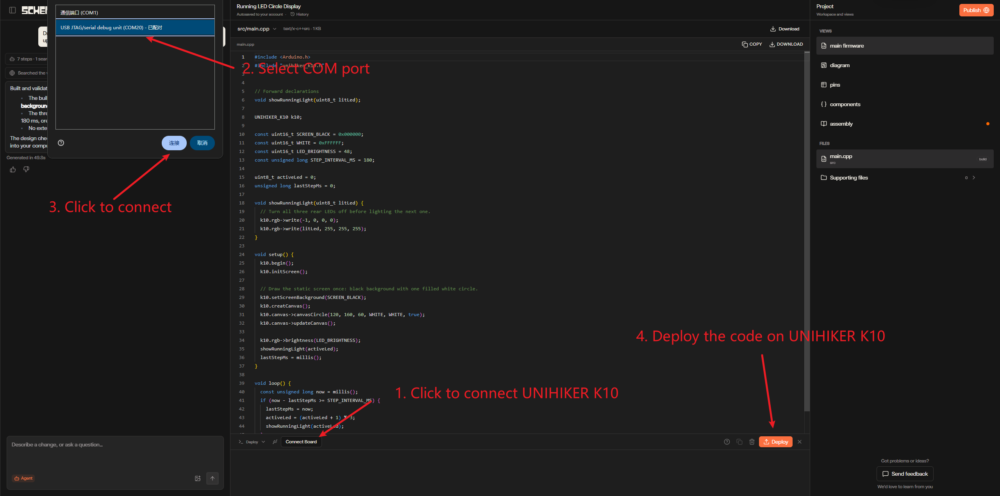
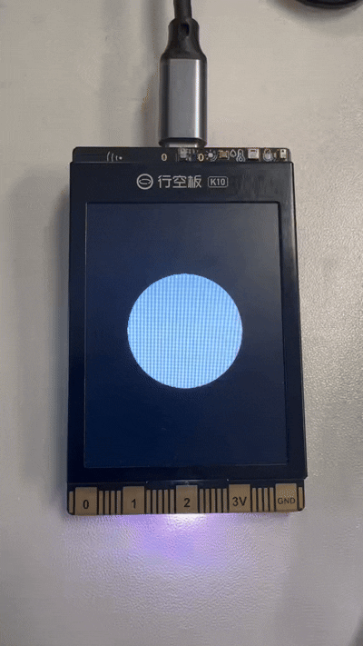
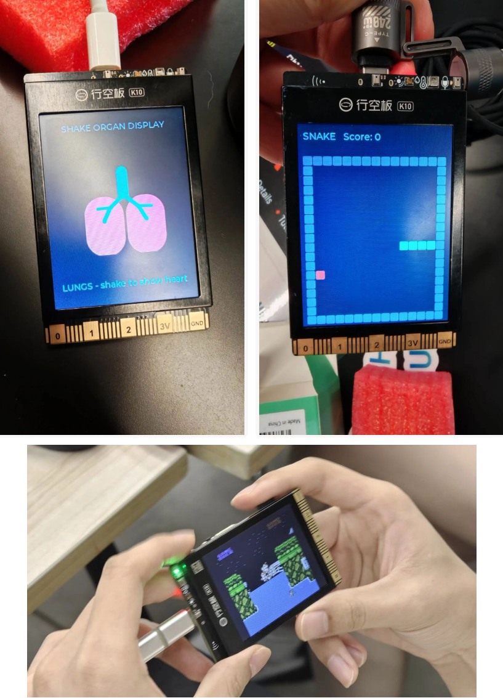

## **UNIHIKER K10 with Schematik**
Schematik is a cloud‑based online AI programming platform. Its backend compilation APIs are fully compatible with Arduino and Platform‑IO, enabling direct reuse of extensive existing hardware libraries and board support packages. Users do not need to write complete code manually. By entering project functional descriptions, behavior logic and hardware interaction requirements in natural language, the AI engine parses intents automatically and generates compilable and runnable embedded source code.

Integrated with one‑click firmware upload, the platform supports rapid prototyping, code iteration and online debugging workflows. It frees developers from environment setup and boiler‑plate code writing, allowing them to focus on implementing core project functions.

 

## **Visit Schematik**
Schematik: [https://www.schematik.io/](https://www.schematik.io/)

## **Start Coding**
- Click **Open App** or **Try Now** in the top‑right corner to register an account.
 

- Once completed, you will enter the Schematik workspace.
 - You can view your historical projects on the left‑hand side.
 - Enter your functional description in the dialogue box on the right.
 

After chatting with Schematik, the main Schematik interface will appear.
The left‑hand panel is the natural‑language interaction area, where you can submit further requirements to Schematik using natural language.
The right‑hand side is the function panel. Click each function item, and relevant content will be displayed in the center of the interface:

- **Main firmware**: Main firmware source code. View the AI‑generated source code in the central view.
- **diagram**: Wiring diagram. If external sensors or physical wiring are required for the project, a wiring schematic will be generated here.
- **pins**: Pinout diagram, showing the pin definitions of the main board.
- **components**: Bill‑of‑materials list, showing all electronic components used in the project.
- **assembly**: Step‑by‑step assembly and connection guide.

The **deploy** button at the bottom is used for firmware deployment.
  

- After verifying that the source code is correct, click the **deploy** button at the bottom to deploy the code to the UNIHIKER K10.
 

 - Wait for the upload to complete, then the program will run successfully.
 

## More
Schematik is capable of far more than basic code generation. Backed by its underlying compilation capability fully compatible with Arduino, you can draw on a wide variety of open‑source Arduino examples to rapidly build all kinds of creative projects.

All Arduino‑compatible APIs can be invoked directly via natural language. There is no need to go through manuals line‑by‑line or memorize complex syntax. Simply describe the functional logic in plain language, and the AI will generate the complete code.

Leveraging the platform’s multi‑turn AI conversation‑driven iteration, you can even turn the UNIHIKER K10 into a retro game console and easily run classic titles such as Tetris and Contra.
From sensor acquisition and peripheral driver development to interactive UIs and fun game creation, the full workflow — including idea conception, code generation, debugging and firmware upload — can be completed entirely within Schematik for both simple hardware prototypes and imaginative creative projects. This greatly lowers the barrier to bringing hardware‑based ideas to life.
