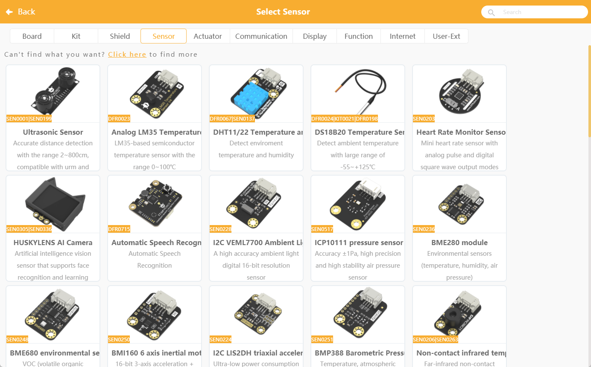
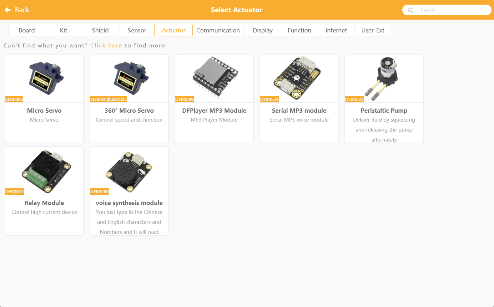
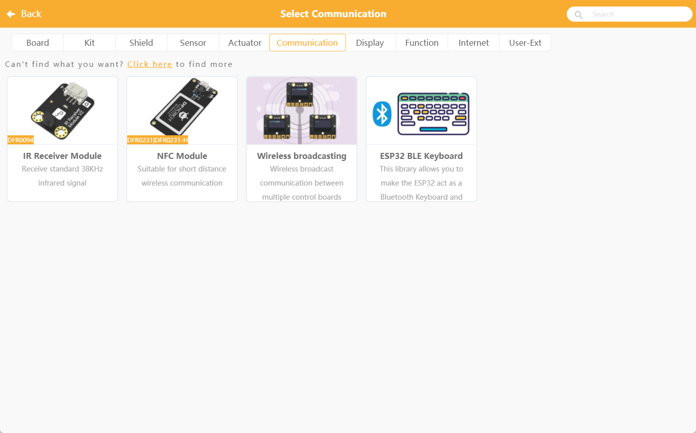
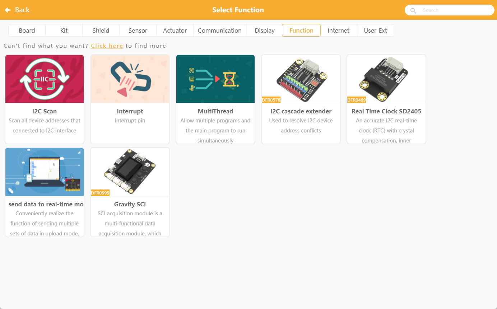
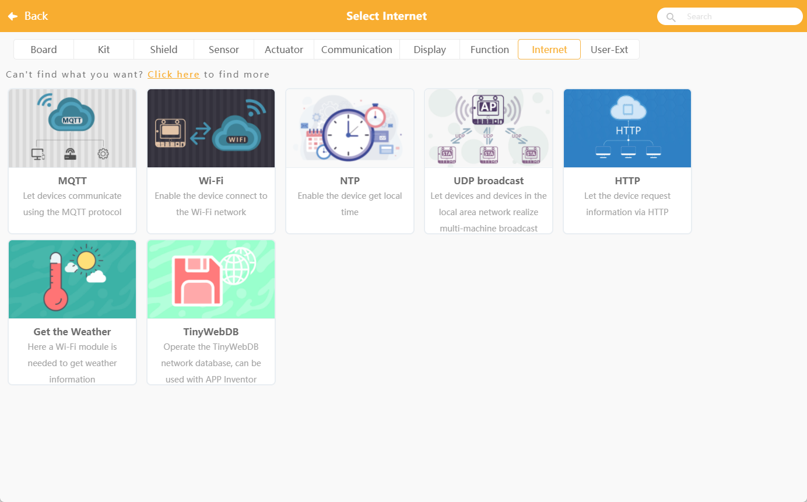

At present, K10 only opens up some of the commonly used sensors, and the compatibility of more sensors will be iterated in subsequent versions.

## Offical library

### Sensor

| SKU             | Part name                    | Mind+ Minimum Version Requirements             |
| --------------- | --------------------------- | ------------------------ |
| SEN0001         | trig echo Ultrasonic sensor  | V1.8.1 RC1.0 - K10 beta version 241012 |
| SEN0203         | Digital/Analogue Heart Rate Sensor         | V1.8.1 RC1.0 - K10 beta version 2410122 |
| SEN0228         | I2C VEML7700 Ambient Light Sensor   | V1.8.1 RC1.0 - K10 beta version 241012 |
| SEN0517         | I2C ICP10111 Barometric Pressure Sensor     | V1.8.1 RC1.0 - K10 beta version 241012 |
| SEN0236         | I2C BEM280 Environment Sensor       | V1.8.1 RC1.0 - K10 beta version 241012 |
| SEN0248         | I2C BME680 Environmental Sensor       | V1.8.1 RC1.0 - K10 beta version 241012 |
| DFR0034         | Analogue sound sensors               | V1.8.1 RC1.0 - K10 beta version 241012 |
| SEN0291         | I2C Digital Power Meter               | V1.8.1 RC1.0 - K10 beta version 241012 |
| SEN0321         | I2C Ozone Sensor              | V1.8.1 RC1.0 - K10 beta version 241012 |
| KIT0176         | I2C Weight Sensor               | V1.8.1 RC1.0 - K10 beta version 241012|
| DFR0067/SEN0137 | DHT11/22 Temperature and Humidity Sensor        | V1.8.1 RC1.0 - K10 beta version 241012 |
| SEN0206/SEN0263 | I2C non-contact infrared temperature sensors    | V1.8.1 RC1.0 - K10 beta version 241012 |
| SEN0388 | URM09- Trig Ultrasonic Distance Measuring Sensor    | V1.8.1 RC1.0 - K10 beta version 250103 |
| DFR0023 | LM35 Linear Analogue Temperature Sensors    | V1.8.1 RC1.0 - K10 beta version 2501033 |
| DFR0024/KIT0021/DFR0198 | DS18B20 Temperature Sensor    | V1.8.1 RC1.0 - K10 beta version 250103 |
| DFR0715 | Speech recognition module | V1.8.1 RC1.0 - K10 beta version 250103 |
| SEN0250 | BMI160 6-axis inertial motion sensor | V1.8.1 RC1.0 - K10 beta version 2501033 |
| SEN0224 | LIS2DH Triaxial Accelerometer | V1.8.1 RC1.0 - K10 beta version 2501033 |
| SEN0251 | BMP388 Air Pressure Temperature Sensor | V1.8.1 RC1.0 - K10 beta version 2501003 |
| SEN0206/SEN0263 | Non-contact infrared temperature sensors | V1.8.1 RC1.0 - K10 beta version 250103 |
| DFR0026 | Analogue environmental sensors | V1.8.1 RC1.0 - K10 beta version 250103 |
| DFR0027 | Digital Vibration Sensors | V1.8.1 RC1.0 - K10 beta version 250103 |
| DFR0029 | Digital Big Button Module          | V1.8.1 RC1.0 - K10 beta version 250103 |
| DFR0030 | Digital Touch Sensor          | V1.8.1 RC1.0 - K10 beta version 250103 |
| DFR0033 | Gravity: Digital Magnetic Sensor    | V1.8.1 RC1.0 - K10 beta version 250103 |
| DFR0034 | Analogue sound sensors            | V1.8.1 RC1.0 - K10 beta version 250103 |
| DFR0051 | Analogue Voltage Detection Module        | V1.8.1 RC1.0 - K10 beta version 250103 |
| DFR0052 | Analogue piezo-ceramic vibration sensors  | V1.8.1 RC1.0 - K10 beta version 250103 |
| DFR0058 | Analogue multi-turn rotation angle sensor  | V1.8.1 RC1.0 - K10 beta version 250103 |
| DFR0061 | JoyStick Module        | V1.8.1 RC1.0 - K10 beta version 250103 |
| DFR0076 | Flame Sensor               | V1.8.1 RC1.0 - K10 beta version 250103 |
| DFR0063 | Lithium Battery Meter            | V1.8.1 RC1.0 - K10 beta version 250103 |
| DFR0553 | 16-bit AD converter module          | V1.8.1 RC1.0 - K10 beta version 250103 |
| SEN0114 | Soil moisture sensors          | V1.8.1 RC1.0 - K10 beta version 250103 |
| SEN0121 | Steam sensor              | V1.8.1 RC1.0 - K10 beta version 250103 |
| SEN0315 | PAJ7620U2 Gesture Recognition Sensor | V1.8.1 RC1.0 - K10 beta version 250103 |
| SEN0376 | Alcohol Sensor              | V1.8.1 RC1.0 - K10 beta version 250103 |
| SEN0364 | Visible Light Sensor          | V1.8.1 RC1.0 - K10 beta version 250103 |
| SEN0359 | Fingerprint Sensor              | V1.8.1 RC1.0 - K10 beta version 250103 |
| SEN0514 | ENS160 Air Quality Sensors    | V1.8.1 RC1.0 - K10 beta version 250103 |
| SEN0518 | MAX30102 Heart Rate Oximetry Sensor  | V1.8.1 RC1.0 - K10 beta version 2501033 |
| SEN0536 | Carbon dioxide sensors          | V1.8.1 RC1.0 - K10 beta version 250103 |
| SEN0540 | LTRUV UV Sensor       | V1.8.1 RC1.0 - K10 beta version 250103 |
| SEN0575 | Tipping Bucket Rainfall Sensor                | V1.8.1 RC1.0 - K10 beta version 250103 |
| SEN0334 | SHT31-F Digital Temperature and Humidity Sensors | V1.8.1 RC1.0 - K10 beta version 250103 |
| SEN0322 | I2COxygen Concentration Sensor       | V1.8.1 RC1.0 - K10 beta version 250103 |
| SEN0619 | BMM350Triaxial Geomagnetic Sensor    | V1.8.1 RC1.0 - K10 beta version 250103 |

### Actuator
| SKU  | Part name                  | Mind+ Minimum Version              |
| ---- | -------------------- | ------------------------ |
| SER0006         | 180° Servo         | V1.8.1 RC1.0 - K10 beta version 250103 |
| SER0043/SER0035 | 360° Servo    | V1.8.1 RC1.0 - K10 beta version 250103 |
| DFR0299         | DFPlayer mini | V1.8.1 RC1.0 - K10 beta version 250103 |
| DFR0534         | Gravity: MP3 Player Module      | V1.8.1 RC1.0 - K10 beta version 250103 |
| DFR0523         | Gravity: Digital Peristaltic Pump   | V1.8.1 RC1.0 - K10 beta version 250103 |
| DFR0473         | 3.3V Relay     | V1.8.1 RC1.0 - K10 beta version 250103 |
| DFR0760         | Gravity: Text to Speech Voice Synthesizer Module    | V1.8.1 RC1.0 - K10 beta version 250103 |

### Communication

| SKU  | Function                 | Mind+ Minimum Version             |
| ---- | -------------------- | ------------------------ |
|      | Bluetooth HID Analogue Bluetooth Keyboard | V1.8.1 RC1.0 - K10 beta version|
| DFR0094           | Infrared Receiver Module | V1.8.1 RC1.0 - K10 beta version 250103 |
| DFR0231/DFR0231-H | RFID/NFC Module | V1.8.1 RC1.0 - K10 beta version 250103 |
|                   | wireless broadcast     | V1.8.1 RC1.0 - K10 beta version 250103 |

### Display

| SKU                     | Part name         | Mind+ Minimum Version             |
| ----------------------- | ------------ | ------------------------ |
| FIT0352/FIT0656/DFR0888 | WS2812 RGB LED | V1.8.1 RC1.0 - K10 beta version 250103 |
| DFR0646 | Gravity: 8-Digital LED Segment Display Module | V1.8.1 RC1.0 - K10 beta version 250103 |

### Function

| SKU  | Function     | Mind+ Minimum Version              |
| ---- | -------- | ------------------------ |
|      | Pin Interrupt | V1.8.1 RC1.0 - K10 beta version 250103 |
|      | multi-threaded   | V1.8.1 RC1.0 - K10 beta version 250103 |
|          | I2C scanner          | V1.8.1 RC1.0 - K10 beta version 250103 |
| DFR0576  | I2C Multiplexer       | V1.8.1 RC1.0 - K10 beta version 250103 |
| DFR0469  | RTC SD2405       | V1.8.1 RC1.0 - K10 beta version 250103 |
|          | Cross-modal data transfer       | V1.8.1 RC1.0 - K10 beta version 250103 |
| DFR0999  | Gravity SCl DAQ | V1.8.1 RC1.0 - K10 beta version 250103 |

### Network

| SKU  | Function         | Mind+ Minimum Version              |
| ---- | ------------ | ------------------------ |
|      | WiFi         | V1.8.1 RC1.0 - K10 beta version 250103 |
|      | MQTT         | V1.8.1 RC1.0 - K10 beta version 250103 |
|      | NTP  | V1.8.1 RC1.0 - K10 beta version 250103 |
|      | UDP broadcast   | V1.8.1 RC1.0 - K10 beta version 250103 |
|          | HTTP      | V1.8.1 RC1.0 - K10 beta version 250103 |
|          | Weather  | V1.8.1 RC1.0 - K10 beta version 250103 |
|          | TinyWebDB | V1.8.1 RC1.0 - K10 beta version 250103 |

## User-extension

The compatibility of current sensors and small modules is still being optimized, and some of the sensors that have been optimized will first be opened for use through the user extension.
If you would like any Gravity sensors to be compatible with the K10, please contact us via email. We will get back to you as soon as possible. 
E-mail: unihiker@dfrobot.com
