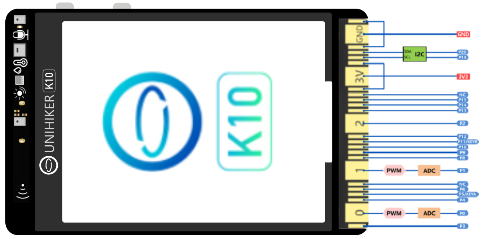
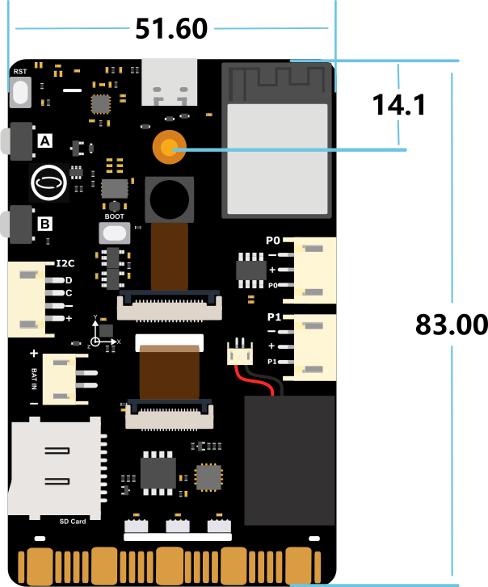
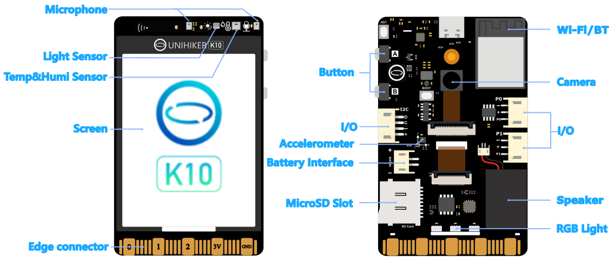

**Core**

| Function  | Description                         |
| ----- | ------------------------------------------------------------ |
| MCU   | Module：ESP32-S3 N16R8 
Processor：Xtensa® LX7 
dual core 32-bit up to 240 MHz 
SRAM：512KB 
ROM：384KB
 Flash：16MB 
PSRAM：8MB 
RTC SRAM：16KB |
| Wi-Fi | Specification：IEEE 802.11b/g/n 
Frequency：2.4G 
Band width：20MHz、40MHz |
| Bluetooth  | Specification：Bluetooth 5、Bluetooth mesh 
Frequency：125 Kbps、500 Kbps、1 Mbps、2 Mbps |

**On-board component**

| Function                      | Description                                |
| ------------------------- | ---------------------------------------------------- |
| Temp&Humi Sensor(AHT20)       | Temperature：-40-85℃  Accuracy±0.3℃
Humidity：0-100%RH Accuracy±2%RH |
| Ambient Light Sensor(LTR303ALS)   | Detection range：0~64k Lux                                  |
| Triaxial Acceleration Sensor(SC7A20H) | ±2G/±4G/±8G/±16G                                     |
| Display                      | 2.8inch 240x320 Colored LCD  ILI9341                                     |
| Camera                    | 2MP，80°FOV   GC2145              |
| A, B, RST,BOOT button            | A, B, RST,BOOT button       |
| MEMS MIC                | MEMS MIC x 2            |
| Speaker                    | Power：2W                          |
| WS2812 RGB LED              | WS2812 RGB LED x 3         |

**Interface**

| Function         | Description                                |
| ------------ | ------------------------------------------------------------ |
| On-board interface     | USB-C power(5V DC)/program upload interface
2Pin PH2.0 battery interface(3.0-6.0V DC)
Recommended power source: 3.7V Lipo battery or three 1.5V AA/AAA cells 
3Pin PH2.0 Full function GPIO x 2
4Pin PH2.0 I2C 
Self-ejecting TF card slot |
| EdgeConnector | Full function GPIO x 2
I2C x 1
Digital IO x 15       |

## **Boardover view**
 

## **Dimensional Drawing**
 

## **On-board resorce**
 

