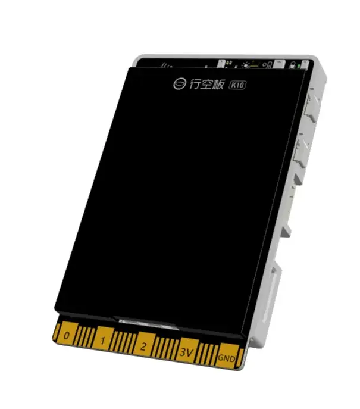

**Schematic** 
[UNIHIKER K10 Schematic](img/hardwarereference_onboard/UNIHIKERk10Sch.PDF) 

**3D Model** 
[UNIHIKER K10 STP model](https://dfimg.dfrobot.com/62b2fb5caa613609f271523c/wiki/0e1a9576dddf1e4a435683e2633d21cb.zip) 

**Case** 
DFRobot official design case, a M3*5 screw is need to fix the case to the K10 board, the case expose all the interfaces of the K10. 
[UNIHIKER K10 case——released by DFRobot](https://dfimg.dfrobot.com/62b2fb5caa613609f271523c/wiki/dd231e44c83eacf7ad601ce01b386718.zip) 
 