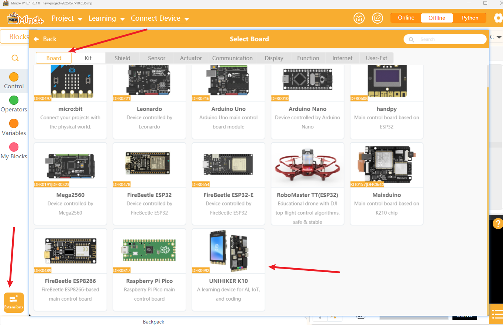
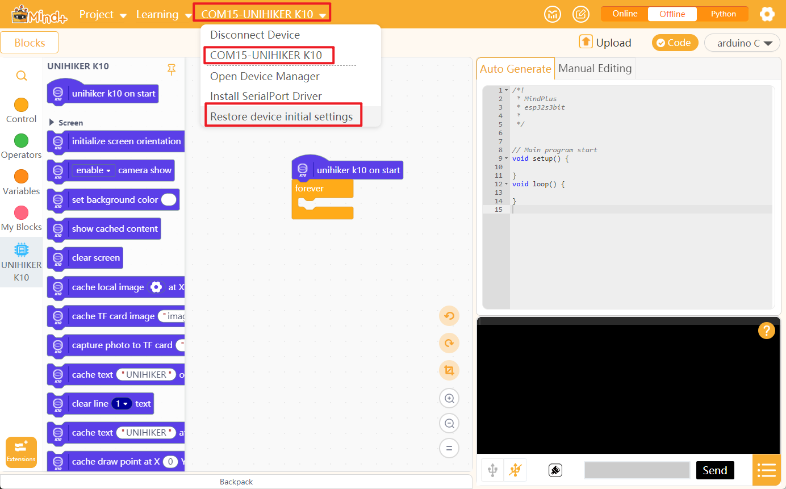
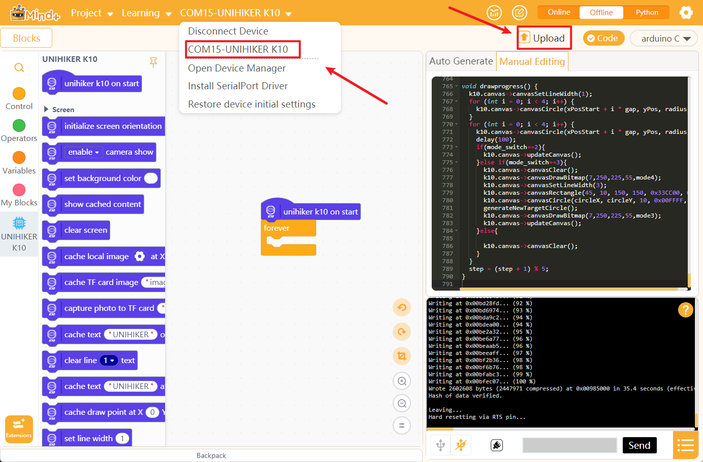

## **Schematic**
[UNIHIKER K10 Schematic](img/hardwarereference_onboard/UnihikerK10Schematic.pdf) 
[UNIHIKER K10 Schematic(Google Drive Download)](https://drive.google.com/file/d/14F7M2dDCvCyds95An-QEZY058ZYZlodp/view?usp=sharing)

## **3D Model**
[UNIHIKER K10 STP model](https://dfimg.dfrobot.com/62b2fb5caa613609f271523c/wiki/0e1a9576dddf1e4a435683e2633d21cb.zip) 
[UNIHIKER K10 STL model](https://dfimg.dfrobot.com/5cabf4771804207b131ae8cb/wiki/cf174faab293c4f3c5f6bd1e92e4a199.zip)

## **Case**
DFRobot official design case, a M3*5 screw is need to fix the case to the K10 board, the case expose all the interfaces of the K10. 
[UNIHIKER K10 case——designed by DFRobot](https://dfimg.dfrobot.com/62b2fb5caa613609f271523c/wiki/dd231e44c83eacf7ad601ce01b386718.zip) 
 

## **Factory Programme**
After uploading other programmes, the factory programme will be overwritten, if you want to re-experience the factory programme, you can follow the process below: 

- Connect K10 to your PC and open "Mind+". Be sure the Mind+ is in the English mode. 
- Select UNIHIKER K10 in extension——>board. 
 
- Connect the K10, then restore device initial setting. The recovery process may take 3~5 minutes 
 
- Download [factory programme](https://img.dfrobot.com.cn/wikicn/62b2fb5caa613609f271523c/90d9a709be69b96c37cadd2af0337b0e.zip) 
- Unzip the programme and open it with Notepad/VSCode etc. and copy the entire contents. 
- Paste it into the manual editing area of Mind+. 
 
- Select the K10 and upload the code. 
 

## **Certification**
- [CE Certification](img/hardwarereference_onboard/DFR0992-EN-CE-Certification.pdf) 
- [FCC Certification](img/hardwarereference_onboard/DFR0992-EN-FCC-Certification.pdf) 
- [RoHS](img/hardwarereference_onboard/DFR0992-EN-ROHS.pdf) 