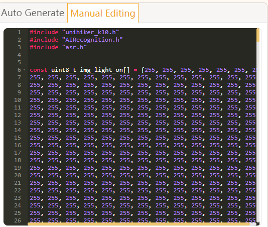

## **Schematic**
[UNIHIKER K10 Schematic](img/hardwarereference_onboard/UNIHIKERk10Sch.PDF) 

## **3D Model**
[UNIHIKER K10 STP model](https://dfimg.dfrobot.com/62b2fb5caa613609f271523c/wiki/0e1a9576dddf1e4a435683e2633d21cb.zip) 
[UNIHIKER K10 STL model](https://dfimg.dfrobot.com/5cabf4771804207b131ae8cb/wiki/cf174faab293c4f3c5f6bd1e92e4a199.zip)

## **Case**
DFRobot official design case, a M3*5 screw is need to fix the case to the K10 board, the case expose all the interfaces of the K10. 
[UNIHIKER K10 case——released by DFRobot](https://dfimg.dfrobot.com/62b2fb5caa613609f271523c/wiki/dd231e44c83eacf7ad601ce01b386718.zip) 
 

## **Factory Programme**
After uploading other programmes, the factory programme will be overwritten, if you want to re-experience the factory programme, you can follow the process below: 
- Download [factory programme](https://dfimg.dfrobot.com/62b2fb5caa613609f271523c/wiki/94b66ba7b78d1fafdbc73675ec2da461.zip) 
- Unzip the programme and open it with Notepad/VSCode etc. and copy the entire contents. 
- Paste it into the manual editing area of Mind+. 
 
- Select the K10 and serial port and upload the code.

## **Arduino IDE SDK**
NOTE: This SDK is in the testing stage, there may be instability problems, recommended to use with MindPlus. 
[MindPlus Tutorial](https://www.unihiker.com/wiki/K10/GettingStarted/gettingstarted_mindplus/#factory-programme)  

SDK URL:
https://downloadcd.dfrobot.com.cn/UNIHIKER/package_unihiker_index.json 
Open "File->Preference" in Arduino IDE 
 

Set "Compiler warnings" as none 
 

Click here to add SDK URL 
 

Copy and paste the URL in the box, then click OK to save 
 

Open "Tools->Board->Boards Manager" 

Serach unihiker and install the SDK 
