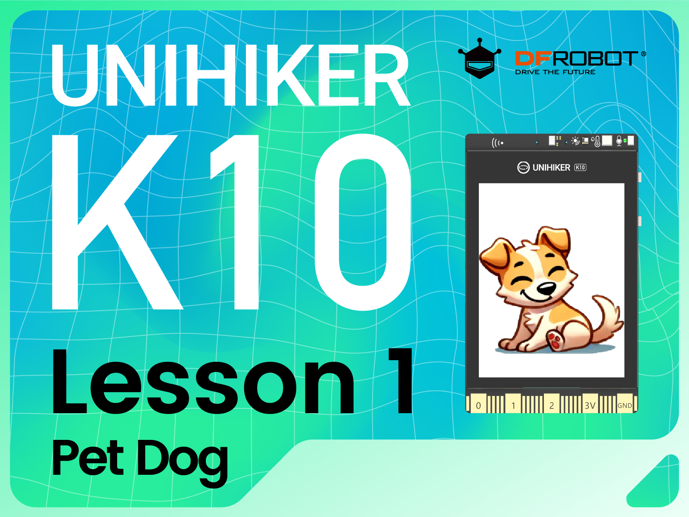
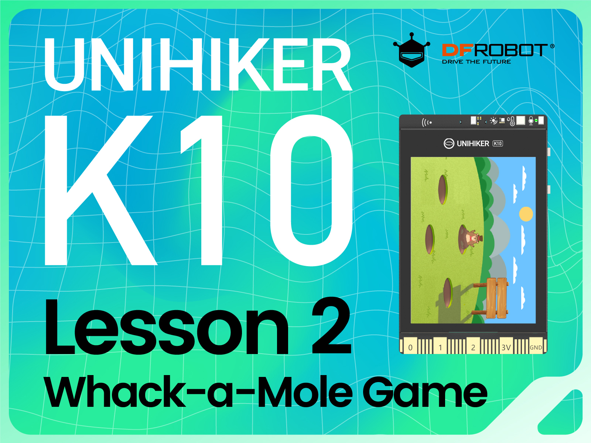
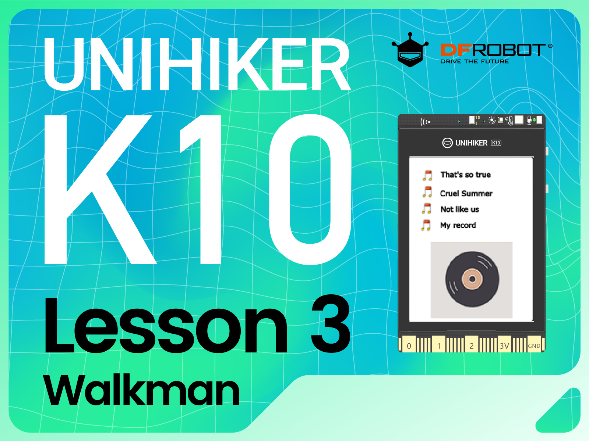
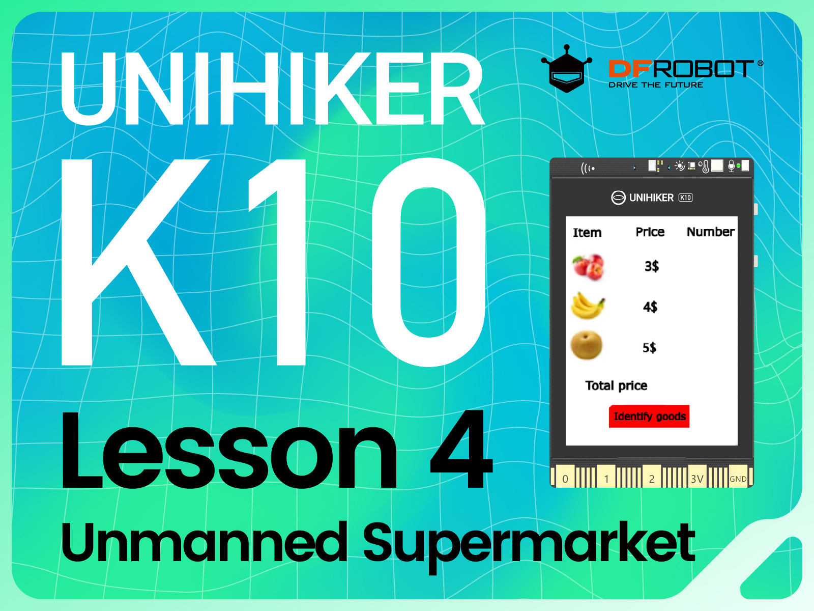
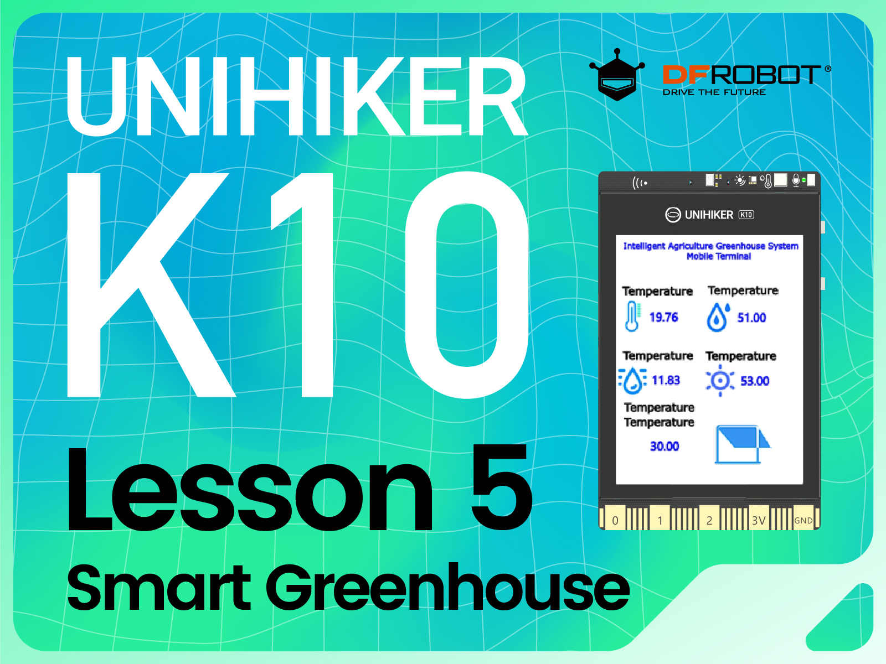

# UNIHIKER Graphical Tutorial for Beginners
 
This is a set of zero-based tutorials, using Mind+ graphical programming to learn the use of unihiker.

|   |  | |
| :------------: | :------------: | :------------: |
|   [Pet dog](https://learn.dfrobot.com/makelog-314927.html "Pet Dog")   |  [Whack-a-Mole Game](https://learn.dfrobot.com/makelog-314928.html "Whack-a-Mole Game")   |[Walkman](https://learn.dfrobot.com/makelog-314931.html "Walkman")|
|   |  |Comming soon...... |
|   [Unmanned Supermarket](https://learn.dfrobot.com/makelog-314933.html "Unmanned Supermarket")   |  [Smart Greenhouse](https://learn.dfrobot.com/makelog-314934.html "Smart Greenhouse")   ||