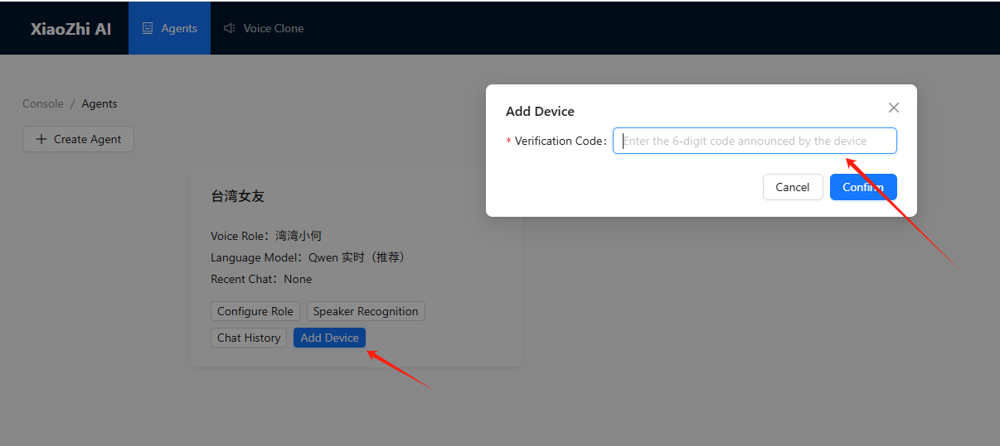

# Introduction
The open-source xiaozhi-esp32 project on GitHub unlocks new possibilities. By leveraging ESP32-S3's capabilities and integrating APIs from models like DeepSeek, it enables localized AI voice chat. We compiled with English firmware, UNIHIKER K10 transforms into a responsive smart terminal supporting multi-turn dialogue, wake-word detection, and real-time translation. 
This synergy of hardware and open-source innovation lowers barriers for AI development.  
With intuitive interfaces and efficient edge computing, developers can prototype voice assistants, educational tools, or smart home solutions effortlessly. The future of edge AI starts here. 
xiaozhi-esp32 is an open-source ESPIDF project, since the configuration process of ESPIDF is a bit tedious, we have compiled an English version of the xiaozhi firmware for you to flash directly.

 
👆Click above picture to watch video tutorial on Youtube.

# Firmware/Software
| **Download** |  |
| --- | --- |
| **XiaoZhi firmware:** | [Google Drive Download(V1.8.5)](https://drive.google.com/file/d/1jiboUqUYUFMY_sb86xG3Fzbp88lRG5bu/view?usp=drive_link) |
| **Flash Download Tool(Only support windows):** | [Click to download](https://dl.espressif.com/public/flash_download_tool.zip) |
| **ESP LaunchPad(Web Tool For All OS):** | [Click to visit](https://igrr.github.io/esp-launchpad/) |

## **Flash Firmware on Windows**
- Click to open the Flash Download Tool, then choose the ESP32-S3. 

- Select the firmware and fill up the address with 0x00, then click on √. 

- Press and hold the BOOT button on the back of K10, connect the board to the computer and select the corresponding port in the software. 
- First click "ERASE" to clear the flsh, and then click "START" to flash the firmware after ERASE step is successful. 
- Press the RST reset button on the K10 board after the flash is completed. 

## **Flash Firmware on Mac/GNU Linux**
- Visit [ESP LAUNCHPAD](https://igrr.github.io/esp-launchpad/)
- Press and hold the BOOT button on the back of K10, connect the board to your Mac/PC then release BOOT button.
- Click "connect" to choose the port. 

- Enter the "DIY" page and choose the .bin firmware which downloaded from Google Drive.
- Change the Flash Address into 0x00
- Click "Program" to flash firmware.

# Config the Wi-Fi and language model
After successfully flash the firmware, press the RST button on the back of K10.
The K10 will first enter the Wi-Fi configuration mode. 

Now use your PC or phone the connect the hotspot of xiaozhi. Then config the Wi-Fi SSID and password to let xiaozhi connect to the Internet.
The K10 could only connect the 2.4GHz Wi-Fi. 

Once the Wi-Fi is successfully connected, the K10 will reboot in 3 second.
And the a six-digit device code will show up on the screen of K10. 

Then you can go the xiaozhi configuration site to config the language model and speaker.
[Xiaozhi config site](https://xiaozhi.me/)

Click on the console: 

Register a xiaozhi account using your mobile phone number. 

After enter the console, then add device and enter the device code now on the K10 display. 

So far, xiaozhi has been successfully deployed on UNIHIKER K10.
You can enter the Configure Role screen to change xiaozhi's role.
We recommend using the following settings to call the Deepseek model and limit the language to English.
But to remember to restart xiaozhi everytime you config the speaker role. 

# Wake up your AI friend and do some small talk
You can now use ‘Javis’ to wake up Xiaozhi and talk to it.

The two on-board buttons of the K10 function as follows:
A: Short press - interrupt/wake up, long press 1s - volume up.
B: Short press - interrupt/wake up, long press 1s - volume down

Have fun with UNIHIKER K10 and xiaozhi.

xiaozhi-esp32: [https://github.com/78/xiaozhi-esp32](https://github.com/78/xiaozhi-esp32) 
Original project author: [@78](https://github.com/78) 
UNIHIKER K10 Feature Contributor: [@HonestQiao](https://github.com/HonestQiao) 

