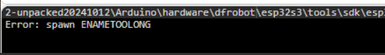
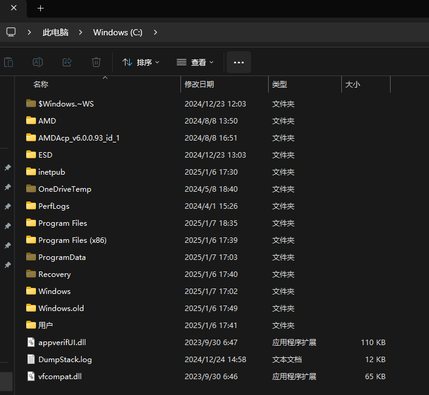

## **Upload error**
Q: Select the K10 board to upload the program, prompting the error message: spawn ENAMETOOLONG. 
 

A: The public beta version of Mind+ is manually unzipped by users, so it may cause the unzipped path of Mind file is not correct or the file name is wrong. Please follow the steps below to solve the problem:
- Completely delete the Mind+ unzipped this time
- Then put the newly downloaded zip in the root directory of C drive.
 
- Quit all antivirus software before unzipping, and make sure that the entire folder path is all English characters. Copying the zip archive is likely to automatically generate Chinese characters in ‘)’ or ‘(’ brackets.