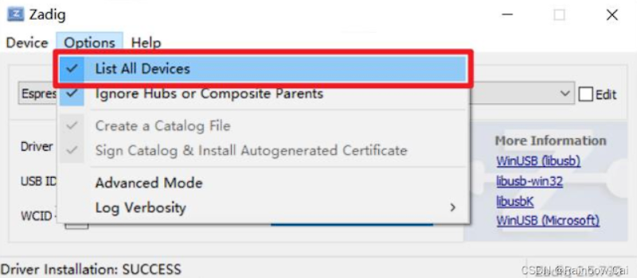
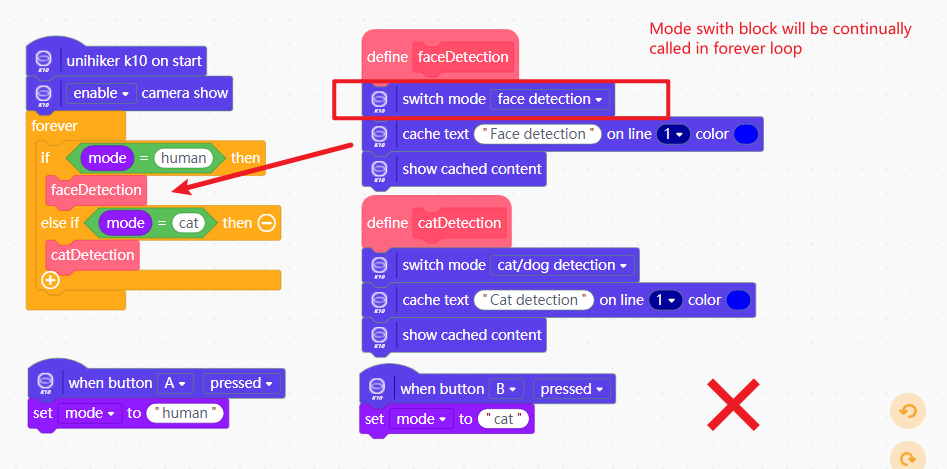

## **How to code K10 in Mind+**
**Q: Can't find K10 after downloading the Mind+** 
A: The K10 is a microcontroller dev board and needs to be programmed in Mind+ offline mode, and the version of Mind should be 1.8.1 or above.

**Q: How to code in Mind+？** 
A: Please view this [page](https://www.unihiker.com/wiki/K10/GettingStarted/gettingstarted_mindplus/)

## **Windows 7 can not connnect to the K10**
**Q: I can't find the port number of K10 in offline mode. Do I need to install the driver?** 
A: 

- On **Windows 10/11**, no driver installation is required.
    If the K10 is not recognized, please ensure you are using the **USB-C cable included with the K10**
    Try connecting the K10 directly to your PC/Mac's **native USB port** istead of going through a USB hub

- On **Windows 7**, the serial driver must be installed manually.
    Please install [zadig](https://zadig.akeo.ie/) and configure it as follows:
 
 

**Q: After Select the K10 board to upload the program, prompting the error message: spawn ENAMETOOLONG.** 
 
A: This is the bug in the public beta version of Mind+, we've fixed it in the formal release. Please download and install the Mind+ through [this page](https://www.unihiker.com/wiki/K10/GettingStarted/gettingstarted_mindplus/).

**Q: K10 continues to reboot and crash after uploading a program.**
A: Please select K10 in Mind+ offline mode and click “Restore device initialization settings”.
 

## **K10 abnormal reboot**
**Q: Why does the board restarts abnormally when using MQTT, pin interrupts, multithreading.**
A: In **MQTT, pin interrupt, multi-threading** and other functions of the callback function / thread and other hat-type blocks, can not use the screen display related blocks, you need to assign a value to the variable in the callback function / thread, and then in the main program will be displayed, the specific use of the following chart (on-board AB button hat-type blocks under the use of the screen display blocks can be run normally, but also pay attention to not a large number of use) 

Reason: Due to the large size of the K10 screen, it takes up a large amount of memory when updating the screen content, and it is not suitable to run a program that takes up a large amount of memory under the hat blocks such as callback functions/threads.

**Q: The board restarts abnormally when using multi-threaded, sub-threaded related blocks.**
A: Any of the blocks in the "screen" section can not be used under the “ hat block in the sub-thread, and any of the blocks in the “Artificial Intelligence” section except for the blocks related to voice recognition. You cannot use any of the blocks in the “Screen Display” section, and you cannot use any of the blocks in the "AI" section can also not be used, except for the voice recognition blocks.

**Q: When using a TF card with AI-related blocks, the board restarts abnormally.**
A: TF card abnormality, when K10 initializes some poor quality TF card it will generate an unknown error causing the program to crash when used in combination with the AI function. It is recommended to use 16G/32G memory card from DFRobot official store. You can delete all the blocks related to the TF card first, and then test if the reboot problem still exists, in order to quickly troubleshoot whether it is a TF card problem.

**Q: The board reboots abnormally when using only the AI-related functions integrated on the board and not using any other extended functions.**
A: The built-in model file of the board is damaged, click “Restore Device Initial Settings” to burn the preset model for the board again.
 

## **Program got stucked**
**Q: When using the AI function, the screen image gets stuck and does not move.**
A: The two blocks "Enable/Disable show camera" and "switch detection mode" should be avoided to be called at high frequency, and should be called at initialization time or through conditional judgment. This problem is easy to appear in the project of multiple recognition mode switching, as follows:
 
 

**Q: When using the AI function, the screen image gets stuck and does not move.**
A: The two blocks "Enable/Disable show camera" and "switch detection mode" should be avoided to be called at high frequency, and should be called at initialization time or through conditional judgment. This problem is easy to appear in the project of multiple recognition mode switching, as follows:
 
 

## **Arduino IDE program issue**
**Any example code displayed on the screen in the Arduino IDE does not function, resulting in a black screen.** 
It is possible that the Arduino IDE introduced an incorrect TFT_eSPI library during program compilation.
To verify this issue, you can enable "Show verbose output during compile & upload” in Arduino IDE's “File->Preferences” and also set “Compiler warnings” to “All”. 
 
If the issue truly stems from an error in include TFT_eSPI, you will encounter the following error when compiling any K10 screen display: the TFT_eSPI module within the BSP has not been called.

After removing the incorrectly called TFT_eSPI, this issue will be resolved.

## **Audio**
Q: When playing wav files from a TF card, the playback sound has a noticeable speedup or the playback sound is garbled.
A: Wav file exception, the wav audio need to be uncompressed dual-channel files.
WAV files can be exported as stereo channels at this [website](https://cloudconvert.com/mp3-to-wav)

Q: When used in conjunction with multi-threading, note playback/audio playback cannot be started again after the thread is stopped.
A: When playing notes/audio in a subthread, the subthread cannot be stopped during playback, otherwise the notes will not be played when the thread is started again.

## **WiFi**
Q: K10 unable to connect to the hotspot on the UNIHIKER M10.
A: UNIHIKER M10 must be install the OS of version 0.3.7 and above, and then switch the mode to WPA2 in "5-Switch Wireless Hotspot Mode".
[UNIHIKER M10 install OS tutorial](https://www.unihiker.com/wiki/SystemAndConfiguration/UnihikerOS/)