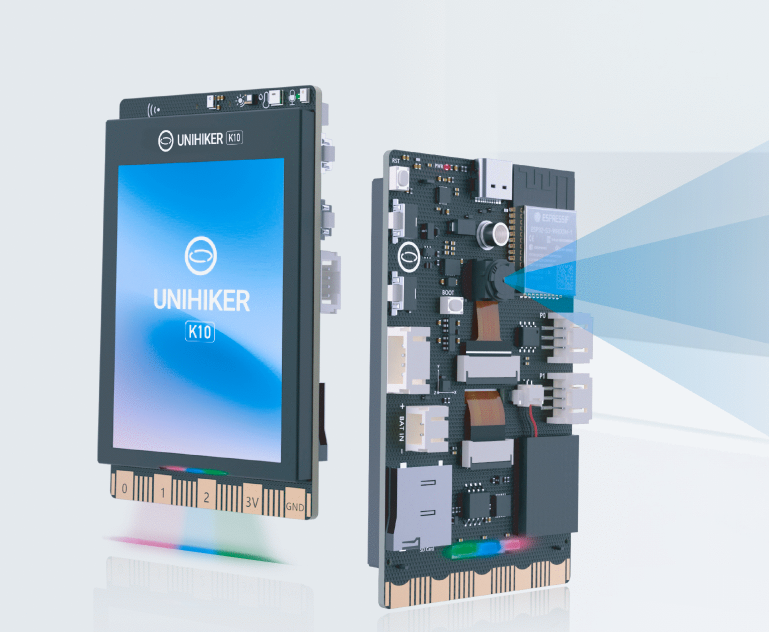
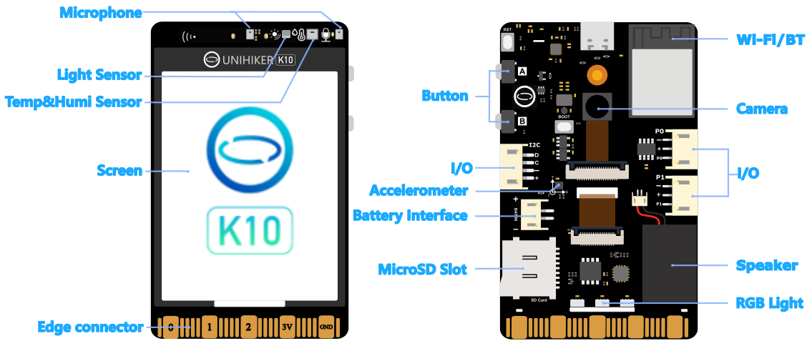
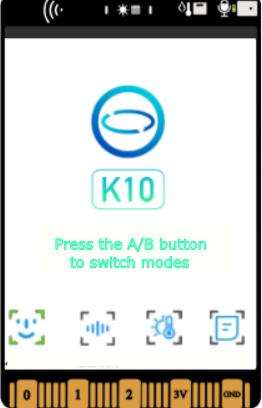
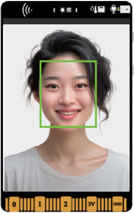
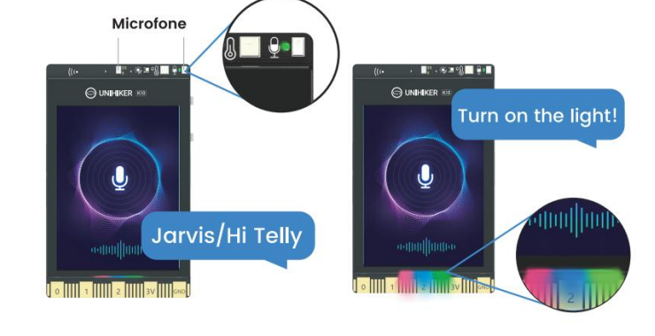
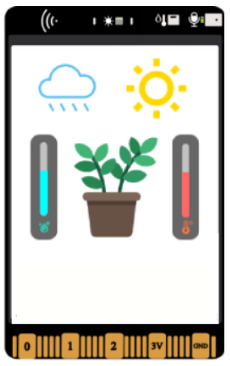
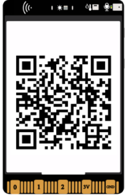

## **UNIHIKER K10**
**Introuction** 
UNIHIKER K10 is a development and learning board designed for rapid experience and learning of artificial intelligence, which meets the learning needs of programming, IoT and AI. The board integrates LCD color screen, WiFi Bluetooth, camera, microphone, speaker, RGB indicator, multiple sensors and rich expansion interfaces. With the highly integrated on-board resources, sensor control, IoT applications, and artificial intelligence projects such as face recognition, voice recognition, and speech synthesis can be easily realized without the need to connect additional devices during the teaching process.

 

**Feature** 

- Integrated camera & built-in algorithms for offline image detection
- Integrated microphone & built-in algorithm for offline speech recognition
- Integrated speaker & built-in algorithm for offline speech synthesis
- 2.8-inch colour screen for clearer data presentation
- Rich interface, compatible with multiple programming software, good scalability

**Layout** 

## **Quick Start**
- Use a USB cable to connect the USB-C to your PC/Mac or to a 5V adapter
- And wait for the K10's screen to display a logo, which means that K10 is ready to go. 

- After successful boot-up, K10 runs the factory built-in program, you can quickly experience the most of the K10 features.  (K10 in the document is the abbreviation of K10 of the UNIHIKER K10) 

!!! Note 
    Please make sure the USB cable is plugged directly into the USB port of your computer, do not use intermediate components such as extension cables or USB dock, and make sure the USB cable has a data transfer function.

**Face Detection Mode** 

- Press button B to switch to the "Face Detection" mode, when a face appears in the picture taken by the camera, the recognition frame will automatically frame out the face. 

**Voice recognition Mode** 

- Press button B again to switch to “voice recognition” mode, you can wake up K10 by speak "Jarvis" or "Hi Telly", then speak command word like turn on the light, turn off the light, play animation, play a game or play music and other operations through the screen prompts, through voice control commands. 

!!! Note 
    To use play music function in the voice recognition mode. You need to prepare a 32G (or below) TF card, and then format it into FAT32 mode, and store a music file with the name of "music.wav" in it to play the music.

**Sensor Mode** 

- Press button B again to switch to “Sensor” mode, at this mode the screen will display a plant. When blowing against the temperature and humidity sensor in the upper right corner of the board, it will simulate rain to water the plant; when it doesn't rain for a long time, the plant will wither; when irradiating the ambient light sensor in the upper right corner of the board with a strong light, the sun will become bigger to simulate sunlight; when it rains and there is enough light, the plant will bloom. 

**QR Display Mode** 

- Press the button B again to switch to “View Tutorial” mode, and scan the QR code through your cell phone to view the tutorial of K10. 

## **Supported Platform**
As an MCU-based development board, the Unihiker K10 is compatible with the following mainstream programming platforms.
Please refer to the system requirements for each programming platform to select the appropriate programming software.

| **Platform** | Platform version requirements | Windows | MacOS | GNU Linux|
| --- | --- | --- | --- | --- |
| **[Mind+](GettingStarted/gettingstarted_mindplus.md)** | V1.8.1 RC1.0 | ✅ | ❌️ | ❌️ |
| **[Arduino IDE](GettingStarted/gettingstarted_arduinoide.md)** | All version | ✅ | ✅ | ✅ |
| **[Platform IO](GettingStarted/gettingstarted_platformio.md)** | All version | ✅ | ✅ | ✅ |
| **[MicroPython](GettingStarted/gettingstarted_mpy.md)** | All version | ✅ | ✅ | ✅ |

## **Tips**
**Battery Power Supply** 
After burning a programme for the K10 in Mind+ or other IDE, the programme will be stored in the board's Flash and will not be lost during a power failure, so when the K10 is re-powered it will run the programme that was uploaded last time.

**Power Supply** 

- Supports power supply via Type-C port, 5V DC.
- Supports power supply via on-board PH2.0 battery port, 3.0~6.0V DC. Recommend power source: 3.7V Lipo battery or three AA/AAA cells.
- Supports power supply via edge connector
- Supports power supply via expansion board

**TF card** 
We recommend using genuine SanDisk cards sold by DFRobot: [32GB Class 10](https://www.dfrobot.com/product-1715.html).
Using an unknown brand of memory card may cause problems such as card read/write failure and program crash.
If you use a 32GB or higher memory card, you need to format the card into FAT32 format.

