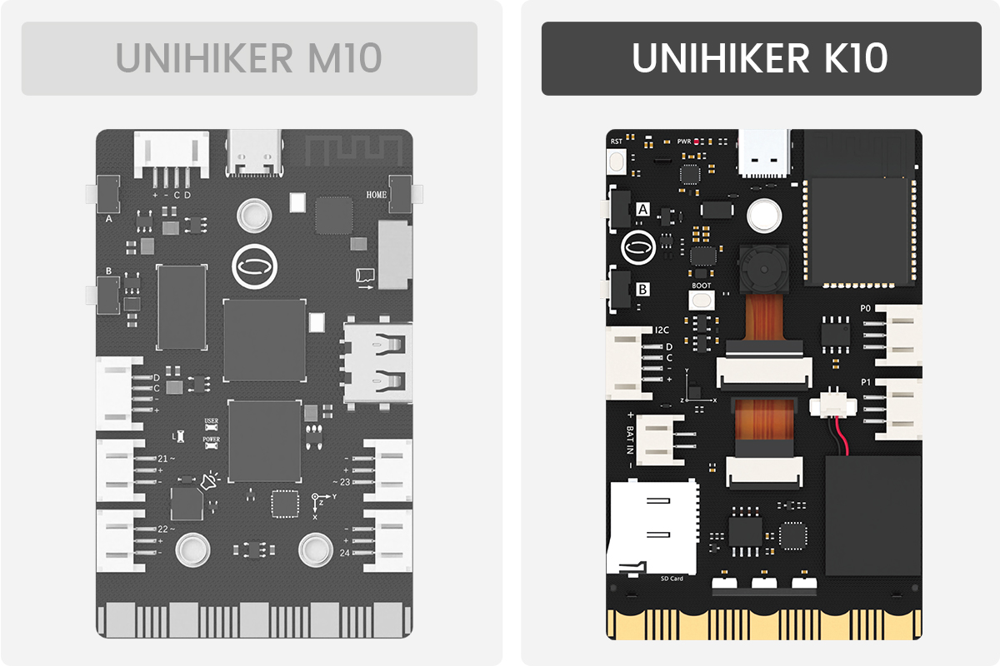
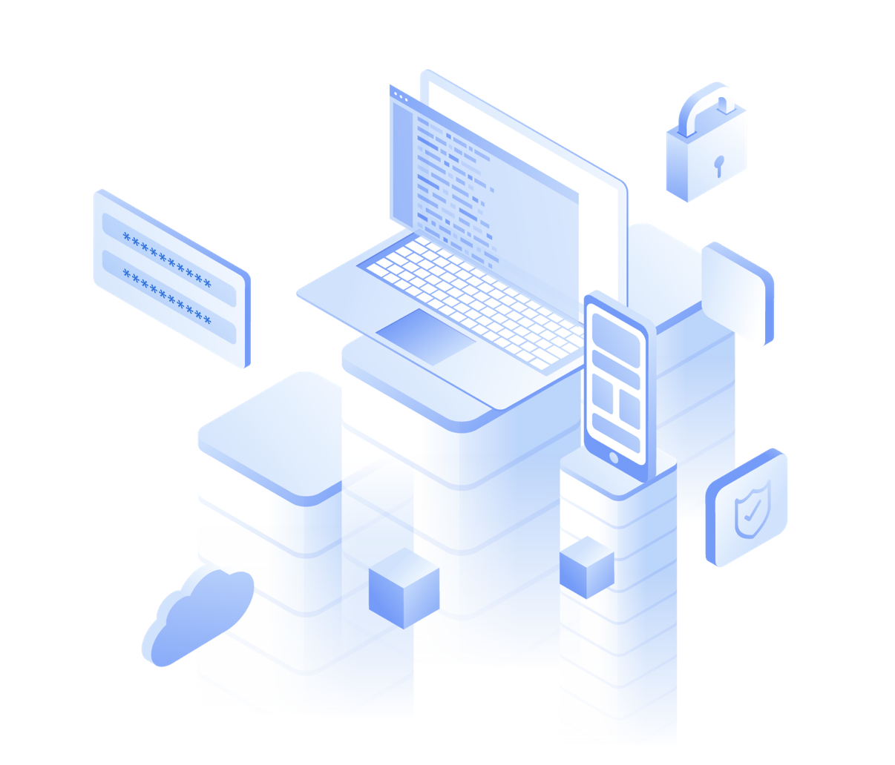
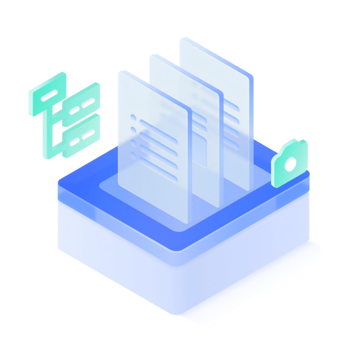
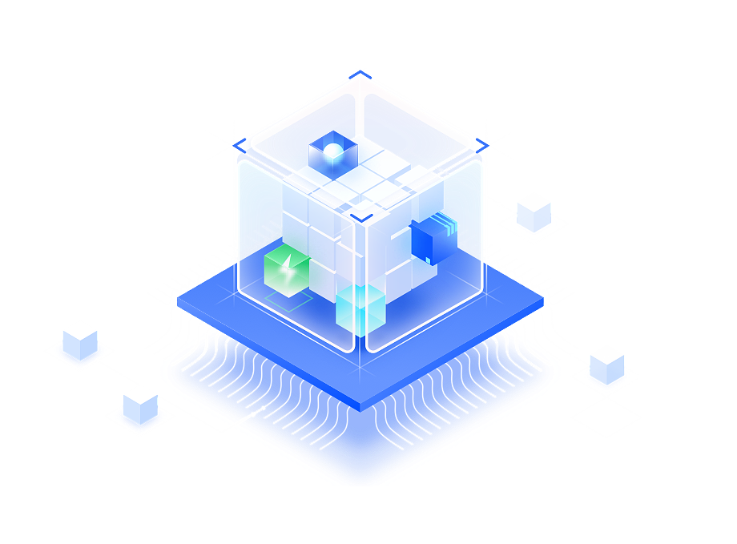

# **Welcome to UNIHIKER K10 Documentation**
Unleash your imagination and embark on a new journey with UNIHIKER K10.

!!! note
      The UNIHIKER M10 and K10 can be distinguished simply by the presence or absence of a camera and USB-A port on the back.

-   :material-format-list-group: &nbsp; __[Getting Started][start]__  
      Essential for Beginners
    &nbsp;__[{width=230, style="display:block;margin: 0 auto"}][start]__

    __&nbsp;[Mind+][MindPlus] | &nbsp; [Arduino IDE][arduinoide] | &nbsp; [Platform IO][platformio] |&nbsp; [MicroPython][micropython]__ 

-   :material-file-tree: &nbsp; __[Examples][examples]__  
      Get Started Quickly Through Projects
    &nbsp;__[{width=198, style="display:block;margin: 0 auto"}][examples]__  

    __&nbsp;[Graphical Coding][Graphical(Mind+)] | [Arduino IDE/PlatformIO][Arduino IDE/PlatformIO] | [MicroPython][Micropython]__

-   :material-folder-open: &nbsp; __[Code reference][Blocks reference(Mind+)]__  
      API reference
    &nbsp;__[{width=198, style="display:block;margin: 0 auto"}][Blocks reference(Mind+)]__  

    __&nbsp;[Blocks reference][Blocks reference(Mind+)] | [Arduino/PlatformIO API][Arduino/PlatformIO API] | [MicroPython API]__

-   :material-information: &nbsp; __[Hardware Reference][specification]__  
      Hardware-Related Information
    &nbsp;__[{width=198, style="display:block;margin: 0 auto"}][specification]__  

    __&nbsp;  [Specification][specification] | [Download][download]__

  [start]: get-started.md
  [examples]: Examples/examples_mindplus.md
  [MindPlus]: GettingStarted/gettingstarted_mindplus.md
  [micropython]: GettingStarted/gettingstarted_mpy.md
  [arduinoide]: GettingStarted/gettingstarted_arduinoide.md
  [platformio]: GettingStarted/gettingstarted_platformio.md
  [Graphical(Mind+)]: Examples/examples_mindplus.md
  [Arduino IDE/PlatformIO]: Examples/examples_arduinoide.md
  [Micropython]: Examples/examples_mpy.md
  [Blocks reference(Mind+)]: CodeReference/CodeReference_blocksReference.md
  [Arduino/PlatformIO API]: CodeReference/CodeReference_arduinoide.md
  [Onboard function]: HardwareReference/hardwarereference_onboardfunction.md
  [specification]: HardwareReference/hardwarereference_specs.md
  [download]: HardwareReference/hardwarereference_stepschematic.md

