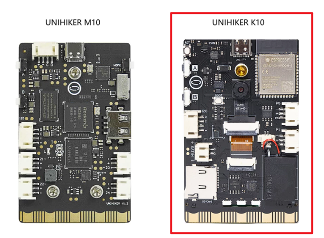

# **Welcome to UNIHIKER K10 Documentation**
Unleash your imagination and embark on a new journey with UNIHIKER K10.

The UNIHIKER M10 and K10 can be distinguished simply by the presence or absence of a camera and USB-A port on the back.

-   :material-format-list-group: &nbsp; __[Getting Started][start]__  
      Essential for Beginners
    &nbsp;__[{width=230, style="display:block;margin: 0 auto"}][start]__

    __&nbsp;[Mind+][MindPlus] |&nbsp; [MicroPython][micropython]__

-   :material-file-tree: &nbsp; __[Examples][examples]__  
      Get Started Quickly Through Projects
    &nbsp;__[{width=198, style="display:block;margin: 0 auto"}][examples]__  

    __&nbsp;[Graphical Coding][Graphical Coding] | [MicroPython Coding][Micropython Coding]__

-   :material-folder-open: &nbsp; __[Code reference][blocks reference]__  
      API reference of Mind+
    &nbsp;__[{width=198, style="display:block;margin: 0 auto"}][blocks reference]__  

    __&nbsp;[Blocks reference][blocks reference] | [MicroPython API]__

-   :material-information: &nbsp; __[Hardware Reference][intruduction]__  
      Hardware-Related Information
    &nbsp;__[{width=198, style="display:block;margin: 0 auto"}][intruduction]__  

    __&nbsp;[Onboard function][Onboard function] |&nbsp; [System Framework][system-framework] |&nbsp; [Specification][specification] |&nbsp;  [Board Overview][overview] |&nbsp; [Dimension][dimension] |&nbsp; [Sch & 3D File][3dfile]__

  [start]: get-started.md
  [examples]: Examples/examples_mindplus.md
  [MindPlus]: GettingStarted/gettingstarted_mindplus.md
  [micropython]: GettingStarted/gettingstarted_mpy.md
  [Graphical Coding]: Examples/examples_mindplus.md
  [Micropython Coding]: Examples/examples_mpy.md
  [blocks reference]: CodeReference/CodeReference_blocksReference
  [intruduction]: HardwareReference/hardwarereference_introduction.md
  [Onboard function]: HardwareReference/hardwarereference_onboardfunction.md
  [system-framework]: HardwareReference/hardwarereference_sysframwork.md
  [specification]: HardwareReference/hardwarereference_specs.md
  [overview]: HardwareReference/hardwarereference_boardoverview.md
  [dimension]: HardwareReference/hardwarereference_dimension.md
  [3dfile]: HardwareReference/hardwarereference_stepschematic.md

