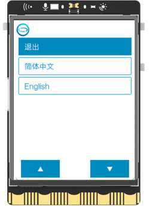
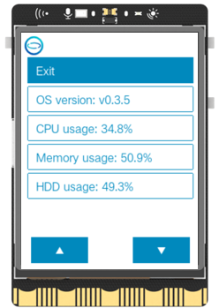
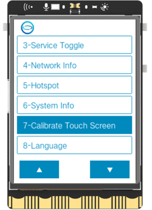
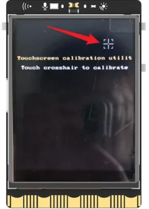
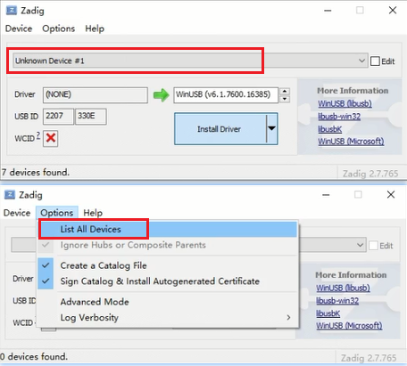
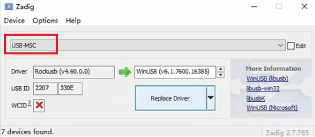

# UNIHIKER OS
If you need to update your UNIHIKER system to the latest version or restore a malfunctioning system, you can follow these steps to flash a new OS. Please note that the UNIHIKER comes with a Linux operating system based on Debian and various built-in features, which may be updated periodically.

## **1. File Backup**

- Before re-flashing the OS image, please note that all files on the UNIHIKER, including those in the root directory, will be cleared and cannot be restored. We recommend backing up any necessary files before proceeding with the firmware flashing process.
- To save personal files from the root directory before flashing the OS, you can use the SMB function to copy them to your computer. After the OS is refreshed, you can copy the files back to the UNIHIKER. Please note that hidden files will not be copied.

## **2. Download OS file**
Before burning the system image, you need to download the image file first. You can choose the appropriate image file according to the release log.

- [click here](./unihiker_os_image.md)

## **3. Burning OS**
After preparing the system image file and UNIHIKER, you can choose the appropriate burning tool according to your situation.

- [click here](./unihiker_os_burn.md)

## **4. Initial Setup**
After the system image is burned, the system is in its initial state, and you need to select the language and calibrate the touch screen.

- 1.On the language selection screen, you can use the AB buttons to move the cursor up and down, and the Home button to confirm your selection. After making your selection, the UNIHIKER will reboot.
!!! note
    If you accidentally select the wrong language, you can reselect your desired language from the [Home Menu](https://www.unihiker.com/wiki/homemenu).  

- 2.After selecting your language, the UNIHIKER logo will appear. Press the HOME button to enter the HOME menu. Use the A and B buttons to move the cursor up and down, and use the HOME button to confirm. Select "Enter" to check the system information and make sure that the system version matches the version of the system image that was just installed. If it does, then the system image has been successfully burned.

- 3.After flashing the system, the touch screen will need to be re-calibrated before use. To do this, select "Calibrate touch screen" in the HOME menu. The screen will display five touch points in sequence. Click on each touch point, and the system will restart to complete the calibration process.

## **5. FAQ**

| **Q** | **If the device to be burned is not displayed, what should I do?** |
| --- | --- |
| A | First, make sure your computer can access the UNIHIKER board correctly. When the board is powered on normally and displays the logo on the screen, you should be able to access the board's webpage menu by entering 10.1.2.3 in your web browser.Then, make sure to follow the steps for burning the system image carefully. It's important to turn off the board and disconnect it from power first, then press and hold the Home button before connecting the USB cable to the PC to let the board enter system image burning mode. |

| **Q** | **The system burning is complete and the progress reaches 100%, but the UNIHIKER still cannot boot up after one minute.** |
| --- | --- |
| A | Maybe the system file is not fully downloaded. You can try to downloading the file from a different source. |

| **Q** | **What should I do if I get stuck at the "Starting" or "Installing Driver" step for more than 5 minutes?** |
| --- | --- |
| A | Restart the burning tool and try burning again. If it still exists, power off the board and re-enter the burning mode, then restart the burning tool to burn. or try using the Command-line Tool.If it still doesn't work, you can try reinstalling the driver, or changing the computer. |

| **Q** | **How to install the driver manually?**  |
| --- | --- |
| **A** | Download the driver package,and run zadig as an administrator: [driver](https://zadig.akeo.ie/) |
| 1 | To select the unihiker option in the Zadig list, unplug and hold the home button while plugging in the unihiker (checking or unchecking "List All Device" in Options refreshes the list). Click "Install Driver" to install the driver. When prompted, check "Always trust..." and click "Install." The installation is successful when "successfully" appears.    |
| 2|After the driver is successfully installed, unplug the unihiker USB, then hold the Home button while plugging it back in. The dropdown list in Zadig should now show "USB-MSC" or "Unknown Device." Click "Replace Driver" and wait until "successfully" appears, indicating the installation is complete.     |
| 3| After completing the previous step, unplug the unihiker USB, then hold the **Home** button while plugging it back in. Next, run the flashing tool as an administrator and try flashing the image again. If a progress bar appears, the process is working correctly.|
| **Note:** |- Do not use other driver installation tools. - If **Rockusb Device** appears in **Device Manager**, right-click and uninstall it. |

| **Q** | **How can I create a full image backup for the UNIHIKER?** |
| --- | --- |
| A | [click](https://www.dfrobot.com/forum/topic/327538) |

| **Q** | **How to use a working unihiker to flash the firmware onto another unihiker??** |
| --- | --- |
| A |  [click here](https://www.dfrobot.com/forum/topic/339927) |

If you encounter any issues that cannot be resolved during use, please don't hesitate to contact us through either of the methods listed below:

1. Join our UNIHIKER channel by the link https://discord.gg/rvvfNCvBKv.
2. Send emails to our mailbox: unihiker@dfrobot.com  
