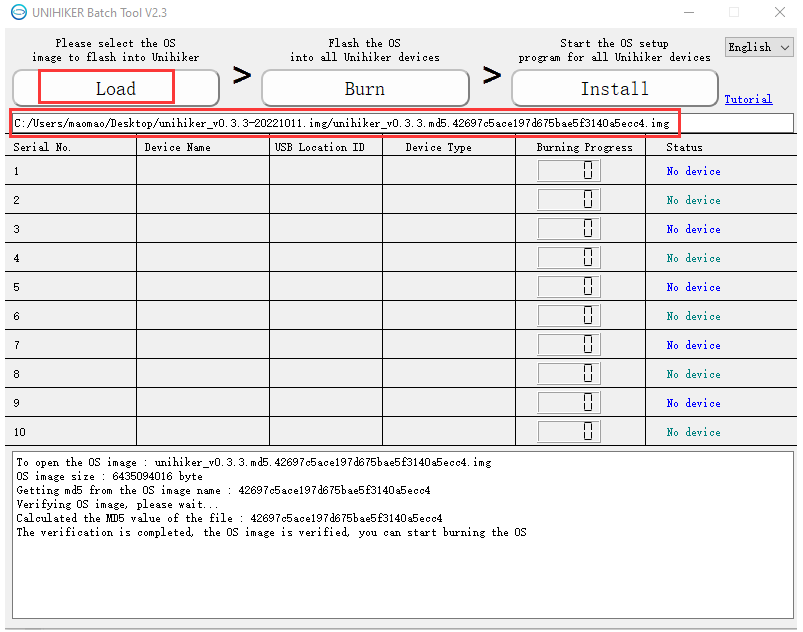
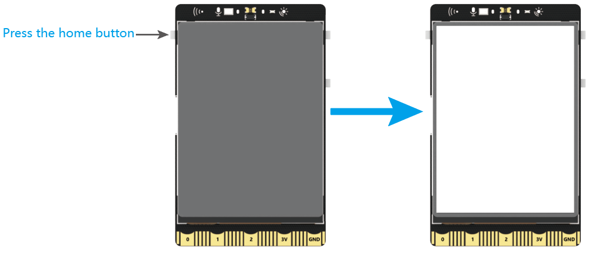
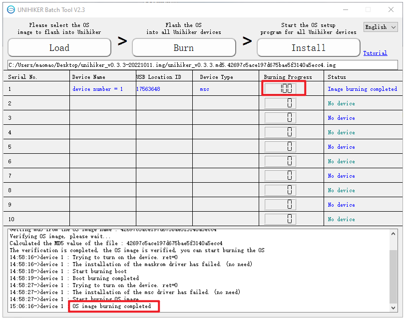

## **Burning tool**
You need to use the Command-line Tool to burn the system image. If you are using Windows, you can also choose a batch burning tool with a GUI interface.

## **1.1 Batch Tool for Windows**

**Windows version (no installation required, just extract and run):**

| **Download channel** | **Windows** | 
| --- | --- | 
| **Download:** | [Click to download](https://download3.dfrobot.com.cn/unihiker/Burner/UNIHIKER_Batch_Tool_V2.3_2023.4_en.zip) | 
| **Download from Google Drive:** | [Click to download](https://drive.google.com/drive/folders/1JU73SOyN5VmpB6ilbxVNvCB9qXfc-Qo-?usp=sharing) | 

### **1.2 Load OS file**

- To use the UNIHIKER Batch Tool, open the UNIHIKERBatchTool.exe file as an administrator and click on the Load button. Select the system image (img) file and the file path will be displayed below.

!!! note
    The V2.3 image burning tool now includes a file verification function. After loading the system file, the md5 verification will be performed on the file, which may take between 30 seconds to 5 minutes depending on the computer's performance. If the md5 value after the file name is inconsistent, it will prompt that the image is damaged.  



### **1.3 Enter firmware flashing mode**

- Before using the batch tool, please disconnect the UNIHIKER from the power source and remove the memory card.
- To enter firmware flashing mode, hold down the Home button on the board and connect it to your computer via USB cable. The board will display a white screen and should be recognized as a new device by the software.
- Once the software has recognized the board as a new device, you can release the Home button. If you need to flash multiple boards at the same time, simply repeat the steps above for each board.



### **1.4 Start burning**

- Once the board to be flashed is recognized, click on "Burn" to begin the firmware flashing process. If this is the first time connecting the board, the driver will be installed before flashing can begin.

!!! note
    While the firmware is being flashed, check the output information in the lower window. If it seems to be stuck at a certain step for more than 5 minutes, please refer to the troubleshooting section at the end of the page for possible solutions.

### **1.5 Burning Completed**

- If you are flashing multiple boards, you will need to wait for each one to reach 100% or prompt an error before proceeding. Once the progress reaches 100%, the firmware flashing process is complete.


### **1.6 Install System**

- Once the firmware has finished flashing, click on "Install" to begin the installation process. The software will control all UNIHIKERs to restart and complete the installation of the new system.
- The new system will be automatically installed on the UNIHIKER, and it may restart multiple times during the process, which usually takes about one minute. Once the installation is complete, the board will stay on the language selection screen.
- During the installation process, please do not operate or power off the board. If a mistake is made, please re-flash the system.


## **2.1 Command-line Tool**

Unihiker's CPU is made by Rockchip, so we can use Rockchip's tool and execute commands to burn the system image.

### **2.2 File Preparation**
To burn the OS for Unihiker, you need to prepare three files:  
1. The img file of Unihiker's OS image.  
2. The loader boot bin file of Unihiker.  
3. rkdeveloptool file suitable for your platform.  

- file 1 can be downloaded from the official Unihiker documentation, which is universally compatible with all platforms
- file 2 and 3 will be provided in the following article.

### **2.3 bin&rkdeveloptool**
Here are the pre-compiled file packages of .bin and rkdeveloptool for download.

- Ubuntu (AMD64):
Tested Platform: i9-12900 + Ubuntu 20.04 LTS
Download Link:[Download](https://dfimg.dfrobot.com/64228321aa9508d63a42c28b/wiki/1cb234325cca25ec876cd0ff70850217.7z)  
MD5: 844413f0581c0b4ba906f540d4115807  

- Debian (arm64):
Tested Platform: Unihiker  (Tips: You can use one UNIHIKER to burn a system image to another UNIHIKER.)
Download Link:[Download](https://dfimg.dfrobot.com/64228321aa9508d63a42c28b/wiki/522d9307c8d8ef6dcb9a77156b260eed.zip)  
MD5: 6ab4abfe40dd037e0079142f71c06cd4

- MacOS (x86):
Tested Platform:  MacBook Pro(intel)
Download Link:[Download](https://dfimg.dfrobot.com/64228321aa9508d63a42c28b/wikien/40095db3d69862ae2ad3bf82b3d813c4.7z)  
MD5: 11d5058e85fad1b2a2194c0ff699a649  

- MacOS (arm64):
Tested Platform: Mac mini(M1)
Download Link:[Download](https://dfimg.dfrobot.com/64228321aa9508d63a42c28b/wikien/e3053945dcf6a62e1c7c38555ce3ac1b.7z)
MD5: 6d10d7ddd0f233030c67c99a676585ad  

- Windows:
Tested Platform: i3-12100 + Win11 64bit
Download Link:[Download](https://dfimg.dfrobot.com/64228321aa9508d63a42c28b/wiki/b4ab152645022f4cf66d4f392e1d5a92.7z)
MD5: 24d9ab6b5608b43e39eb130563f5b9d8

If there is no platform suitable for you, you can compile rkdeveloptool for your platform from the following repository and extract the .bin file from the above packages.

Repository Link: https://github.com/rockchip-linux/rkdeveloptool


### **2.4 Enter flashing mode**

- Disconnect the UNIHIKER board from the power source (the memory card also needs to be removed)

- Press and hold the Home button on the board , and connect the board to your computer via USB cable. Then the board will enter the firmware flashing mode and display a white screen. The software should recognize the board as a new device.

- Release the Home button now.


### **2.5 Burning**
#### Linux Platform

> Reminder: After downloading the file, verify the MD5 value to ensure the downloaded file is complete.

First, perform the following preparations in the file manager or command line:  
1. Extract the downloaded rkdeveloptool file to obtain the burner_linux_amd64 or burner_linux_arm64  folder, which contains the files burner.sh,rk3308...bin, and rkdeveloptool.  
2. Place the downloaded Unihiker system image file (.img file) into the burner_mac folder.  

Then, perform these operations in the terminal:  

```bash

# Grant executable permission
 #amd64
sudo chmod -R 777 burner_linux_amd64
cd burner_linux_amd64
 #arm64
 #sudo chmod -R 777 burner_linux_arm64
 #cd burner_linux_arm64
#List the identified devices. If it is empty, it means that the board has not entered the flashing mode.
rkdeveloptool ld
# Execute the script to burn the image. Wait for the progress to reach 100%, the board will restart automatically twice during this period. Please do not do anything. After about 1 minute, the image burning is completed when the language selection screen appears on the screen.
sudo bash burner.sh
```

#### MacOS Platform

> Reminder: After downloading the file, verify the MD5 value to ensure the downloaded file is complete.

First, perform the following preparations in the file manager:  
1. Extract the downloaded rkdeveloptool file to obtain the burner_mac folder, which contains the files burner.sh,rk3308...bin, and rkdeveloptool.  
2. Place the downloaded Unihiker system image file (.img file) into the burner_mac folder.  

Then, perform these operations in the terminal:  

```bash
# First, navigate to the parent directory of the burner_mac folder using the 'cd' command.
# Grant executable permission
sudo chmod -R 777 burner_mac
cd burner_mac
#List the identified devices. If it is empty, it means that the board has not entered the flashing mode.
#When executing the following command, if it is intercepted by the system, please open "Security & Privacy" and choose to allow the request for "rkdeveloptool".
./rkdeveloptool ld
# Execute the script to burn the image. Wait for the progress to reach 100%, the board will restart automatically twice during this period. Please do not do anything. After about 1 minute, the image burning is completed when the language selection screen appears on the screen.
./burner.sh
```

#### Windows Platform

> Reminder: After downloading the file, verify the MD5 value to ensure the downloaded file is complete.

First, perform the following preparations in the file manager:  
1. Extract the downloaded rkdeveloptool file to obtain the burner_win folder, which contains the files flash.bat, rk3308...bin, and rkdeveloptool.exe  
2. Place the downloaded Unihiker system image file (.img file) into the burner_win folder.  

Then, perform these operations in the terminal:  

```bash
# First, navigate to the parent directory of the burner_win folder using the 'cd' command.
cd burner_win
#List the identified devices. If it is empty, it means that the board has not entered the flashing mode.
rkdeveloptool.exe ld
#bruner the OS  image, and make sure to replace the file name with the actual name of the img file.
flash.bat unihiker_v0.3.5.md5.9acbf38210ef954d5e9a0c1389830732.img
```

---  


