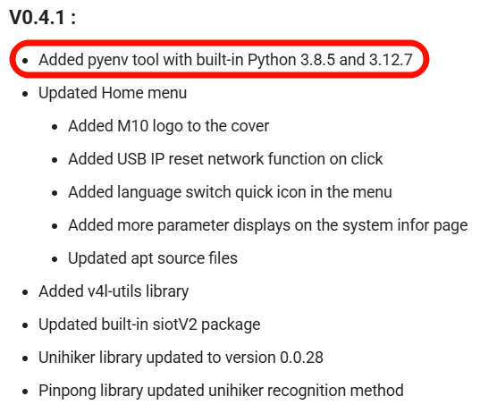
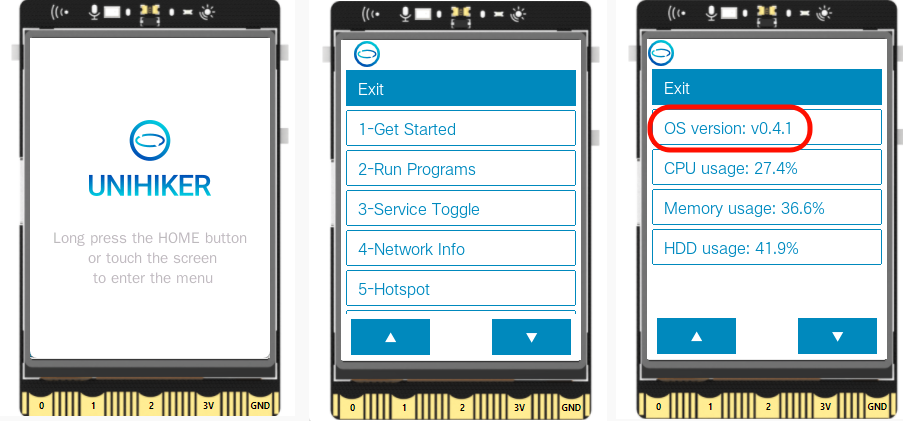
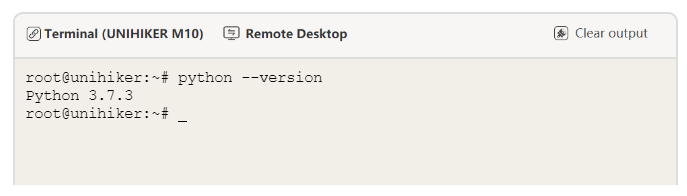
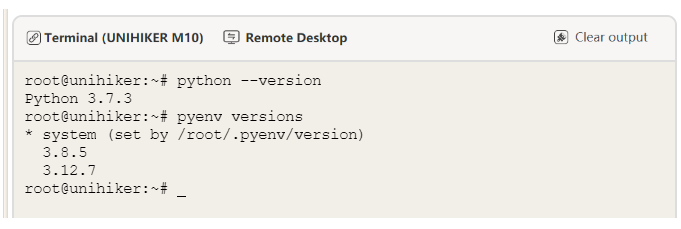
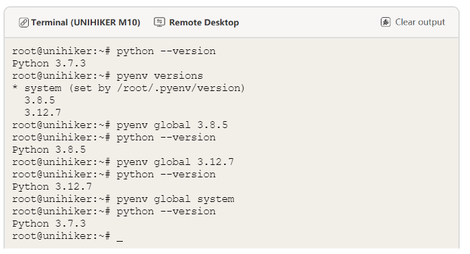

##  Preface
The UNIHIKER M10 is a development board running the Debian 10 operating system, capable of running full Python3. Since Debian 10 comes with Python 3.7 by default, some newer libraries, especially AI-related ones, may require higher versions of Python, such as 3.8 or 3.12.

Because the UNIHIKER M10 runs Linux, multiple Python versions can be installed. The `pyenv` tool is designed to manage different Python versions. It can install or uninstall various Python versions and direct the system's default `python` and `pip` commands to any of these versions.

> Note: Tools like `conda`, `miniconda`, or `miniforge` can also manage multiple Python versions, but they consume more resources and are not recommended for use on the UNIHIKER board.

## Installing pyenv
There are two methods to install `pyenv` on the UNIHIKER M10:
1. **(Recommended)** Use system version 0.4.1 or later. Starting from version 0.4.1, `pyenv` and multiple Python versions are pre-installed, eliminating the need for additional installation.

 

> To check the system version: Go to `Home Menu > System Info`.
> To upgrade the system: Visit [https://www.unihiker.com/wiki/SystemAndConfiguration/UnihikerOS/unihiker_os_image/#os-image](https://www.unihiker.com/wiki/SystemAndConfiguration/UnihikerOS/unihiker_os_image/#os-image).

 

2. Manually install `pyenv` on the UNIHIKER board.
This requires basic Linux terminal command-line knowledge. Follow instructions here:
[https://github.com/liliang9693/unihiker-pyenv-python/blob/master/README.md](https://github.com/liliang9693/unihiker-pyenv-python/blob/master/README.md).

## Using pyenv
Once `pyenv` is installed, connect to the UNIHIKER terminal to check versions or switch between them.
> Note: Pay attention to spaces and hyphens in commands. Copy (`Ctrl+C`) and paste (`Ctrl+V`) commands directly into the terminal.

- **Check the current Python version.**
If unsure about the current Python version, use this command or check `System Info` in the Home menu (available in system versions 0.4.1 and above).

```bash
python --version
```

 

- **List installed Python versions under `pyenv`.**
This command displays all Python versions managed by `pyenv`. Here, `system` refers to the default Python 3.7, and the asterisk (`*`) indicates the currently active version.

```bash
pyenv versions
```

 

- **Switch Python versions:**
Use these commands to switch versions. After switching, verify with the previous version-checking command.
> Note: Each Python version uses a unique `pip` repository path. While the default (`system`) includes many pre-installed libraries, newer Python versions initially have only minimal libraries (e.g., `setup`, `unihiker`, `pinpong`). If errors like `no module xxxx` occur after switching, manually install missing libraries via .

```bash
pyenv global 3.8.5
```

```bash
pyenv global 3.12.7
```

```bash
pyenv global system
```

 

## Additional Commands

- **List all installable Python versions:**
```bash
pyenv install --list
```

- **Install a specific Python version (e.g., 3.9.7):**
```bash
pyenv install <version>
```

- **Refresh the version list:**
Run after installing a new version and check with `pyenv versions`.
```bash
pyenv rehash
```

- **Uninstall a Python version:**
Cannot uninstall `system`.
```bash
pyenv uninstall <version>
```