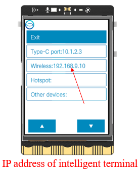
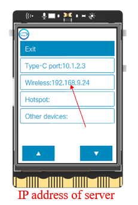
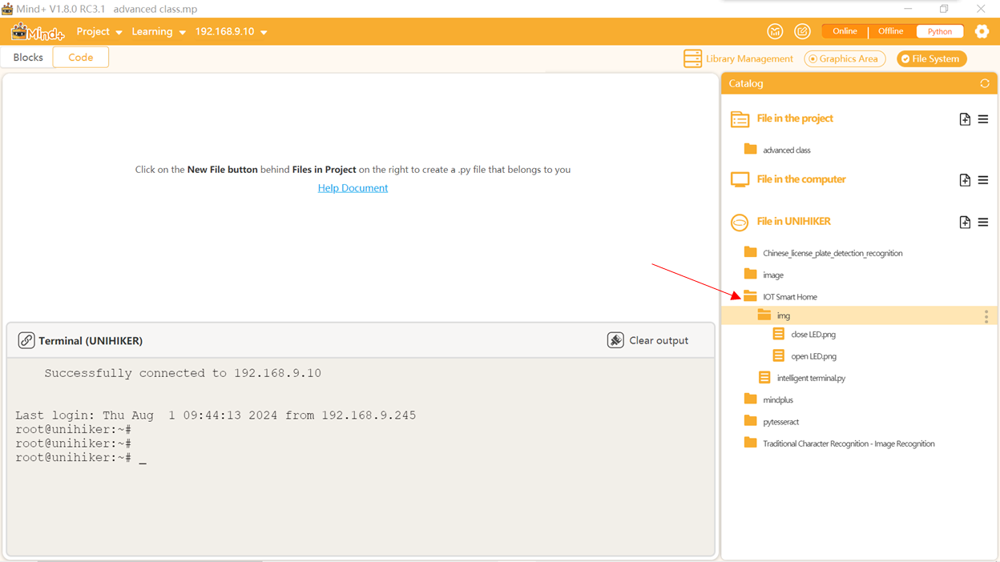
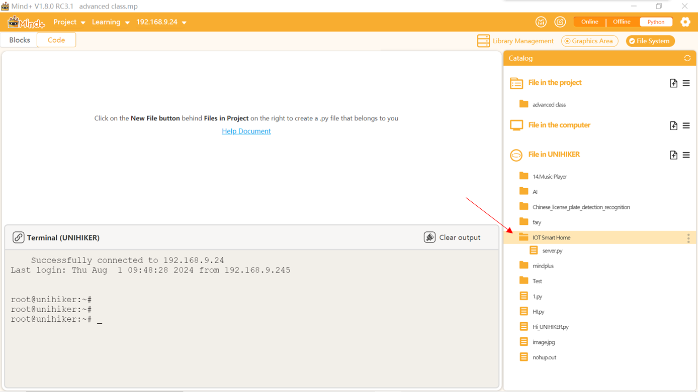

## **Project Introduction**
In the previous example, we combined sensors with a single blank board to create multiple small devices. However, in real IoT scenarios, it is often necessary to collect data from various locations and consolidate it into a central platform for remote access. Therefore, in this example, we will use 2 UNIHIKERs to design a multi-node smart IoT furniture system and simulate a real IoT scenario.  

In this project, you will need 2 UNIHIKERs connected to the same LAN segment as your computer. The second UNIHIKER will act as a server by opening the SIoT application separately. The humidity and temperature data detected by the first UNIHIKER will be displayed on its screen and also sent to the SIoT IoT platform on the second UNIHIKER. You will then subscribe to the messages received by the IoT platform on the second UNIHIKER and display the humidity and temperature data from the first UNIHIKER on its screen. Additionally, you will be able to control the on/off function of the LED lights on the first UNIHIKER through the second UNIHIKER.  


## **Hardware Required**

- [UNIHIKER](https://www.dfrobot.com/product-2691.html)
- [Gravity: Digital Piranha LED Module - Green](https://www.dfrobot.com/product-632.html)
- [Gravity: DHT11 Temperature & Humidity Sensor For Arduino](https://www.dfrobot.com/product-174.html)

  

## **Code**
To enable simultaneous code debugging and data communication between two UNIHIKERs, it is crucial to have them connected to the same local area network address, such as '192.168.9'. This ensures efficient communication and debugging capabilities between the two UNIHIKERs.
  

  

To start, we need to import the folder 'IOT Smart Home' into two UNIHIKERs and create a new folder called 'img' in the 'intelligent terminal' UNIHIKER to store the necessary photos.  



The code is divided into two main parts: intelligent terminal and server-side. Please refer to the code comments for specific details.  

```python
# UNIHIKER1 detects temperature and humidity data and sends it to the SIoT IoT platform enabled by UNIHIKER2.
from unihiker import GUI  # Import the GUI module of the unihiker library
from pinpong.board import Board, PinImport the GUI module of the unihiker library# Import Board and Pin modules from the pinpong library
from pinpong.board import DHT11  # Import DHT Library
import time  # Import time library
import siot  # Import the siot library

'''Initialize the board and hardware'''
Board().begin()  # Initialize the blank board
led = Pin(Pin.P24, Pin.OUT)  # Pin initialization to level output
dht11 = DHT11(Pin(Pin.P21))  # Initialize pin 21 to analog input mode

'''Set IoT platform connection parameters'''
SERVER = "192.168.9.24"  # MQTT server IP, enter personal actual IP
CLIENT_ID = ""  # On SIoT, CLIENT-ID can be left blank
IOT_UserName = 'siot'  # user name
IOT_PassWord = 'dfrobot'  # password
IOT_pubTopic1 = 'LED'  # Humidity topic, "Project Name/Equipment Name"
IOT_pubTopic2 = 'moisture' 
IOT_pubTopic3 = 'temperature' 
# Define callback function
def sub_relay(client, userdata, msg):  # Accept subscription information function
    topic = msg.topic
    payload = msg.payload.decode()
    '''Define the operation when receiving instructions'''
    print("\nTopic:" + topic + " Message:" + payload)  # Print the received information
    if payload == 'relay on':  # If you receive 'relay on'
        img.config(w=240, h=320, image='img/open LED.png')
        led.value(1)
        text_mode.config(text="open")
    elif payload == 'relay off':  # If you receive 'relay off'
        img.config(w=240, h=320, image='img/close LED.png')
        led.value(0)  
        text_mode.config(text="close")

siot.init(CLIENT_ID, SERVER, user=IOT_UserName,password=IOT_PassWord)  # Initialize and ensure that the entered username and password are correct
siot.connect()  # Connect to the Siot IoT platform
siot.subscribe(IOT_pubTopic1, sub_relay)  # Subscribe to IoT platform messages
siot.loop()  # circulate

'''Display screen interface'''
gui = GUI()  # Instantiate GUI object
img = gui.draw_image(w=240, h=320, image='img/close LED.png')  # display background
title = gui.draw_text(x=50, y=10, text='IoT Smart Home', font_size=14, color='red')
gui.draw_round_rect(x=20, y=40, w=200, h=42, r=8, width=1)
gui.draw_text(x=30, y=52, text='The state of LED:', font_size=11)  # display text
text_mode = gui.draw_text(x=160, y=47, color="red", text="close", font_size=14)  # Display LED status
gui.draw_round_rect(x=20, y=230, w=200, h=80, r=8,width=1)
gui.draw_text(x=30, y=235, color="black", text='humidity:')  # Display the text 'Humidity value:'
gui.draw_text(x=30, y=270, color="black", text='temperature:')  # Display the text 'Humidity value:'
text_value1 = gui.draw_text(x=120, y=238, color="red", text="", font_size= 11)  # Display humidity value data
gui.draw_text(text="%RH",x=160,y=238,font_size=12, color="red")
text_value2 = gui.draw_text(x=150, y=272, color="red", text="", font_size= 11)  # Display temperature value data
gui.draw_text(text="℃",x=190,y=272,font_size=12, color="red")

while True:  # circulate
    moisture_value = dht11.humidity()  # Read simulated values
    temperature_value = dht11.temp_c()  # Read simulated values

    siot.publish(IOT_pubTopic1, flag)  # Publish information to the IoT platform
    siot.publish(IOT_pubTopic2, moisture_value) 
    siot.publish(IOT_pubTopic3, temperature_value)

    text_value1.config(text = moisture_value)  # Update humidity value
    text_value2.config(text = temperature_value)  # Update humidity value
    time.sleep(1)  # Delay 1 seconds
```
```python
from unihiker import GUI  # Import the GUI module of the unihiker library
import time  # Import time library
import siot  # Import the siot library

'''Set IoT platform connection parameters'''
SERVER = "192.168.9.24"  # MQTT server IP address, enter personal actual IP address
CLIENT_ID = ""  # On SIoT, CLIENT-ID can be left blank
IOT_UserName = 'siot'  # user name
IOT_PassWord = 'dfrobot'  # password
IOT_pubTopic1 = 'LED'  # topic, "Project Name/Equipment Name"
IOT_pubTopic2 = 'moisture' 
IOT_pubTopic3 = 'temperature' 
global moisture_value 
moisture_value = 0
global temperature_value
temperature_value = 0
global LED_state
LED_state = 0
# Define callback function
def click_A():  # Define the operation when clicking button A - switch images
    siot.publish(IOT_pubTopic1, 'relay on')  # Release information 'relay on' to IoT platform
    text_mode.config(text = "open")
def click_B():  # Define the operation when clicking button B - switch images
    siot.publish(IOT_pubTopic1, 'relay off')  # Release information 'relay off' to IoT platform
    text_mode.config(text = "close")
    
'''Display screen page'''
gui=GUI()  # Instantiate GUI object
# Display filled rectangle
gui.fill_rect(x=0, y=0, w=240, h=320, color="#99CCFF")  # Draw a filled rectangle to display as background
# show heading
title = gui.draw_text(x=50, y=10, text='IoT Smart Home', font_size=14, color='blue')
# Display part1 data (rounded rectangle, text)
gui.draw_round_rect(x=20, y=40, w=200, h=42, r=8, width=1)  # Display rounded rectangle
gui.draw_text(x=30, y=52, text='The state of LED:', font_size=11)  # Display the text 'Light Value'
text_mode = gui.draw_text(x=160, y=52, color="red", text="close", font_size=11)

# Display data status (rounded rectangles, text)
gui.draw_round_rect(x=20, y=90, w=200, h=80, r=8,width=1)
text1 = gui.draw_text(x=30, y=95, text='humidity：', font_size=11, color='black') 
text_value1 = gui.draw_text(x=100, y=95, color="red", text="", font_size=12)  # Display humidity value data
gui.draw_text(text="%RH",x=140,y=95,font_size=12, color="red")
text3 = gui.draw_text(x=30, y=135, text='temperature：', font_size=11, color='black')
text_value2 = gui.draw_text(x=130, y=135, color="red", text="", font_size=12)  # Display temperature value data
gui.draw_text(text="℃",x=170,y=135,font_size=12, color="red")
# Display manual controls (rounded rectangles, buttons, text)
gui.draw_round_rect(x=20, y=180, w=200, h=80, r=8,width=1)

button_A = gui.add_button(x=30, y=200, w=70, h=30, text="open", onclick=click_A)
button_B = gui.add_button(x=140, y=200, w=70, h=30, text="close", onclick=click_B)

# Define callback function
def sub_cb(client, userdata, msg): 
    topic = msg.topic  # Topic data stored in variables
    payload = msg.payload.decode()  # Convert payload message data into a string and store it in a variable
    print("\nTopic:" + topic + " Message:" + payload)  # Terminal printing data
    if topic == IOT_pubTopic2:
        moisture_value = payload
        text_value1.config(text = str(moisture_value))  # Update screen display data
    if topic == IOT_pubTopic3:
        temperature_value = payload
        text_value2.config(text = str(temperature_value))

siot.init(CLIENT_ID, SERVER, user=IOT_UserName,password=IOT_PassWord)  # Initialize and ensure that the entered username and password are correct
siot.connect()  # Connect to the Siot IoT platform
siot.subscribe(IOT_pubTopic1, sub_cb)  # Subscribe to Topic Data
siot.subscribe(IOT_pubTopic2, sub_cb)  
siot.subscribe(IOT_pubTopic3, sub_cb)
siot.loop()  # circulate

while True:  # circulate
    time.sleep(0.5)  # Delay by 0.5 seconds
```
## **Demo Effect**


---
