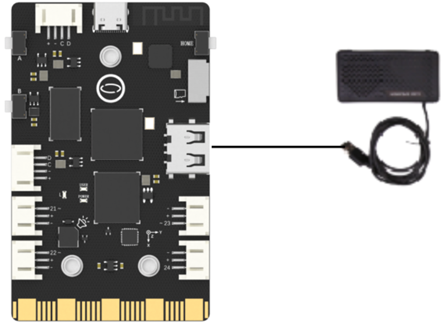

## Project Introduction
In this chapter, we have implemented a Speech Synthesis Assistant by using a USB external speaker.
To control a USB speaker using the UNIHIKER, we can use onboard USB interface. This will allow us to access and control the audio through the side interface of the board, which is connected to a microcontroller responsible for controlling onboard components and GPIO.
To control the audio, we can use the engine = pyttsx3.init()methods from the pyttsx3 library in Python. This will allow us to Control the synthesis of audio and play it according to the user's wishes through parameter settings. You can explore different functionalities and parameters of the pyttsx3 library to customize your DIY Speech Synthesis Assistant.

## Hardware Required

- [UNIHIKER](https://www.dfrobot.com/product-2691.html)
- USB speaker


**Code**
To create a DIY speech synthesis assistant, we can use the pyttsx3 library in Python. First, import pyttsx3 and use engine = pyttsx3.init() to initialize the audio output function. Then, we can use engine.setProperty() to set the volume and speed of audio output. To input text, we can use engine.say() and the Python library will automatically recognize the language and play it. To save the audio output, we can use the function engine.save(). You can experiment with different parameters and functions to customize your DIY Speech Synthesis Assistant project further.
```python
'''Voice Play Text'''
import pyttsx3  # Import pyttsx3 library
engine = pyttsx3.init()  # Initialize TTS engine and create engine objects
engine.setProperty('volume',1)  # Set the pronunciation volume (within the range of 0-1)
engine.setProperty('rate',120)  # Set the reading speed (within the range of 0-200)
engine.say("hello, i am unihiker")  # Read the content aloud in English
engine.save_to_file("hello, i am unihiker", "test.mp3")  # Save the content as audio (named test. mp3)
engine.runAndWait()  # Run the TTS engine and wait for the reading to complete
```
## Demo Effect


