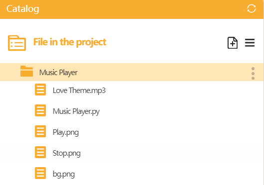
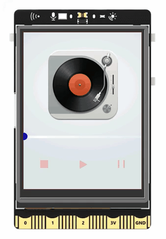

## Project Introduction
The audio playback function of UNIHIKER can be used to create a music player. This project utilizes the draw_image() method of the GUI() class in the UNIHIKER library to create the interface and buttons of the music player. The start_play(file) method of the Audio() class is used to control the start of playback, the pause_play() method is used to pause playback, the resume_play() method is used to continue playback, and the stop_play() method is used to stop playback and is tied to the button's callback function. Additionally, the draw_line() and draw_circle() methods of the GUI() class can be used to create a progress bar for the music player. The play_time_remain() method of the Audio() class can then be used to get the remaining playback time and bind it with the progress bar. Below is an example demonstrating the creation of a music player.  
{width=300, style="display:block;margin: 0 auto"} 

## Hardware Required

- [UNIHIKER](https://www.dfrobot.com/product-2691.html)
- USB speaker
## Code
To create the GUI interface for the music player, first create instances of GUI and Audio. Then, use the draw_image() method of the GUI object to create the image objects, including the background and three buttons of the music player. Use the draw_line() and draw_circle() methods of the GUI() class to create the progress bar of the music player.
In the second part, three callback functions are defined to handle the three buttons of the music player. In the callback function of the play button, starting or continuing playback is determined by checking the change of the flag variable. The start_play(file) method of the Audio() class is used to trigger the start of playback, and the pause_play() method is used to trigger the continuation of playback. In the callback functions of the pause button and the stop button, the pause_play() method and stop_play() method are used to trigger the pause and stop of playback, respectively.
In the main function, the play_time_remain() method of the Audio() class is used to obtain the remaining playback time and calculate the coordinate parameters. Then, the config() method of the line and circle objects is used to update the coordinate parameters of the progress bar, achieving the movement of the progress bar. This allows for a fully functional music player using the audio playback function of UNIHIKER.
**Note:**

1. The audio and image files need to be stored in the directory where this code is located. The file "Love Theme.mp3" needs to be downloaded and renamed online by oneself.

{width=400, style="display:block;margin: 0 auto"}   

2. Connect the USB speaker to the Type-A port of UNIHIKER.
```python
#  -*- coding: UTF-8 -*-

# MindPlus
# Python
from unihiker import Audio
from unihiker import GUI

# Event callback function
def button_click1():
    global flag
    u_audio.stop_play()
    flag = 0

def button_click2():
    global flag
    global time
    play.config(w=32)
    pause.config(w=14)
    stop.config(w=16)
    # Determine whether to start playing and continue playing
    if (flag == 0):
        u_audio.start_play("Love Theme.mp3")
        time = u_audio.play_time_remain()
    elif (flag == 1):
        u_audio.resume_play()
    flag = 1

def button_click3():
    play.config(w=16)
    pause.config(w=28)
    stop.config(w=16)
    u_audio.pause_play()


# Instantiated object
u_gui = GUI()
u_audio = Audio()

flag = 0

# Background picture
bg=u_gui.draw_image(image="bg.png",x=0,y=0)
# stop button
stop=u_gui.draw_image(image="Stop.png",x=34,y=261,onclick=button_click1)
# play button
play=u_gui.draw_image(image="Play.png",x=122,y=270,origin="center",onclick=button_click2)
# pause button
pause=u_gui.draw_image(image="Pause.png",x=199,y=269,origin="center",onclick=button_click3)

# progress bar
line=u_gui.draw_line(x0=0,y0=213,x1=0,y1=213,width=5,color="#CCCCFF")
circle=u_gui.fill_circle(x=0,y=212,r=7,color="#0000FF")


while True:
    # Progress bar move
    if (not (flag == 0)):
        duration = (((time - u_audio.play_time_remain()) / time) * 240)
        line.config(x1=duration)
        circle.config(x=duration)
        if (duration == 240):
            flag = 0
    # End of play
    if (flag == 0):
        line.config(x1=0)
        circle.config(x=0)
        play.config(w=16)
        pause.config(w=14)
        stop.config(w=16)
```
{width=300, style="display:block;margin: 0 auto"}
