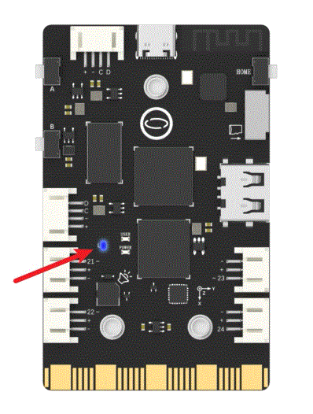

## Project Introduction
UNIHIKER is equipped with a microcontroller responsible for controlling onboard components and GPIO. Based on this functionality, we can control the onboard LED of UNIHIKER to flash. This project uses the Pin(Pin.P25, Pin.OUT).write_digital(signal) method of in the PinPong library of Python to control a blue LED (marked as L) located on the back of the board.
Below is an example of controlling the LED to flash.  
{width=300, style="display:block;margin: 0 auto"} 

## Hardware Required

- [UNIHIKER](https://www.dfrobot.com/product-2691.html)
## Code
In this example, the first step is to initialize UNIHIKER with Board().begin(). Then, the pin corresponding to the L LED is initialized as a digital output mode using Pin(Pin.P25, Pin.OUT). In the main loop, the value(1) method or write_digital(1) method of the L LED object is used to output a high level, which is maintained for 1 second. Following this, the value(0) method or write_digital(0) method of the L LED object is used to output a low level, which is also maintained for 1 second. This allows for the control of the onboard LED to flash using the microcontroller of UNIHIKER.
```python
#  -*- coding: UTF-8 -*-

# MindPlus
# Python
from pinpong.board import Board,Pin
import time

# initialization
Board().begin()

# The pin is initialized to level output mode, and P25 is the pin of the L light
led = Pin(Pin.P25, Pin.OUT)

while True:
    # output high level voltage
    # led.value(1)		# Method 1
    led.write_digital(1)	# Method 2
    time.sleep(1)

    # output low level voltage
    # led.value(0)		# Method 1
    led.write_digital(0)	# Method 2
    time.sleep(1)
```
## Demo Effect
{width=300, style="display:block;margin: 0 auto"}
