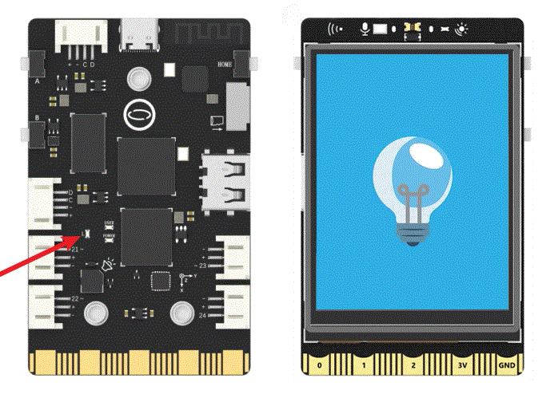

## Project Introduction
The A and B buttons on UNIHIKER can be used by the user, allowing for the creation of a project that involves a button-controlled LED. This project first checks whether the A and B buttons on UNIHIKER have been pressed, and then controls the blue LED located on the back of UNIHIKER to turn on and off. Additionally, different images are displayed on the screen to simulate the on and off state of the LED. In the PinPong library, there are two ways to use the buttons - the first is to directly read the query, and the second is to use interrupt event callbacks. Below is an example of controlling the LED to turn on and off using the A and B buttons.
{width=500, style="display:block;margin: 0 auto"} 

## Hardware Required

- [UNIHIKER](https://www.dfrobot.com/product-2691.html)
## Code 1
#### Query-based Invocation:
To begin, instantiate a GUI object and use draw_image() to create an image object. Then, initialize UNIHIKER with Board().begin() and set the pin corresponding to the L LED to a digital output mode using Pin(Pin.P25, Pin.OUT). In the main loop, use if (button_a.is_pressed()==True): and if (button_b.is_pressed()==True): to determine whether button A or button B has been pressed. If a button is pressed, use the write_digital() method of the led object to update the LED status and the config() method of the image object to change the displayed image. This allows for the control of the LED using the A and B buttons on UNIHIKER.
**Note:** When a button is pressed, it will return a value of True. If the button is not pressed, it will return a value of False.
```python
#  -*- coding: UTF-8 -*-

# MindPlus
# Python
from pinpong.extension.unihiker import *
from pinpong.board import Board,Pin
from unihiker import GUI

# Instantiate a GUI object
u_gui=GUI()
img=u_gui.draw_image(image="1.png",x=0,y=0)

# initialization
Board().begin()
led = Pin(Pin.P25, Pin.OUT)

while True:
    # Determine whether the button is pressed
    if (button_a.is_pressed()==True):
        led.write_digital(1)
        img.config(image="2.png")

    # Determine whether the button is pressed
    if (button_b.is_pressed()==True):
        led.write_digital(0)
        img.config(image="1.png")
```
## Code 2
#### Callback Invocation:
To begin, create a GUI object instance and use draw_image() to create an image object. Next, initialize the UNIHIKER board with Board().begin(). Then, set the pin corresponding to the L LED to a level output mode using Pin(Pin.P25, Pin.OUT). Define two interrupt event callbacks to update the LED state using the write_digital() method of the led object and change the displayed image using the config() method of the image object. Finally, use button_a.irq(trigger=trigger mode, handler=callback function) and button_b.irq(trigger=trigger mode, handler=callback function) to trigger the A and B buttons, respectively. This allows for the control of the LED using interrupt event callbacks for the A and B buttons on UNIHIKER.
**Trigger Parameter:** Trigger modes include rising edge (Pin.IRQ_RISING), falling edge (Pin.IRQ_FALLING), and level transition (Pin.IRQ_RISING+Pin.IRQ_FALLING).
```python
# -*- coding: utf-8 -*-
from pinpong.board import *
from pinpong.extension.unihiker import *
from unihiker import GUI

# Instantiate a GUI object
u_gui=GUI()
img=u_gui.draw_image(image="1.png",x=0,y=0)

# initialization
Board().begin()
led = Pin(Pin.P25, Pin.OUT)

# Interrupt Event Callback Function
def btn_a_rasing_handler(pin):
    led.write_digital(1)
    img.config(image="2.png")

# Interrupt Event Callback Function
def btn_b_rasing_handler(pin):
    led.write_digital(0)
    img.config(image="1.png")

# Rising Edge Trigger
button_a.irq(trigger=Pin.IRQ_RISING, handler = btn_a_rasing_handler)
button_b.irq(trigger=Pin.IRQ_RISING, handler = btn_b_rasing_handler)

while True:
    pass
```
## Demo Effect
{width=600, style="display:block;margin: 0 auto"}
