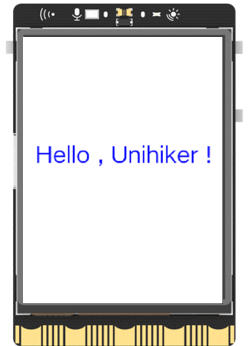

## **Project Introduction**
This project utilizes the dynamic display features of a flexible panel, providing the flexibility to adjust font color, size, and placement. It enables the presentation of any desired text. Below is an example that showcases the display of the phrase "Hello, Unihiker" on the screen.  

{width=300, style="display:block;margin: 0 auto"}  

## **Hardware Required**

- [UNIHIKER](https://www.dfrobot.com/product-2691.html)  

## **Code**
When utilizing the unihiker library to display text on the screen, the initial step is to create a GUI object. Then, the draw_text() function of the GUI object is used to generate a text object, specifying the desired content, coordinate position, font size, color, and other attributes of the text. In cases where certain attributes of the text need to be updated or modified, the config() function of the text object can be directly used to achieve this.  

```python
from unihiker import GUI
import time 


gui = GUI()

Text = gui.draw_text(text='Hello , Unihiker !',x=15,y=120,font_size=20)
Text.config(color='#0000FF')


while True:
    time.sleep(1)
```
## **Demo Effect**
{width=300, style="display:block;margin: 0 auto"}  

---  


