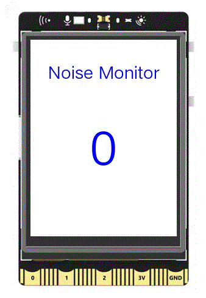

## Project Introduction
The UNIHIKER also comes with a microphone that can capture the intensity of ambient sound. This feature can be utilized to create a noise monitoring device, where the intensity of the environmental sound is displayed on the screen. Additionally, a noise threshold can be set, and when the sound intensity surpasses this threshold, a buzzer will sound as a warning. Below is an example of a noise monitoring device.  
{width=300, style="display:block;margin: 0 auto"} 

## Hardware Required

- [UNIHIKER](https://www.dfrobot.com/product-2691.html)
## Code
In this example, the UNIHIKER is initialized using the Board().begin() function. Then, an Audio object and a GUI object are instantiated, and two text objects are created using the draw_text() function. These text objects display the noise monitoring and corresponding noise values respectively. In the main loop, the sound_level() method of the Audio object is used to obtain the ambient sound intensity, and then the config() method of the text object is used to update the light value on the screen. At the same time, the sound intensity is checked to see if it exceeds the set threshold. If it does, the buzzer.pitch(frequency) function is used to emit an alarm sound, followed by the buzzer.stop() function to turn off the buzzer.
**Note:** As the microphone on the UNIHIKER is not a standard sound sensor capable of recording and performing voice recognition, it is connected to the CPU instead of the coprocessor. Therefore, the Audio class in the UNIHIKER library is used instead of the pinpong library to obtain the ambient sound intensity.
```python
#  -*- coding: UTF-8 -*-

# MindPlus
# Python
from pinpong.extension.unihiker import *
from pinpong.board import Board,Pin
from unihiker import Audio
from unihiker import GUI

Board().begin()

# Instantiate object
audio = Audio()
gui = GUI()
gui.draw_text(text="Noise Monitor",x=120,y=50,font_size=20, color="#0000FF", origin="center")
sound_text = gui.draw_text(text="",x=120,y=170,font_size=55, color="#0000FF", origin="center")

while True:
    # Update the displayed sound value
    sound_value = audio.sound_level()
    sound_text.config(text=sound_value)
    
    # Noise detection
    if (sound_value > 30):
        buzzer.pitch(392)
        time.sleep(0.1)
        buzzer.stop()
```
## Demo Effect

