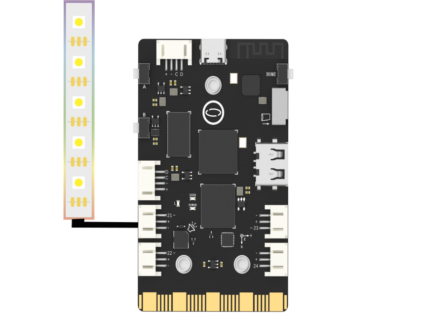

## **Project Introduction**
In this part, we will use an external light strips to achieve red, orange, yellow, green, blue, and purple colors.
UNIHIKER is equipped with a microcontroller responsible for controlling onboard components and GPIO.   

Based on this functionality, we can control the external light strips by Pin21. This project uses the np = NeoPixel(Pin(NEOPIXEL_PIN), PIXELS_NUM) method in the PinPong library of Python to control a NeoPixel LED externally connected through side pins of the board.
Here is an example of controlling the NeoPixel LED to blink.
![2-480P[00h00m00s-00h00m07s].gif](img/2_Colourful_Light_Strip/1721282022249-1ad244eb-5d0a-41f5-9850-052c6ae63bf6.gif)
## **Hardware Required**

- [UNIHIKER](https://www.dfrobot.com/product-2691.html)
- [WS2812 RGB](https://www.dfrobot.com.cn/goods-2629.html)

{width=400, style="display:block;margin: 0 auto"}
## **Code**
In this example, the UNIHIKER is first initialized with Board().begin(). Then, we use NEOPIXEL_PIN = Pin.P21 to initialize the pin. To define the number of lights, we use PIXELS_NUM = 7. Finally, we use np = NeoPixel(Pin(NEOPIXEL_PIN), PIXELS_NUM) to initialize the NeoPixel. In the main loop, we use the np[0] = (0, 255 ,0) function to change the color of the lights. We can also use the np.rainbow(0,7,0,0x0022FF) function to display a rainbow pattern. To achieve the desired results, two loops can be used to change the color of the lights and to turn them off sequentially.
```python
# -*- coding: utf-8 -*-

# Experimental effect: Control WS2812 single line RGB LED light
# Wiring: Use a Windows or Linux computer to connect a blank board, and connect the ws2812 light to the p21 port
import time
from pinpong.board import Board,Pin,NeoPixel

NEOPIXEL_PIN = Pin.P21
PIXELS_NUM = 7  # number of lights

Board("UNIHIKER").begin()  # Initialize, select board type, do not input board type for automatic recognition

np = NeoPixel(Pin(NEOPIXEL_PIN), PIXELS_NUM)

while True:
  np[0] = (0, 255 ,0)  # Set the RGB color of the first light
  np[1] = (255, 0, 0)  # Set the RGB color of the second light
  np[2] = (0, 0, 255)  # Set the RGB color of the third light
  np[3] = (255, 0, 255)  # Set the RGB color of the forth light
  np[4] = (255, 255, 0)  # Set the RGB color of the fifth light
  np[5] = (0, 255, 255)  # Set the RGB color of the sixth light
  np[6] = (255, 255, 255) # Set the RGB color of the seventh light
  time.sleep(1)

  np.rainbow(0,7,0,0x0022FF)  # Display the light strip in the form of a rainbow
  time.sleep(1)

  for i in range(7):
    np.rotate(1)  # Cycle to change the color of the light a beads
    time.sleep(1)

  for i in range(7):
    np.shift(1)  # Turn off the light beads in sequence
    time.sleep(1)

  np.clear()
```
## **Demo Effect**
![2-480P[00h00m00s-00h00m07s].gif](img/2_Colourful_Light_Strip/1721282070837-c76388ff-0d8b-4a56-982b-593a09caea0b.gif)


---
