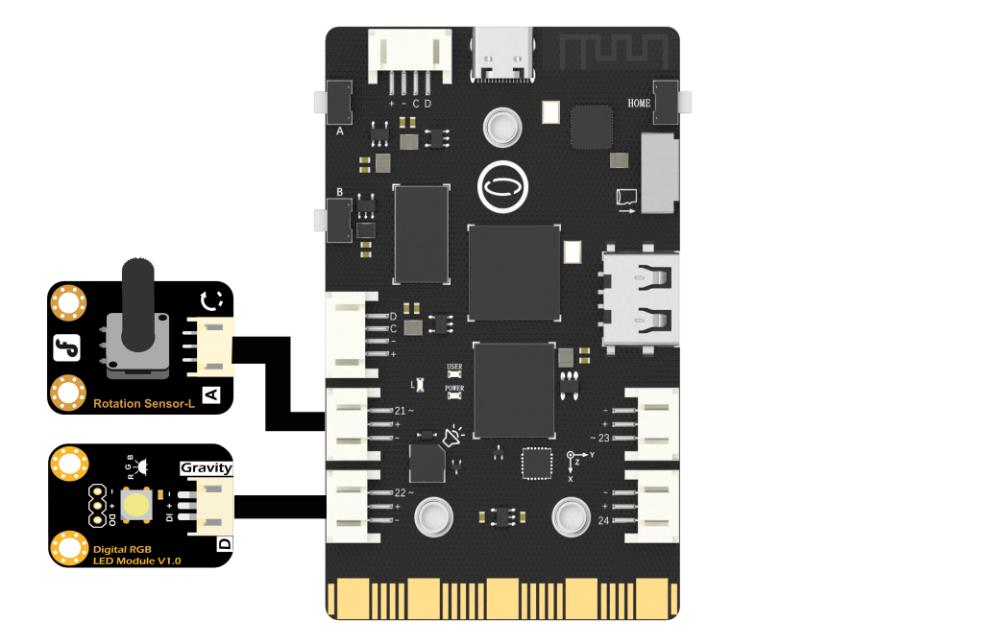

## **Project Introduction**
In this section, we used an external knob and an external adjustable color LED to achieve a RGB LED colour palette.
UNIHIKER is equipped with a microcontroller responsible for controlling onboard components and GPIO. Based on this functionality, we can control the external RGB LED by Pin22. At the same time, we control the LED by an external knob whose function is adc21 = ADC(Pin(Pin.P21)). This project uses the NEOPIXEL_PIN = Pin.P22 method in the PinPong library of Python to control the RGB LED externally connected through side pins of the board. 
Here is an example of controlling the konb to change the colour of the RGB LED. 
![4-480P[00h00m00s-00h00m09s].gif](img/4_RGB_LED_Color_Palette/1721282199734-6852abbc-134f-4a70-8f8c-30b78ffa79d3.gif)
## **Hardware Required**

- [UNIHIKER](https://www.dfrobot.com/product-2691.html)
- [Gravity: Analog Rotation Potentiometer Sensor for Arduino - Rotation 300°](https://www.dfrobot.com/product-87.html)
- [Gravity: Digital RGB LED Module](https://www.dfrobot.com/product-1848.html)


## **Code**
In this example, UNIHIKER is first initialized with Board().begin(). Then, we use NEOPIXEL_PIN = Pin.P22 to initialize the pin. As in the second section, the function that controls LED RGB in this article is np = NeoPixel(Pin(NEOPIXEL_PIN), PIXELS_NUM). In the main loop, we use the np[0] = (0, 255 ,0) function to change the colour of the lights. In this part, binary color matching is used to adjust the colour in lighting through multi judgment statements.
```python
# -*- coding: utf-8 -*-
# Experimental effect: Implement knob control over RGB LED lights
# Wiring: Use a Windows or Linux computer to connect a UNIHIKER main control board, Pin21 connects knob, Pin22 connects light
import time
from pinpong.board import Board,Pin,ADC,NeoPixel  # Import ADC class to implement analog input

Board("UNIHIKER").begin()  # Initialize, select board type, do not input board type for automatic recognition
NEOPIXEL_PIN = Pin.P22
PIXELS_NUM = 1  # Number of LEDs
np = NeoPixel(Pin(NEOPIXEL_PIN), PIXELS_NUM)

# Analog pin P0 P1 P2 P3 P4 P10 P21 P22
# Pass Pin into ADC to implement analog input
adc21 = ADC(Pin(Pin.P21))

while True:
  print("P21=", adc21.read())
  print("------------------")
  time.sleep(0.5)
  
  i = adc21.read()
  if i >= 0 and i <= 512:
     np[0] = (0, 0, 0)
  elif i > 512 and i <= 1024:
     np[0] = (0, 0 ,255)
  elif i > 1024 and i <= 1536:
     np[0] = (0, 255, 0)
  elif i > 1536 and i <= 2048:
     np[0] = (0, 255, 255)
  elif i > 2048 and i <= 2560:
     np[0] = (255, 0, 0)
  elif i > 2560 and i <= 3072:
     np[0] = (255, 0, 255)
  elif i > 3072 and i <= 3584:
     np[0] = (255, 255, 0)
  else:
     np[0] = (255, 255, 255)  # The above are all binary modulation of the lamp beads
```
## **Demo Effect**
![4-480P[00h00m00s-00h00m09s].gif](img/4_RGB_LED_Color_Palette/1721282199734-6852abbc-134f-4a70-8f8c-30b78ffa79d3.gif)
