## Downloading and Installing Thonny
In this tutorial, we will demonstrate how to download and install Thonny on your Windows, Mac, or Linux computer.  
### Requirements
● Windows - Win 7 or newer  
● Linux -  100MB or more  
● Mac OS X - Mac10.11 or later  
### Thonny
Thonny is an IDE specifically designed for Python beginners, featuring a friendly user interface and robust code editing, running, and debugging capabilities. It simplifies Python code writing, making it straightforward and easy. Thonny also supports connecting and programming the UNIHIKER through its built-in SSH remote functionality.  
### Download the Editor
Download the Thonny application that supports UNIHIKER.
● for Windows : [[Download]](https://img.dfrobot.com.cn/wiki/none/49990b1e1e72cb7c95f161be759c86ba.zip).
● for Linux and MacOS:[ [Select and download Thonny from the official Website]](https://thonny.org/)(Version 3.3.13 is better).
Tips: Thonny does not support Python versions below version 3.8 starting from version 4.x, which may prevent the UNIHIKER from connecting. Please use the link provided to download and install version 3.3.13.  
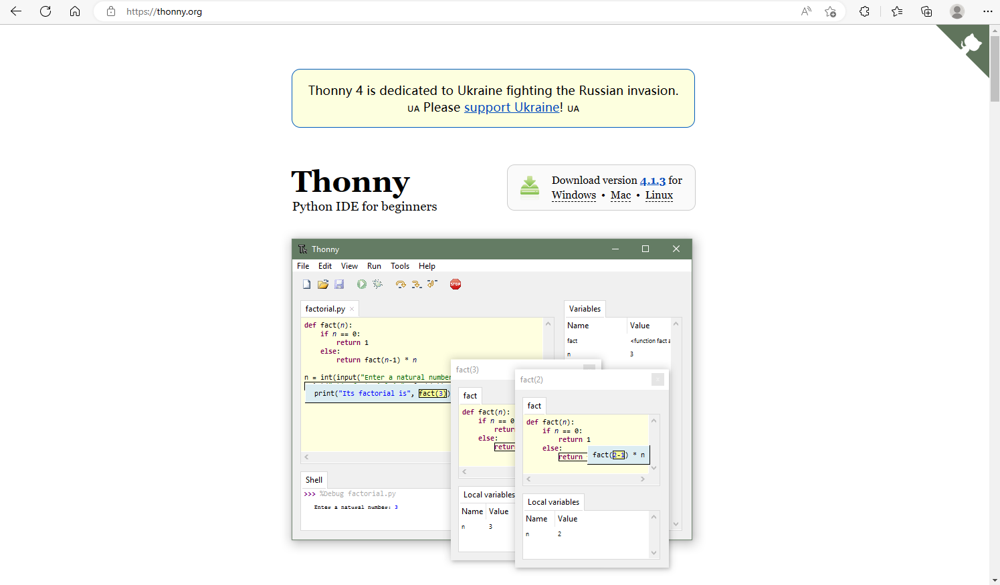
### Installation and open Thonny
#### Windows 
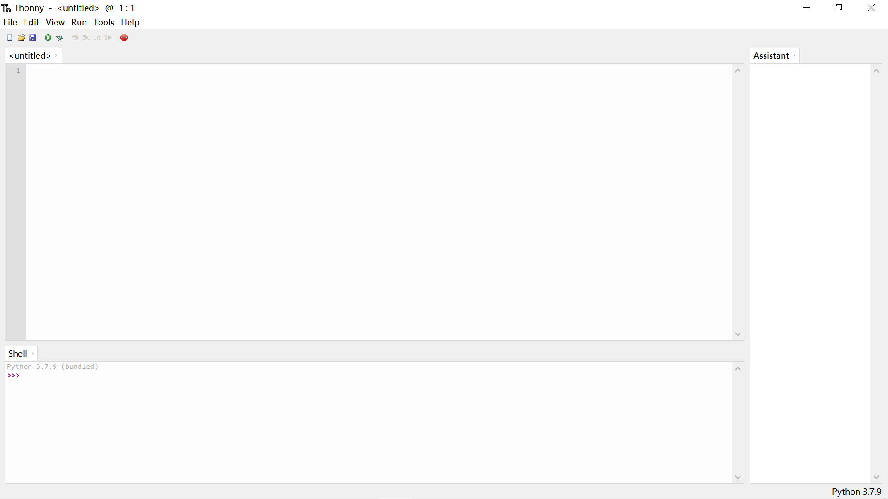
#### macOS
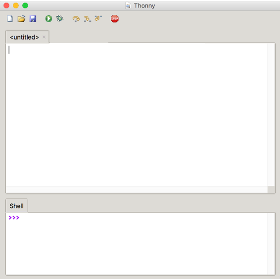{style="display:block;margin: 0 auto"}
#### Linux
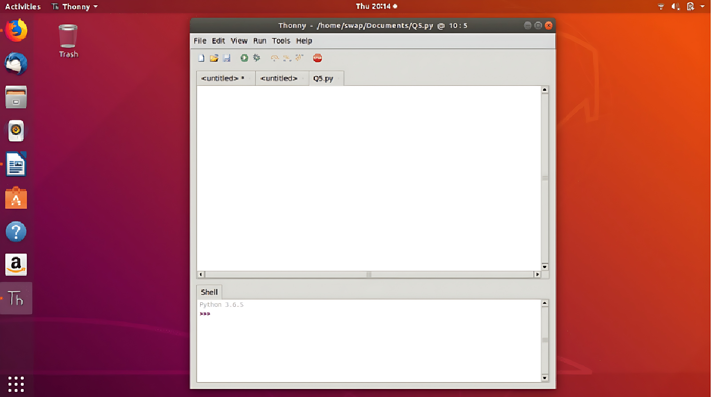
## Starting up the UNIHIKER
### Connect the UNIHIKER
Connect the UNIHIKER to your computer using the Type-C to USB cable. Once connected and powered on, the UNIHIKER logo will appear on the screen.  
{style="display:block;margin: 0 auto"}  
> Note1: Please ensure that you plug the USB cable directly into the computer's USB port without using an extension cord or dock. If you encounter any issues with the connection, please refer to the FAQ for a solution.  
> Note2: When the UNIHIKER is connected to your PC via USB, the IP address is fixed at 10.1.2.3. You can find the IP address in the "Home" menu of the UNIHIKER.  
## Run a simple example with Thonny
The Thonny software supports programming the UNIHIKER through Python code, you can create a simple example as follows.
(1) Launch Thonny and check the "Files" and "Shell" options in the "View" menu.  
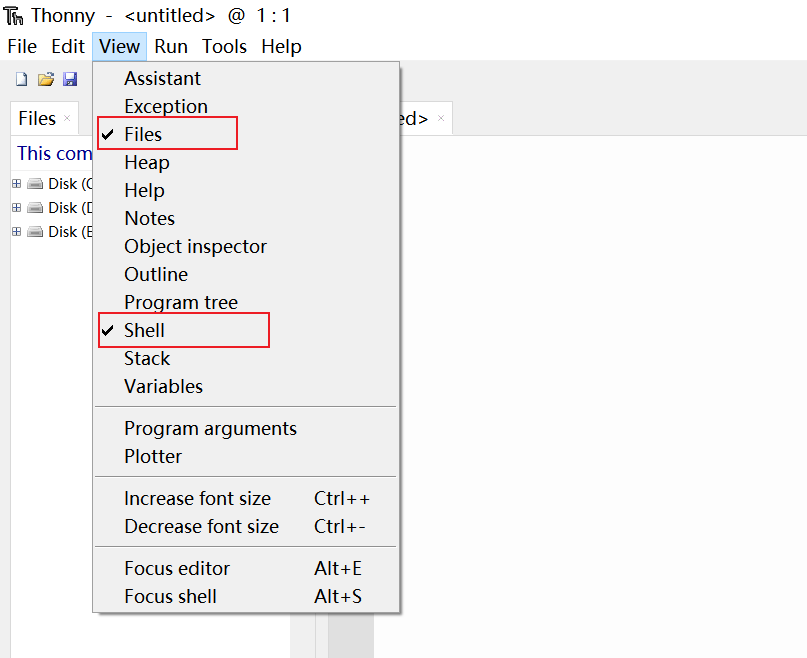{width=500, style="display:block;margin: 0 auto"}
(2) After completing the previous step, you will see a screen like this. The left side is the file directory area, and the right side consists of the code editing area and the terminal area.    

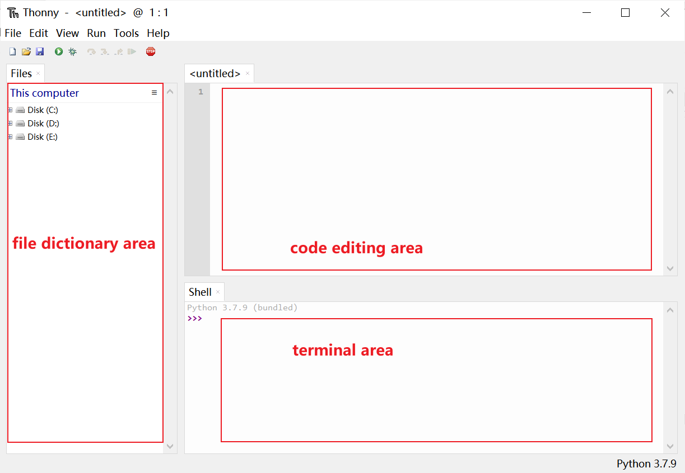{style="display:block;margin: 0 auto"}  

(3) To connect UNIHIKER using Thonny, you may follow these steps:

1. Click on "Select interpreter" in the "Run" menu.
2. Choose "Remote Python 3 (SSH)".
3. Input the Host (IP address) and Username as follows:
   - Host: 10.1.2.3
   - Username: root

This allows Thonny to connect to UNIHIKER via SSH for Python programming.
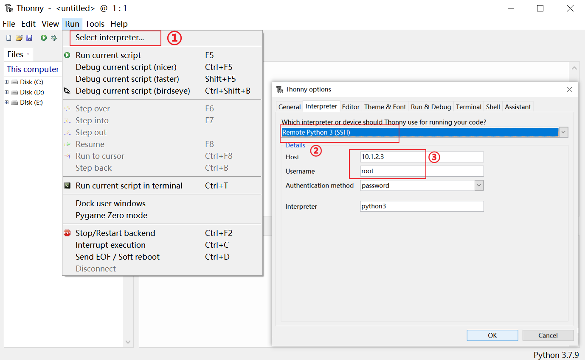  
  {width=300, style="display:block;margin: 0 auto"}
After that, it will prompt for a password. Enter the default password 'dfrobot' and select 'Save password' to remember it.  
  
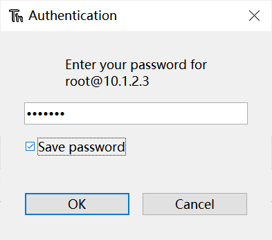{width=300, style="display:block;margin: 0 auto"}  
> Note1: When connecting UNIHIKER to the computer via a USB cable, the default IP address is '10.1.2.3', the default username is 'root', and the default password is 'dfrobot'.  
> Note2: If it prompts "Can't connect to '10.1.2.3' with user 'root': [WinError 10060]", you should verify whether the board is properly connected to the computer.    
  
Upon successful connection, the file directory will display the files within the board, and the terminal will switch to the remote terminal of the board.  
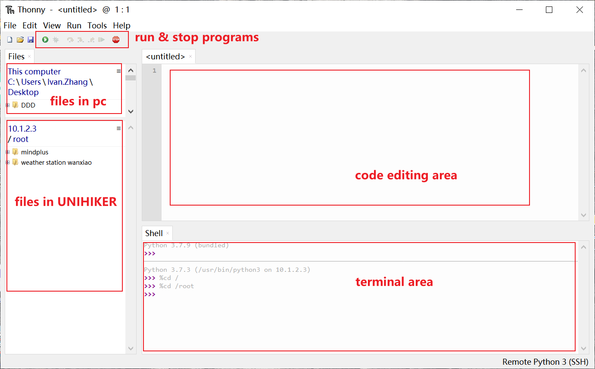  
  
(4) Then, we can click "new" option and "save" option to create a new file named "Hi UNIHIKER.py" 
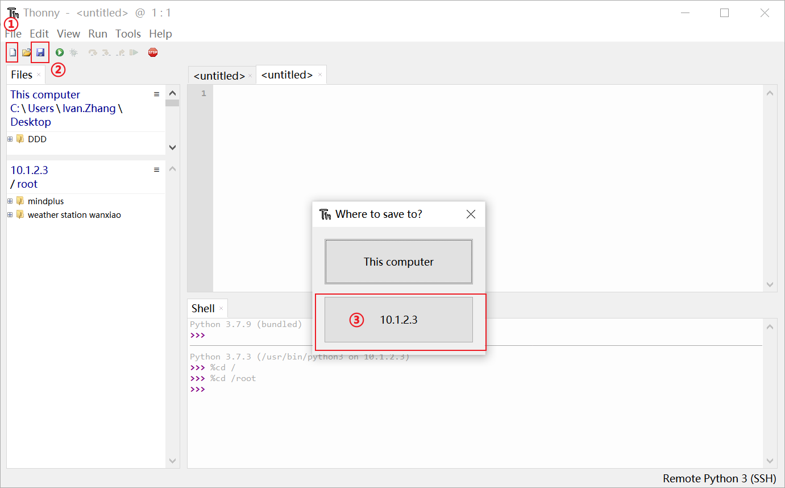
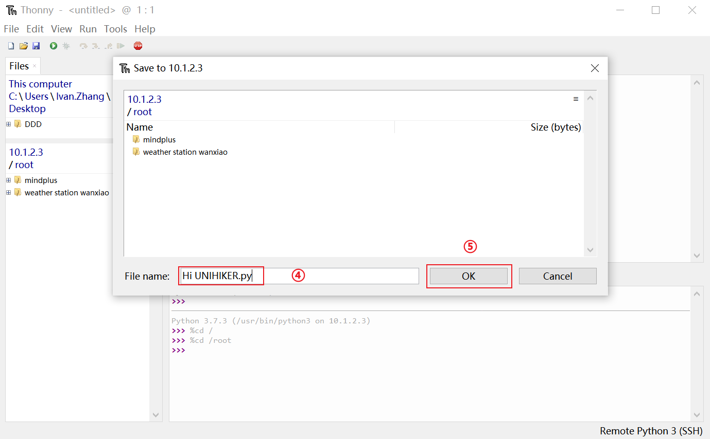  
  
(5) After creating the file,  you may insert this code into the code editing area of the file "Hi UNIHIKER.py" .Here's a code snippet that will display "HI UNIHIKER" on the screen.
```python
from unihiker import GUI
import time

gui = GUI()
#unihiker text
gui.draw_text(text="HI UNIHIKER",origin="center",x=120,y=160,color="#0066CC")

while True:
    time.sleep(1)
```
(6) Click the button as follows to run the program on the UNIHIKER .
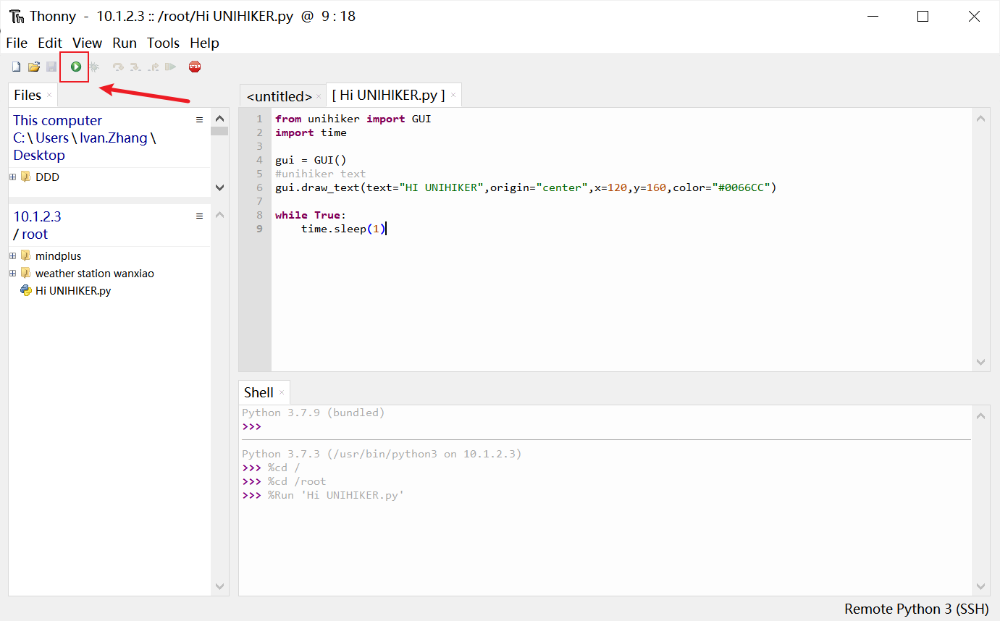
After running the code, the board will execute it, and you can observe the running result directly on the board itself.  
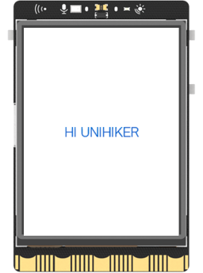{width=300, style="display:block;margin: 0 auto"}   
  
Congratulations, you have successfully implemented programming control for the UNIHIKER. Now, you can explore exciting projects or delve deeper into understanding the foundations of UNIHIKER. Remember, the possibilities are endless with UNIHIKER. Have fun exploring and learning!

1. Discover a wide range of straightforward programming exercises to improve your understanding of control structures with UNIHIKER: [Examples](https://www.yuque.com/joanna-rqvih/unihiker_wiki_en/ktu7u5wqrqocflu0)
2. Explore the utilization of supplementary Python libraries specifically related to UNIHIKER functionalities: [Reference](https://www.yuque.com/joanna-rqvih/unihiker_wiki_en/btd6oualns4g6fgd)
3. Gain insights into the built-in hardware capabilities of UNIHIKER: [Hardware ](https://www.yuque.com/joanna-rqvih/unihiker_wiki_en/ogm50gebc6wgp3dm)

