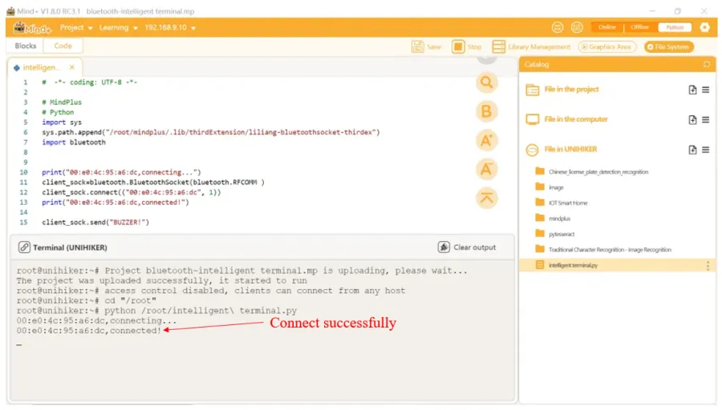
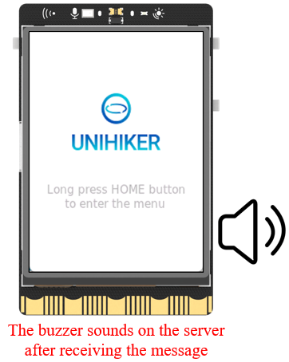
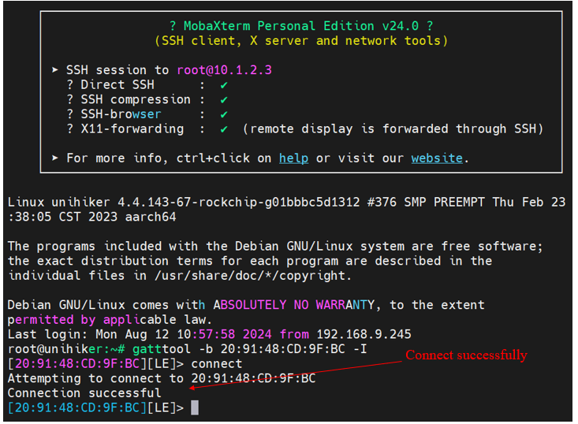

## **1. Bluetooth Communication Case Using Python Language bluetooth Library**
### **Description**
Bluetooth is a wireless technology that supports short-range communication (usually within 10 meters) between devices, enabling wireless information exchange between numerous devices including mobile phones, PDAs, wireless headphones, laptops, and related peripherals. By utilizing Bluetooth technology, communication between mobile communication terminal devices can be effectively simplified, making data transmission faster and more efficient, thus expanding the path for wireless communication.
Its essence is to establish a universal Radio Air Interface for communication environments between fixed or mobile devices, further combining communication technology with computer technology, enabling various 3C devices to communicate or operate with each other at close range without wires or cables. Simply put, Bluetooth technology is a technology that uses low-power radio to transmit data between various 3C devices.
### **Common functions**


#### 1.1 BluetoothSocket( )
| **Syntax**          | **Object=bluetooth.BluetoothSocket(bluetooth.RFCOMM)**        |  
| :--------------     | :--------------------      |
| **Description**     | Define the initialization function for the intelligent terminal bluetooth interface.      |  
| **Parameters**      | **bluetooth.RFCOMM**: Bluetooth Serial Port Linear Simulation Protocol.   |  
| **Return**          | **None    |  


#### 1.2 connect( )
| **Syntax**          | **Object.connect("address", value)**        |  
| :--------------     | :--------------------      |
| **Description**     | Bluetooth connection function.      |  
| **Parameters**      | **address:** Server address.   |   
|                     | **value:** Connection success flag value.|
| **Return**          | Connection success flag value.    |  


#### 1.3 send( )
| **Syntax**          | **Object.send("data")**        |  
| :--------------     | :--------------------      |
| **Description**     | Send data.      |  
| **Parameters**      | **data:** The data that the user wants the smart terminal to send.   |  
| **Return**          | **None    |  


#### 1.4 bind( )
| **Syntax**          | **Object.bind(("", port))**        |  
| :--------------     | :--------------------      |
| **Description**     | Define the port number and bind the address and port used for communication to the socket.      |  
| **Parameters**      | **port:** The number of port.   |  
| **Return**          | **None    |  


#### 1.5 listen( )
| **Syntax**          | **Object.listen(value)**      |  
| :--------------     | :--------------------      |
| **Description**     | Define the port number and bind the address and port used for communication to the socket.      |  
| **Parameters**      | **value:** The number of queued sockets.   |  
| **Return**          | **None    |  


#### 1.6 recv( )
| **Syntax**          | **data = Object.recv(1024)**        |  
| :--------------     | :--------------------      |
| **Description**     | Receive data sent by intelligent terminal.     |  
| **Parameters**      | **data:** Receive data sent by smart terminals.   |  
|                     | **1024:** The length of the buffer zone.          |
| **Return**          | Data    |  


#### 1.7 client_sock.close( ), server_sock.close( )
| **Syntax**          | **client_sock.close( ), server_sock.close( )**       |   
| :--------------     | :--------------------      |
| **Description**     | Close the Bluetooth terminals.      |  
| **Parameters**      | **None   |  
| **Return**          | **None    |  


### **Example Description**
In the following code, we designed two terminals, an intelligent terminal and a server, on two UNIHIKERs. The smart terminal sends data to the server, and after receiving the data from the smart terminal, the buzzer receives a command from the controller to play music.
### **Hardware Required**

- [UNIHIKER](https://www.dfrobot.com/product-2691.html) × 2
### **Example Code**
The first paragraph is the server program, which receives data from the smart terminal and controls the buzzer to play music after running.
```python
#  -*- coding: UTF-8 -*-

# MindPlus
# Python
import sys
sys.path.append("/root/mindplus/.lib/thirdExtension/liliang-bluetoothsocket-thirdex")
import time
from pinpong.board import Board,Pin
from pinpong.extension.unihiker import *
import bluetooth
import threading
import time
import os

bt_recv_data=''

def getData():  # Obtain intelligent terminal data
    global bt_recv_data
    data = bt_recv_data
    bt_recv_data=''
    return data

def server_loop():  # Terminal detection loop to check if it is connected to the smart terminal
    global bt_recv_data
    os.system("sudo hciconfig hci0 piscan")
    os.system("cat /opt/bdaddr")

    server_sock=bluetooth.BluetoothSocket( bluetooth.RFCOMM )  # Server interface functions
    port = 1
    server_sock.bind(("", port))  # port
    server_sock.listen(1)  # The number of queued sockets
    while True:
        client_sock,address = server_sock.accept()  # Obtain the address of the smart terminal
        print ("Accepted connection from ",address)
        while True:
            try:
                data = client_sock.recv(1024)  # Obtained intelligent terminal data
                #print ("received [%s]" % data)
                bt_recv_data = data.decode()  # Decoding data
                #print(bt_recv_data)
            except Exception as e:
                print(e)
                break

        client_sock.close()  # Close the interface
    server_sock.close()  # Close the interface

Board().begin()
threading.Thread(target=server_loop).start()  # Open thread

while True:
    if (len(bt_recv_data)>0):  # Determine whether data from the smart terminal has been received
        ShuJu = getData()
        print(ShuJu)
        if (ShuJu == 'BUZZER!'):  # If the data is set by the smart terminal
            buzzer.play(buzzer.DADADADUM,buzzer.Once)  # Buzzer beeps
    time.sleep(1)
```
**Program Effect:**


The second paragraph is the intelligent terminal program, which sends data to the server after running.
```python
#  -*- coding: UTF-8 -*-

# MindPlus
# Python
import sys
sys.path.append("/root/mindplus/.lib/thirdExtension/liliang-bluetoothsocket-thirdex")
import bluetooth


print("00:e0:4c:95:a6:dc,connecting...")  # Print the address of the smart terminal
client_sock=bluetooth.BluetoothSocket(bluetooth.RFCOMM )  # Bluetooth interface of smart terminal
client_sock.connect(("00:e0:4c:95:a6:dc", 1))  # Function for determining Bluetooth connection
print("00:e0:4c:95:a6:dc,connected!")  # Print connection successful

client_sock.send("BUZZER!")  # Sending data to the server

while True:
    pass
```
**Program Effect:**


After the smart terminal is connected, the buzzer on the server will sound and display the successful connection and data on the terminal.



## **2. A case study of Bluetooth communication using the bluepy.btle library in Python**
### **Description**
In addition to the Bluetooth library, we can also use the Bluepy.btle library for Bluetooth communication. In this case, we will take the DFRobot's BLE-Link Dongle as an example to illustrate how to use UNIHIKER to communicate with BLE devices.
The BLE-Link Dongle is a device that can convert BLE messages into USB serial port messages, making it ideal for BLE communication testing. First, we plug the BLE-Link Dongle into the computer's USB port, and then use the serial assistant software to follow the BLE-Link user manual to configure it as a slave mode.
Tips: How to initialize the BLE module? For more information, please refer to: [https://wiki.dfrobot.com/USBBLE-LINK_Bluno_Wireless_Programming_Adapter_SKU__TEL0087](https://wiki.dfrobot.com/USBBLE-LINK_Bluno_Wireless_Programming_Adapter_SKU__TEL0087)
### **Common functions**


#### 2.1 DefaultDelegate.__init__( )
| **Syntax**          | **DefaultDelegate.__init__(self)**       |   
| :--------------     | :--------------------      |
| **Description**     | Initialize Bluetooth device.      |  
| **Parameters**      | **self**: Default settings.   |  
| **Return**          | **None    |  


#### 2.2 handleNotification( )
| **Syntax**          | **handleNotification(self, cHandle, data)**       |   
| :--------------     | :--------------------      |
| **Description**     | Process data identification function.      |  
| **Parameters**      | **self:** Default settings.   |  
|                     | **cHandle:** Default settings. |
|                     | **data:** The transmitted data.  |
| **Return**          | Data    |  


#### 2.3 Peripheral( )
| **Syntax**          | **Object = Peripheral(address, attribute)**      |   
| :--------------     | :--------------------      |
| **Description**     | Slave variable setting function.      |  
| **Parameters**      | **address:** The address of the BLE Bluetooth module.   | 
|                     | **attribute:** Attributes can be set to public or private.  |
| **Return**          | **None    |  


#### 2.4 setDelegat( )
| **Syntax**          | **Object.setDelegate(default delegate)**       |   
| :--------------     | :--------------------      |
| **Description**     | Initialize the slave.      |  
| **Parameters**      | **User defined slave class.**   |  
| **Return**          | **None    |  


#### 2.5 getServiceByUUID( )
| **Syntax**          | **service = Object.getServiceByUUID(UUID("ID"))**       |   
| :--------------     | :--------------------      |
| **Description**     | Obtain the communication service ID from the Bluetooth module.      |  
| **Parameters**      | **ID:** Communication service ID.   |  
| **Return**          | **None    |  


#### 2.6 getCharacteristics( )
| **Syntax**          | **char = Object.getCharacteristics(UUID("ID"))[0]**       |   
| :--------------     | :--------------------      |
| **Description**     | Bluetooth slave module obtains string service ID function.      |  
| **Parameters**      | **ID:** Get string service ID.   |  
| **Return**          | Data    |  


#### 2.7 waitForNotifications( )
| **Syntax**          | **Object.waitForNotifications(time)**       |   
| :--------------     | :--------------------      |
| **Description**     | Waiting for the data retrieval function.      |  
| **Parameters**      | **time:** The waiting time set by the user themselves.   |  
| **Return**          | **None    |  


### **Example Description**
The following code is suitable for communication scenarios where the slave Bluetooth module and UNIHIKER can be successfully connected. Firstly, UNIHIKER sends a "hello" signal to the slave module after running the program, waiting for the Bluetooth slave module to send a signal. At the same time, we use the serial monitoring assistant on Windows to send a signal to UNIHIKER, which can be seen on mind+.
### **Hardware Required**

- [UNIHIKER](https://www.dfrobot.com/product-2691.html) 
- [Bluno Link - A USB Bluetooth 4.0 (BLE) Dongle](https://www.dfrobot.com/product-1220.html)



### **Example Code**
```python
import time
from bluepy.btle import Peripheral, UUID, DefaultDelegate

class MyDelegate(DefaultDelegate):
    def __init__(self):
        DefaultDelegate.__init__(self)
    def handleNotification(self, cHandle, data):
        print('Received data:', data)
p = Peripheral("20:91:48:CD:9F:BC", "public")

try:

    p.setDelegate(MyDelegate())

    svc = p.getServiceByUUID(UUID("0000dfb0-0000-1000-8000-00805f9b34fb"))

    char = svc.getCharacteristics(UUID("0000dfb1-0000-1000-8000-00805f9b34fb"))[0]

    while True:
        char.write(bytes("hello\n", 'utf-8'))
        time.sleep(0.2)
        if p.waitForNotifications(0.1):  # handleNotification() was called
            continue
        print("Waiting...")

finally:
    p.disconnect()
```
**Program Effect:**


---
