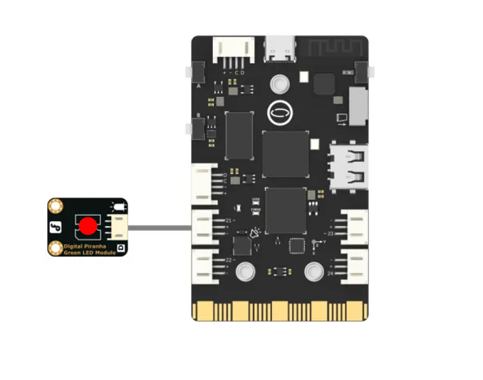

### **Description**
Digital signals are signals obtained by binary quantization of analog signals, and all pins on UNIHIKER support the output of this signal at a voltage level of 3.3V.
### **Common functions**


#### 1.1 value( )
| **Syntax**          | **Object.value(v)**        |  
| :--------------     | :--------------------      |
| **Description**     | Output digital level.      |  
| **Parameters**      | **v**: 0 or 1, 1 means outputing at a high voltage level while 0 means outputing at a low voltage level.   |  
| **Return**          | HIGH level or LOW level    |  


#### 1.2 write_digital( )
| **Syntax**          | **Object.write_digital(v)**   |  
| :--------------     | :--------------------      |
| **Description**     | Output digital level       |  
| **Parameters**      | **v**: 0 or 1, 1 means outputing at a high voltage level while 0 means outputing at a low voltage level.   |  
| **Return**          | HIGH level or LOW level    |  


### **Example Description**
Below is a sample code using the PinPong Library to control an LED and print corresponding messages when the LED is turned on or off. This code allows for the changes in the output level of GPIO pins to be felt through the on/off of LED lights.
### **Hardware Required**

- [UNIHIKER](https://www.dfrobot.com/product-2691.html)
- [Gravity: Digital Piranha LED Module - Red](https://www.dfrobot.com/product-471.html)


### **Example Code**
```python
# -*- coding: UTF-8 -*-

import time
from pinpong.board import Board, Pin

Board().begin() # Initialize the UNIHIKER

led = Pin(Pin.P21, Pin.OUT) # Set Pin P21 as an output pin for the LED

while True:
    # led.value(1)  # The second method
    led.write_digital(1) # Turn on the LED by setting the pin value to high
    print("The LED light is on") # Display a message indicating that the LED light is on 
    time.sleep(1)  # Pause the program for 1 second
    # led.value(0)  # The second method
    led.write_digital(0) # Turn off the LED by setting the pin value to low
    print("The LED light is off")  # Display a message indicating that the LED light is off
    time.sleep(1) # Pause the program for 1 second
```
**Program Effect:**
![20240805_154353[00h00m00s-00h00m05s].gif](img/1_Digital_Output_GPIO_/1722843885000-ab87e462-fbf8-41c3-ad2d-afeee0e974a2.gif)


---
