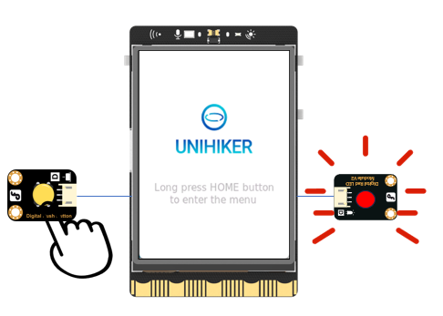

### **Description**
Read the level value from the specified IO pin, high level (3.3V) or low level (0V).

### **Common functions**  

The following two functions can achieve the same effect.


#### 1.1 Pin( )
| **Syntax**          | **PinObject = Pin(Pin.num, Pin.IN)**         |  
| :--------------     | :--------------------      |
| **Description**     | Set the specified pin to OUT mode.       |  
| **Parameters**      | **Pin.num**: Pin number.                        |
|                                   |  **Pin.IN**: IN mode. |
| **Return**          | Pin object    |  


#### 1.2 read_digital( )
| **Syntax**          | **PinObject.read_digital()**         |  
| :--------------     | :--------------------      |
| **Description**     | Input digital level.       |  
| **Parameters**      | **None                     |  
| **Return**          | high-level(1) orlow-level(0)   |  


#### 1.3 value( )
| **Syntax**          | **PinObject.value()**         |  
| :--------------     | :--------------------      |
| **Description**     | Input digital level.       |  
| **Parameters**      | **None                     |  
| **Return**          | high-level(1) orlow-level(0)    |  


### **Example Description**
The main focus of this project is to read input from an external digital sensor button module and use it to control the illumination of the onboard L-LED on the UNIHIKER. By monitoring the state of the sensor button module, the L-LED can be toggled between two states: illuminated and extinguished.
### **Hardware Required**

- [UNIHIKER]()
- [Gravity: Digital Push Button (Yellow)](https://www.dfrobot.com/product-73.html)
- [Gravity: Digital Piranha LED Module - Red](https://www.dfrobot.com/product-471.html)
### **Example Code**
Set the button pin P23 to input mode and the LED pin P21 to output mode.
In the loop, continuously read the value of pin P23, print it out, and input it into the function controlling pin P21, to achieve the effect of controlling the light switch with the button.

> Note:  
    - If the pin is not connected to anything, digitalRead() can return either a HIGH level or LOW level, which can change randomly.  
    - All pins on the UNIHIKER development board are capable of digital input, operating at a voltage level of 3.3V.  

```python
# -*- coding: UTF-8 -*-
# Experiment Effect: Use the button to toggle the state of the blue LED labeled "L" on the back of the UNIHIKER.
# Wiring: Connect a button module to the UNIHIKER P23 interface
import time
from pinpong.board import Board, Pin

Board().begin()  # Initialize the UNIHIKER

btn = Pin(Pin.P23, Pin.IN)  # Initialize the pin as an input pin
led = Pin(Pin.P21, Pin.OUT)  # Initialize the LED pin as an output pin

while True:
    # v = btn.value()  # Read the pin level - Method 1
    v = btn.read_digital()  # Read the pin level - Method 2
    print(v)  # Print the read pin level to the terminal
    # led.value(v)  # Set the LED pin according to the button state - Method 1
    led.write_digital(v)  # Set the LED pin according to the button state - Method 2
    time.sleep(0.1)  # Wait for 0.1 seconds

```

### **Program Effect:**




---
