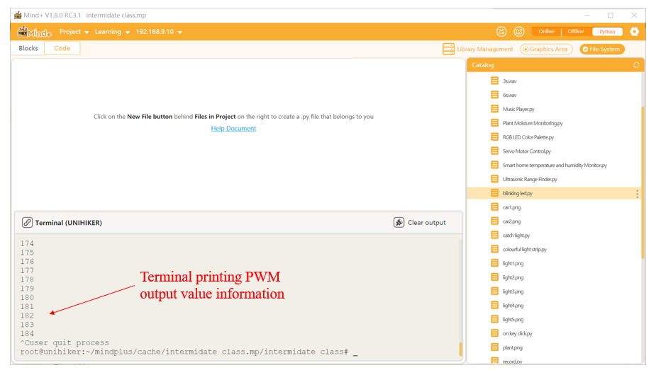

### **Description**
PWM wave is a very effective technique for controlling analog circuits using the digital output of microprocessors, widely used in many fields from measurement, communication to power control and conversion. UNIHIKER supports 8 channels of 10-bit PWM output, corresponding to the following pins: P0, P2, P3, P10, P16, P21, P22 and P23.
### **Common functions**  
| `Object = PWM(Pin(board,Pin.num)), Object.duty(i)`    |                            |
| :--------------     | :--------------------      |
| **Description**     | Define a pin as an PWM output and control the output of PWM waves through functions.       |  
| **Syntax**          | **Object = PWM(Pin(board,Pin.num)), Object.duty(i)**         |  
| **Parameters**      | **board:** UNIHIKER.  |
|                     | **Pin.num:** Pin number. |
|                     |  **i:** Control the duty cycle of PWM waves.                |  
| **Return**          | Continuous, time-varying current    |  


| `Object = Pin(Pin.num, Pin.PWM), Object.write_analog(i)`    |                            |
| :--------------     | :--------------------      |
| **Description**     | Define a pin as an PWM output and control the output of PWM waves through functions.       |  
| **Syntax**          | **Object = Pin(Pin.num, Pin.PWM), Object.write_analog(i)**         |  
| **Parameters**      | **Pin.num:** Pin number.  |
|                     | **Pin.PWM:** Initialize pins to PWM mode. |
|                     | **i:**Control the duty cycle of PWM waves.                |  
| **Return**          | Continuous, time-varying current    |  


### **Example Description**
In this example, the UNIHIKER is first initialized with Board().begin(). Then, we use pwm0 = PWM(Pin(Pin.P21)) to initialize the pin, which can output a PWM wave. In the main loop, we use the range() function to generate a loop array and then use the pwm0.duty() function to adjust the PWM duty cycle. We can understand the principle of PWM output by observing the status of LED lights and the display of terminal numbers.  

### **Hardware Required**

- [UNIHIKER](https://www.dfrobot.com/product-2691.html)
- [Gravity: Digital Piranha LED Module - Green](https://www.dfrobot.com/product-632.html)


### **Example Code**
```python
# -*- coding: utf-8 -*-

#Experimental effect: Using PWM wave to control LED breathing light
#Wiring: Use a Windows or Linux computer to connect a blank board, and P21 to connect an LED light module
import time
from pinpong.board import Board,Pin,PWM #Import PWM class to achieve analog output

Board("UNIHIKER").begin()  #Initialize, select board type, do not input board type for automatic recognition
#P0 P2 P3 P8 P9 P10 P16 P21 P22 P23
pwm0 = PWM(Pin(Pin.P21)) #Input Pin into PWM to achieve analog output
#PWM supports a range of 0-1023
pwm0.freq(1000)  #set PWM frequence 
while True:  #loop
    pwm0.duty(0)
    time.sleep(2)
    for i in range(301):  #from 0 to 600
        pwm0.duty(i) 
        print(i) 
        time.sleep(0.02)   #delay 2us
    pwm0.duty(300) 
    time.sleep(2)    
    for i in range(301 , 0, -1):  #from 600 to 0
        pwm0.duty(i)  
        print(i)
        time.sleep(0.02)   #delay 2us 
```
**Program Effect:**




---
