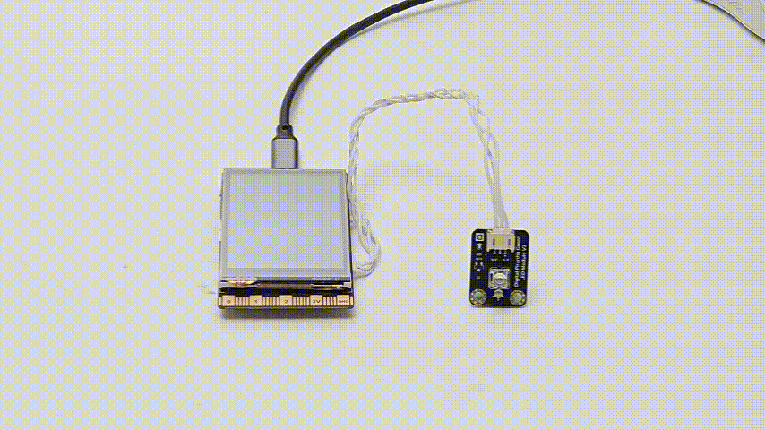

### **Description**
Write a PWM analog value to the specified pin, contrl the pin to output a PWM wave with a specific duty cycle.  
- Generally used for adjusting LED brightness or motor speed.  
- UNIHIKER supports an 8-channel 10-bit PWM generator, these pins support it: P0, **P2**, P3, **P8,P9,P10**, P16,P21,P22 and P22.  
> Note: P8 and P2 share one PWM channel, P9 and P10 share one PWM channel, so P8 and P9 can also use PWM, but P2 and P10 cannot be used when they are in use. Also note that P8P9 is a group, P2P10 is a group, only one group can be used at the same time, they cannot be mixed (for example, if P8 or P9 outputs PWM, then P2 or P10 cannot output PWM).  

### **Common functions**  

There are two ways to output PWM waves, one is using the Pin class, and the other is the independent PWM class.

#### 1.1 Pin( )
| **Syntax**          | **PinObject = Pin(Pin.num, Pin.PWM)**         |  
| :--------------     | :--------------------      |
| **Description**     | Set the specified pin to PWM mode.       |  
| **Parameters**      | **Pin.num**: Pin number. (P0,**P2**,P3,**P8,P9,P10**,P16,P21,P22,P23)        |
|                                   |  **Pin.PWM**: PWM mode. |
| **Return**          | Pin object    |  


#### 1.2 write_analog( )
| **Syntax**          | **PwmObject.write_analog(i)**         |  
| :--------------     | :--------------------      |
| **Description**     | Control the duty cycle of the PWM output.       |  
| **Parameters**      | **i:**Control the duty cycle of PWM waves. (0~1023)               |  
| **Return**          | **None   |  


#### 1.3 PWM(Pin( ))
| **Syntax**          | **PwmObject = PWM(Pin(Pin.num))**         |  
| :--------------     | :--------------------      |
| **Description**     | Define a PWM class object by specifying a pin.       |  
| **Parameters**      | **Pin.num:** Pin number. (P0,P2,P3,P8,P9,P10,P16,P21,P22,P23) |
| **Return**          | Pwm object    |  

#### 1.4 freq( )
| **Syntax**          | **PwmObject.freq(i)**         |  
| :--------------     | :--------------------      |
| **Description**     | Set the frequency of the PWM output..      |  
| **Parameters**      | **i:**Frequency of the PWM wave.        |  
| **Return**          | **None     |  


#### 1.5 duty( )
| **Syntax**          | **PwmObject.duty(i)**         |  
| :--------------     | :--------------------      |
| **Description**     | Control the duty cycle of the PWM output.      |  
| **Parameters**      | **i:** Control the duty cycle of PWM waves.  (0~1023)         |  
| **Return**          | **None     |  


### **Example Description**
In this example, we first initialize UNIHIKER with Board().begin(), then initialize the pin to PWM mode using the Pin or PWM class. In the main loop, we use the range() function to generate a loop array, and then adjust the PWM duty cycle using the write_analog() or duty() function. By observing the brightness of the LED light, we can understand the principle of PWM output.

### **Hardware Required**

- [UNIHIKER](https://www.dfrobot.com/product-2691.html)
- [Gravity: Digital Piranha LED Module - Green](https://www.dfrobot.com/product-632.html)


### **Example Code**
```python
# -*- coding: utf-8 -*-

#Experimental effect: Using PWM wave to control LED breathing light
#Wiring: Use a computer to connect a UNIHIKER, and P21 to connect an LED light module
import time
from pinpong.board import Board,Pin,PWM #Import PWM class to achieve analog output

Board("UNIHIKER").begin()  #Initialize, select board type, do not input board type for automatic recognition
#P0 P2 P3 P8 P9 P10 P16 P21 P22 P23
pwm0 = Pin(Pin.P21, Pin.PWM)
#pwm0 = PWM(Pin(Pin.P21)) #Input Pin into PWM to achieve analog output
#PWM supports a range of 0-1023
#pwm0.freq(1000)  #set PWM frequence 
while True:  #loop
    for i in range(1000,0,10):  
        #pwm0.duty(i) 
        pwm0.write_analog(i)
        print(i) 
        time.sleep(0.02)   #delay 2us

    for i in range(1000 , 0, -10):  
        #pwm0.duty(i)  
        pwm0.write_analog(i)
        print(i)
        time.sleep(0.02)   #delay 2us 
```
**Program Effect:**



---
