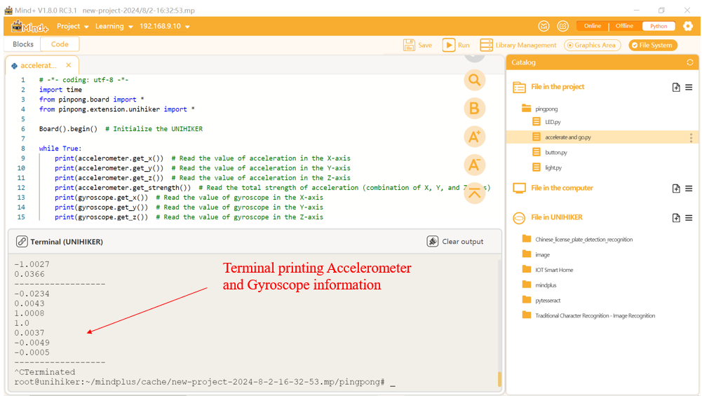

### **Description**
The back panel of the UNIHIKER is equipped with a 6-axis accelerometer-gyroscope sensor, which can read the X, Y, and Z values of acceleration individually, as well as the total strength in X, Y, and Z directions, and the X, Y, and Z values of the gyroscope.
### **Syntax**

- **Accelerometer: **accelerometer.get_x() accelerometer.get_y() accelerometer.get_z() accelerometer.get_x()
- **Gyroscope: **gyroscope.get_x() gyroscope.get_y() gyroscope.get_z()
### **Parameters**
**None
### **Return**
****Accelerometer values and gyroscope values**
### **Example Description**
The code below can be used to sense changes in value through the Accelerometer and Gyroscope sensor on UNIHIKER.
### **Hardware Required**

- [UNIHIKER](https://www.dfrobot.com/product-2691.html)
### **Example Code**
```python
# -*- coding: utf-8 -*-

import time
from pinpong.board import *
from pinpong.extension.unihiker import *

Board().begin()  # Initialize the UNIHIKER

while True:
    print(accelerometer.get_x())  # Read the value of acceleration in the X-axis
    print(accelerometer.get_y())  # Read the value of acceleration in the Y-axis
    print(accelerometer.get_z())  # Read the value of acceleration in the Z-axis
    print(accelerometer.get_strength())  # Read the total strength of acceleration (combination of X, Y, and Z axes)
    print(gyroscope.get_x())  # Read the value of gyroscope in the X-axis
    print(gyroscope.get_y())  # Read the value of gyroscope in the Y-axis
    print(gyroscope.get_z())  # Read the value of gyroscope in the Z-axis
    print("------------------")
    time.sleep(1)
```
**Program Effect:**



---
