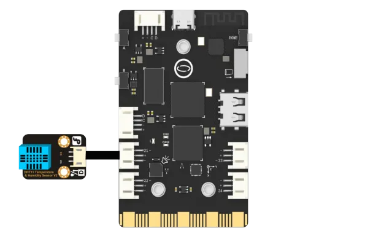
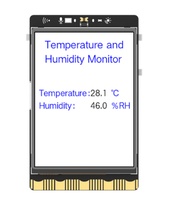
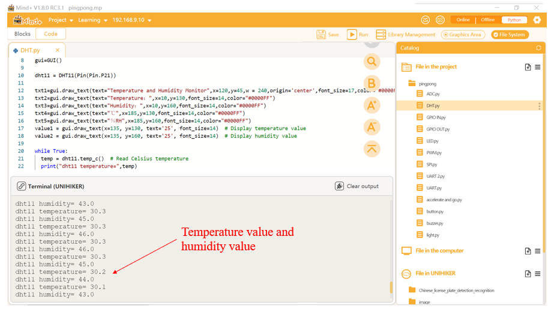

### Description
UNIHIKER is equipped with a microcontroller that is responsible for controlling the onboard components and GPIO. To achieve this, we will utilize the Python PinPong library to connect and control the temperature and humidity sensors externally through the side pins of the board.
### Syntax
**Object.temp_c()**
**Object.humidity()**
### Parameters
**Pin.P21:** Pin number 21.
### Return
**temperature **and** humidity**
### Example Description
In this example, UNIHIKER is first initialized with Board().begin(). Then, we use dht11 = DHT11(Pin(Pin.P21)) to initialize the pin. At the same time, we need to initialize the screen image, we use gui=GUI(). Then we use the temp = dht11.temp_c() method to collect analog values of temperature. At the same time, we use  humi = dht11.humidity(). To achieve experimental results, two value setting functions can be set to change the value in the text on the screen.
### Hardware Required

- [UNIHIKER](https://www.dfrobot.com/product-2691.html)
- [Gravity: DHT11 Temperature & Humidity Sensor For Arduino](https://www.dfrobot.com/product-174.html)


### Example Code
```python
# -*- coding: utf-8 -*-

# Experimental effect: Reading the DHT temperature and humidity sensor
# Wiring: Use a computer to connect a UNIHIKER main control board, dht11 to P21, and dht22 to P22
import time
from pinpong.board import Board,Pin,DHT11,DHT22
from pinpong.extension.unihiker import *
from pinpong.libs.dfrobot_analog_urm09 import ANALOG_URM09
from unihiker import GUI  # Import unihiker library

Board("UNIHIKER").begin()  # Initialize, select board type, do not input board type for automatic recognition
gui=GUI()

dht11 = DHT11(Pin(Pin.P21))

txt1=gui.draw_text(text="Temperature and Humidity Monitor",x=120,y=45,w = 240,origin='center',font_size=17,color="#0000FF")
txt2=gui.draw_text(text="Temperature：",x=10,y=130,font_size=14,color="#0000FF")
txt3=gui.draw_text(text="Humidity：",x=10,y=160,font_size=14,color="#0000FF")
txt4=gui.draw_text(text="℃",x=185,y=130,font_size=14,color="#0000FF")
txt5=gui.draw_text(text="％RH",x=185,y=160,font_size=14,color="#0000FF")
value1 = gui.draw_text(x=135, y=130, text='25', font_size=14)  # Display temperature value
value2 = gui.draw_text(x=135, y=160, text='25', font_size=14)  # Display humidity value

while True:
  temp = dht11.temp_c()  # Read Celsius temperature
  print("dht11 temperature=",temp)
  time.sleep(1)
  value1.config(text = temp)  # Update display temperature value

  humi = dht11.humidity() #Reading humidity
  print("dht11 humidity=",humi)
  value2.config(text = humi)  # Update display distance value
  time.sleep(1)
```
**Program Effect:**


