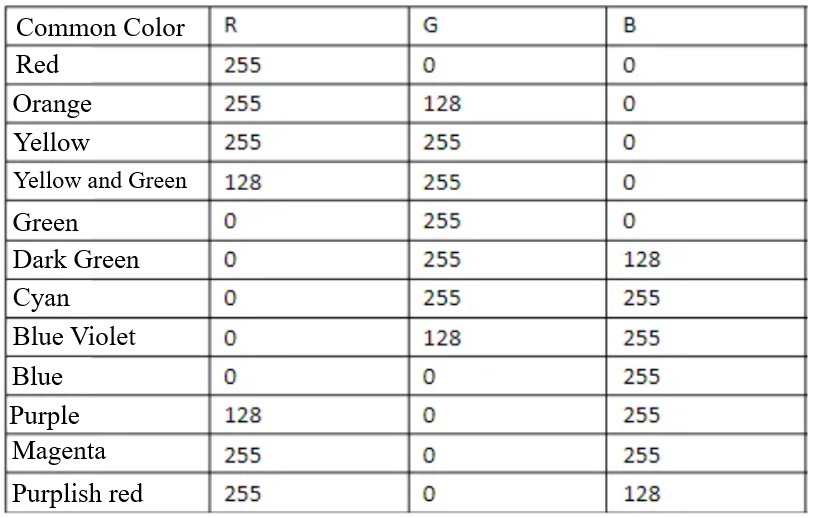
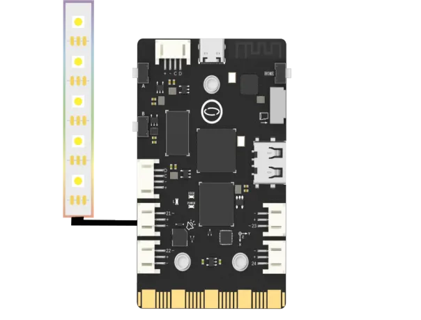

### **Description**
UNIHIKER is equipped with a microcontroller responsible for controlling onboard components and GPIO. This project uses the PinPong library of Python to control a NeoPixel LED externally connected through side pins of the board. We will use an external light strips to achieve red, orange, yellow, green, blue, and purple colors.
### **Common functions**
#### **4.1.**Object = NeoPixel(Pin(NEOPIXEL_PIN), PIXELS_NUM)****
##### **Description**
Define the initialization function for the light strip.
##### **Syntax**
**Object = NeoPixel(Pin(NEOPIXEL_PIN), PIXELS_NUM)**
##### **Parameters**
**NEOPIXEL_PIN**: User defined LED strip occupying pins.
**PIXELS_NUM**: Users can choose the number of light beads they want to turn on.
##### **Return**
**None
#### **4.2.**Object.brightness(value)****
##### **Description**
Set the brightness of the light.
##### **Syntax**
**Object.brightness(value)**
##### **Parameters**
**value: **The brightness of the lamp.
##### **Return**
The level that varies over time.
#### **4.3.**Object[num] = (R,G,B)****
##### **Description**
Set the color of the light.
##### **Syntax**
**Object[num] = (R,G,B)**
##### **Parameters**
**num: **The number of the lamp.
**R, G, B: **The numerical values of the three primary colors required for the mixing of light beads.
##### **Return**
Color that changes with the function.
#### **4.4.**Object.range_color(num.start,num.end,color)****
##### **Description**
Set a range of LED lights on.
##### **Syntax**
**Object.range_color(num.start,num.end,color)**
##### **Parameters**
**num.start, num.end: **The range within which the light bulb is illuminated.
**color: **The color of the light bead is displayed in hexadecimal.
##### **Return**
The level that changes with the range.
#### **4.5.**Object.shift(num)****
##### **Description**
Turn off the light beads in sequence. When the last light moves, the last light goes out.
##### **Syntax**
**Object.shift(num)**
##### **Parameters**
**num: **The number of light beads turned off each time.
##### **Return**
The level that varies over time.
#### **4.6.**Object.rotate(num)****
##### **Description**
Cycle lighting of LED beads. When the last position of the light moves, the last position of the light moves to the first position, and the cyclic movement is suitable for creating a rotating halo.
##### **Syntax**
**Object.rotate(num)**
##### **Parameters**
**num: **The number of beads per cycle.
##### **Return**
The level that varies over time.
#### **4.7.**Object.rainbow(LEDs,LED number,beginHue,color)****
##### **Description**
Control the light strip to display rainbow colors. Set a light strip as a gradient color, with a range of values as shown in the table below:

##### **Syntax**
**Object.rainbow(LEDs,LED number,beginHue,color)**
##### **Parameters**
**LEDs: **The LED type.
**LED number:** The number of LED.
**beginHue:** Initial color tone value.
**color: **Lamp bead color.
##### **Return**
**None
### **Example Description**
In this example, the UNIHIKER is first initialized with Board().begin(). Then, we use NEOPIXEL_PIN = Pin.P21 to initialize the pin. To define the number of lights, we use PIXELS_NUM = 7. Finally, we use np = NeoPixel(Pin(NEOPIXEL_PIN), PIXELS_NUM) to initialize the NeoPixel. In the main loop, we use the np[0] = (0, 255 ,0) function to change the color of the lights. We can also use the np.rainbow(0,7,0,0x0022FF) function to display a rainbow pattern. To achieve the desired results, two loops can be used to change the color of the lights and to turn them off sequentially.
### **Hardware Required**

- [UNIHIKER](https://www.dfrobot.com/product-2691.html)
- [WS2812 RGB](https://www.dfrobot.com.cn/goods-2629.html)


### **Example Code**
```python
# -*- coding: utf-8 -*-

# Experimental effect: Control WS2812 single line RGB LED light
# Wiring: Use a Windows or Linux computer to connect a blank board, and connect the ws2812 light to the p21 port
import time
from pinpong.board import Board,Pin,NeoPixel

NEOPIXEL_PIN = Pin.P21
PIXELS_NUM = 7  # number of lights

Board("UNIHIKER").begin()  # Initialize, select board type, do not input board type for automatic recognition

np = NeoPixel(Pin(NEOPIXEL_PIN), PIXELS_NUM)

while True:
  np[0] = (0, 255 ,0)  # Set the RGB color of the first light
  np[1] = (255, 0, 0)  # Set the RGB color of the second light
  np[2] = (0, 0, 255)  # Set the RGB color of the third light
  np[3] = (255, 0, 255)  # Set the RGB color of the forth light
  np[4] = (255, 255, 0)  # Set the RGB color of the fifth light
  np[5] = (0, 255, 255)  # Set the RGB color of the sixth light
  np[6] = (255, 255, 255) # Set the RGB color of the seventh light
  time.sleep(1)

  np.rainbow(0,7,0,0x0022FF)  # Display the light strip in the form of a rainbow
  time.sleep(1)

  for i in range(7):
    np.rotate(1)  # Cycle to change the color of the light a beads
    time.sleep(1)

  for i in range(7):
    np.shift(1)  # Turn off the light beads in sequence
    time.sleep(1)

  np.clear()
```
**Program Effect:**


---
