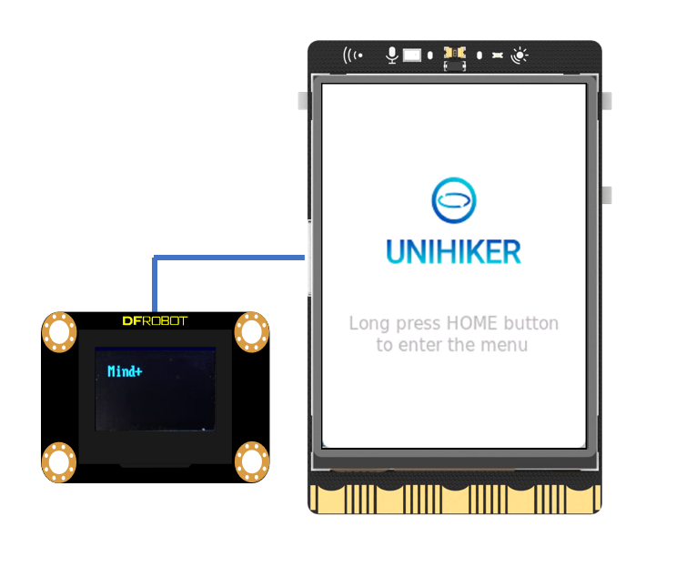

### Description
OLED 2864 display module is a compact monochrome graphic display module from DFRobot.It embeded an 0.96" OLED with 128x64 high resolution.Because of the advantages of OLED technology,the module own wider viewing angles and improved brightness compared with the character LCD.
UNIHIKER is equipped with a microcontroller that is responsible for controlling the onboard components and GPIO. To achieve this, we will utilize the Python PinPong library to connect and control the OLED 2864 Display Screen externally through the side pins of the board.
### Common functions
#### 5.1.**Object=SSD1306_I2C(width=128, height=8*8)**
##### Description
Define the initialization function for the OLED 2864.
##### Syntax
**Object=SSD1306_I2C(width=128, height=8*8)**
##### Parameters
**width**: User can define OLED width.
**height**: Users can define OLED height.
##### Return
**None
#### 5.2.Object.fill(num)
##### Description
Control whether the OLED lights up in full screen.
##### Syntax
**oled1.fill(num)**
##### Parameters
**num: **There are two values: 0 and 1. 0 represents not illuminating the full screen, and 1 represents illuminating the full screen.
##### Return
**None
#### 5.3.Object.text("t",x,y)
##### Description
Control the text displayed on the screen.
##### Syntax
**Object.text("t",x,y)**
##### Parameters
**t: **User defined display of text.
**x: **The x-axis value displayed in text.
**y: **The y-axis value displayed in text.
##### Return
Text displayed on the screen.
#### 5.4.Object.show()
##### Description
Control the text displayed on the screen.
##### Syntax
**Object.show()**
##### Parameters
**None
##### Return
**None
### Example Description
In this example, UNIHIKER is first initialized with Board().begin(). Then, we use oled1=SSD1306_I2C() to initialize the pin. At the same time, we need to initialize the screen image, we use oled1.fill(). Then we use the oled1.text("Mind+",8,8) method to display the text the users want to show. At last, we use oled1.show() to turn on the screen. 
### Hardware Required

- [UNIHIKER](https://www.dfrobot.com/product-2691.html)
- [Gravity: I2C OLED-128x64 Display](https://www.dfrobot.com/product-1576.html)


```python
#  -*- coding: UTF-8 -*-

# MindPlus
# Python
import sys
sys.path.append("/root/mindplus/.lib/thirdExtension/liliang-gravityvoicerecognition-thirdex")
from pinpong.board import Board
from pinpong.libs.dfrobot_ssd1306 import SSD1306_I2C

Board().begin()
oled1=SSD1306_I2C(width=128, height=8*8)
oled1.fill(0)
oled1.text("Mind+",8,8)
oled1.show()

while True:
    pass
```
**Program Effect:**

