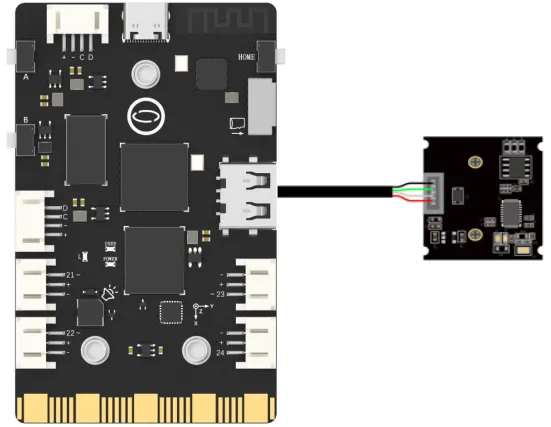
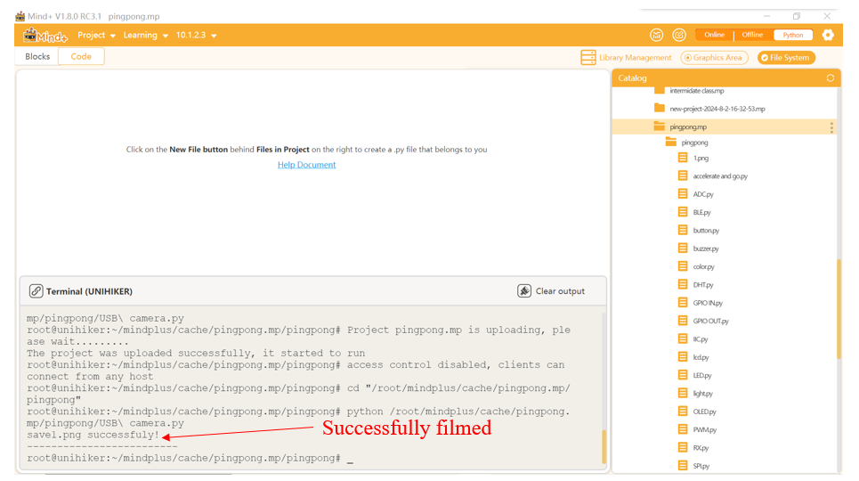
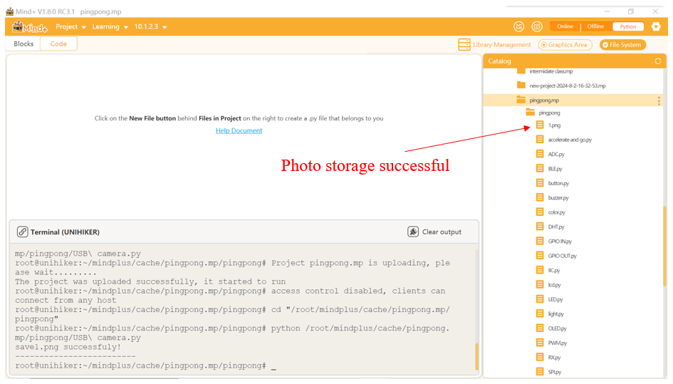
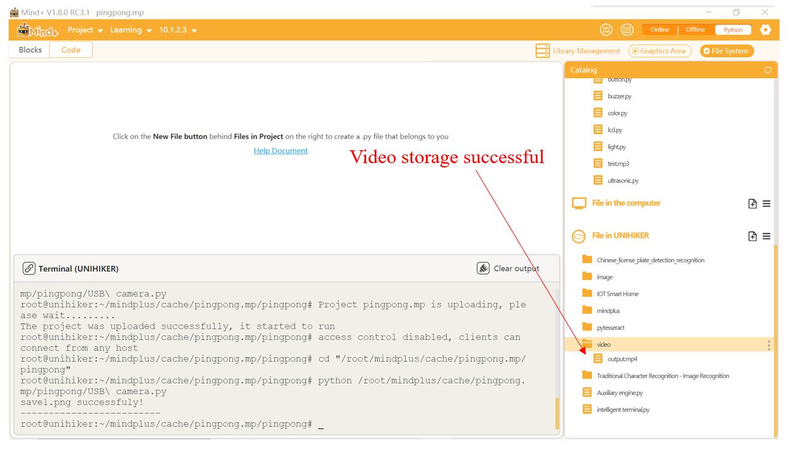

### Description
UNIHIKER provides a USB interface that can be used to control external cameras.
To control a USB camera using the UNIHIKER, we can use the cap = cv2.VideoCapture(0) method from the OpenCV library in Python. This will allow us to access and control the camera through the side interface of the board, which is connected to a microcontroller responsible for controlling onboard components and GPIO.
To control the DIY Camera and shoot a video, we can use the cap.read() and cv2.imshow() methods from the OpenCV library in Python. This will allow us to read the video stream from the camera and display it on the UNIHIKER board's screen. 
This section will provide a detailed introduction to the common functions and usage effects of USB cameras.
### Common functions
#### 1.**Object = cv2.VideoCapture(num) **
##### Description
Open the media.
##### Syntax
**Object = cv2.VideoCapture(num)**
##### Parameters
**num: **The number of the camera.
##### Return
**None
#### 2.**Object.set(cv2.CAP_PROP_BUFFERSIZE, value) **
##### Description
Camera parameter settings.
##### Syntax
**Object.set(cv2.CAP_PROP_BUFFERSIZE, 1) **
##### Parameters
**cv2.CAP_PROP_BUFFERSIZE: **Set maximum buffer size.
**value: **buffer size.
##### Return
**None
#### 3.**cv2.namedWindow('winname',cv2.WND_PROP_FULLSCREEN) **
##### Description
Camera window naming.
##### Syntax
**cv2.namedWindow('winname',cv2.WND_PROP_FULLSCREEN) **
##### Parameters
**'winname': **The name of the window.
**cv2.WND_PROP_FULLSCREEN: **Full screen display.
##### Return
**None
#### 4.**cv2.setWindowProperty('winname',cv2.WND_PROP_FULLSCREEN, cv2.WINDOW_FULLSCREEN) **
##### Description
Camera parameter settings.
##### Syntax
**cv2.setWindowProperty('winname',cv2.WND_PROP_FULLSCREEN, cv2.WINDOW_FULLSCREEN) **
##### Parameters
**'winname': **The name of the window.
**cv2.WND_PROP_FULLSCREEN: **Full screen display.
**cv2.WINDOW_FULLSCREEN: **Full screen display.
##### Return
**None
#### 5.**Object.isOpened()**
##### Description
Verify if the opening is successful. 
##### Syntax
**while(Object.isOpened())**
##### Parameters
**None
##### Return
True or False
#### 6.**ret, frame = cap.read()**
##### Description
Read a frame of the image.
##### Syntax
**ret, frame = cap.read()**
##### Parameters
**ret: **Read the successful identifier.
**frame: **One frame of image.
##### Return
Identification bit and single frame image.
#### 7.**cv2.imshow('winname',frame)**
##### Description
Display the image in a window.
##### Syntax
**cv2.imshow('winname',frame)**
##### Parameters
**'winname': **Window Name.
**frame: **Single frame image.
##### Return
**None
#### 8.frame = cv2.resize(frame, (240, 320))
##### Description
Crop the frame to UNIHIKER screen size.
##### Syntax
**frame = cv2.resize(frame, (240, 320))**
##### Parameters
**frame: **Single frame image.
**240, 320: **width and length.
##### Return
The cropped video frame.
#### 9.** frame = cv2.flip(frame,1)**
##### Description
Rotate the image 180°.
##### Syntax
**frame = cv2.flip(frame,1)**
##### Parameters
**frame: **Single frame image.
**1: **It can be changed to 0 to alter the flipping form.
##### Return
Flip the screen 180 degrees.
#### 10.** if key & 0xFF == ord('key.num')**
##### Description
Detect key presses. 
##### Syntax
**if key & 0xFF == ord('key.num')**
##### Parameters
**key: **Key value.
**0xFF: **The default value for participation and computation..
**key.num: **The number of the button.
##### Return
True or False.
#### 11.** frame = cv2.rotate(frame, cv2.ROTATE_90_COUNTERCLOCKWISE)**
##### Description
Rotate the screen 90 degrees.
##### Syntax
**frame = cv2.rotate(frame, cv2.ROTATE_90_COUNTERCLOCKWISE)**
##### Parameters
**frame: **Single frame image.
**cv2.ROTATE_90_COUNTERCLOCKWISE: **Default parameter, rotate 90 °.
##### Return
The rotated image.
#### 12.** cv2.imwrite(str(index) + ".png", frame)**
##### Description
Store a frame of image according to the path.
##### Syntax
**cv2.imwrite(str(index) + ".png", frame)**
##### Parameters
**str(index): **Image number.
**".png": **Register number.
**frame: **Single frame image.
##### Return
Picture
#### 13.fourcc = cv2.VideoWriter_fourcc(*'mp4v'), **Object= cv2.VideoWriter('/root/video/output.mp4',fourcc,value,(240,320)), Object.write(frame)**
##### Description
Record a video.
##### Syntax
**fourcc = cv2.VideoWriter_fourcc(*'mp4v')**
**Object= cv2.VideoWriter('/root/video/output.mp4',fourcc,3,(240,320))**
**Object.write(frame)**
##### Parameters
**'/root/video/output.mp4': **Save the path of the video.
**fourcc: **Video format.
**data: **Write data.
**value: **The frame rate of the video.
##### Return
Video
#### 14.** Object.release(), cv2.destroyAllWindows()**
##### Description
Close OpenCV, close the windows.      
##### Syntax
**cap.release()**
**cv2.destroyAllWindows()**
##### Parameters
**None
##### Return
**None
### Example Description
To create a Camera, we will use a USB camera as an expansion module. 
To control a USB camera using the UNIHIKER, we can use the method from the OpenCV library in Python. This will allow us to access and control the camera through the side interface of the board, which is connected to a microcontroller responsible for controlling onboard components and GPIO.
To control the DIY Camera and shoot a video, we can use the methods from the OpenCV library in Python. This will allow us to read the video stream from the camera and display it on the UNIHIKER board's screen. You can explore different functionalities and parameters of the OpenCV library to customize your DIY Camera project.
### Hardware Required

- [UNIHIKER](https://www.dfrobot.com/product-2691.html)
- [MegaPixels USB Camera for Raspberry Pi / NVIDIA Jetson Nano / UNIHIKER](https://www.dfrobot.com/product-2089.html)


### Example Code
The following code implements the common functions of using a camera on UNIHIKER.
The generated video after running is in a state where it is horizontally flipped 180 ° and rotated 90 ° to the right relative to the normal video.
```python
#  -*- coding: UTF-8 -*-
import cv2  # Import OpenCV library


# Open usb camera 0.
cap = cv2.VideoCapture(0) 
# Set the camera buffer to 1, to decrease the latency.
cap.set(cv2.CAP_PROP_BUFFERSIZE, 1) 
# Set the windows to be full screen.
cv2.namedWindow('winname',cv2.WND_PROP_FULLSCREEN) 
# Set the windows to be full screen.
cv2.setWindowProperty('winname',cv2.WND_PROP_FULLSCREEN, cv2.WINDOW_FULLSCREEN) 

index = 1
fourcc = cv2.VideoWriter_fourcc(*'mp4v')

while (cap.isOpened()): 
    # Read one frame from usbcam.
    ret, frame = cap.read() 
    # If frame available. 
    if ret: 
        '''crop the center of the frame and resize to (240, 320) while keeping image ratio.'''
        h, w, c = frame.shape  # Record the shape and size of the image, including height, width, and channel
        w1 = h*240//320  # change the height to fit the render image
        x1 = (w-w1)//2  # midpoint of width without resizing
        frame = frame[:, x1:x1+w1]  # crop into the center
        frame = cv2.resize(frame, (240, 320))  # resize according to the screen keeping the aspect ratio 
        frame = cv2.flip(frame,1)  # Rotate horizontally 180 °
        frame = cv2.rotate(frame, cv2.ROTATE_90_COUNTERCLOCKWISE)
        '''Display real-time video stream'''
        cv2.imshow('winname',frame)  # Display image img on winname window
        key = cv2.waitKey(1)  # Refresh the image every 1ms, and the delay cannot be 0, otherwise the read result will be a static frame
        if key & 0xFF == ord('a'):  # Press the A key to enter the save image operation below
            cv2.imwrite(str(index) + ".png", frame)
            print("save" + str(index) + ".png successfuly!")
            print("-------------------------")
            index += 1
            # lz = cv2.VideoWriter('/root/video/output.mp4',fourcc,3,(240,320))  # Store video recordings
            # lz.write(frame)  # Storage frame
            # cv2.imshow('cvNamedWindow',frame)  # Display video stream
        '''Press the B key to exit the program'''
        if key & 0xFF == ord('b'):
            break

cap.release()  # Release the camera
cv2.destroyAllWindows()  # Close all
```
**Program Effect:**
Firstly, turn on the camera and the video stream will be displayed on UNIHIKER. Press the 'b' key to exit.
![20240813_150015[00h00m00s-00h00m06s].gif](img/1_USB_Carema/1723532458106-358f3a33-1c2f-4750-a05d-0912d3661a82.gif)
Press the 'a' key to take a picture with the camera.


Replace the code after pressing the 'a' key in the comments to complete the recording and storage of the video.

