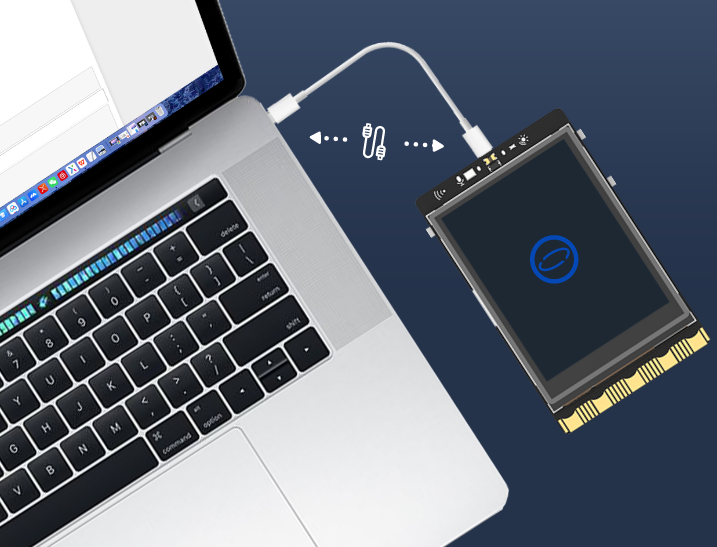
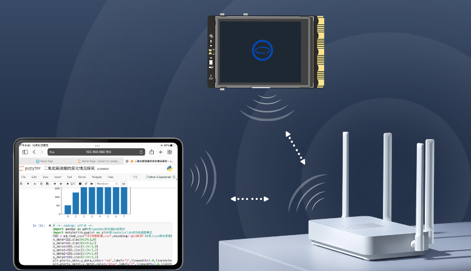
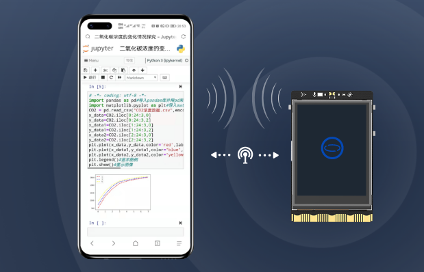

The UNIHIKER is a single-board microcomputer that can be accessed by other devices, such as smartphones, computers, and tablets, for programming or data transmission through the network, as long as they are connected to the same network. There are various ways to connect the UNIHIKER to the network, including using a USB cable, router WiFi, hotspot mode, or Ethernet cable.
## 1.1- USB
When connecting the UNIHIKER to a computer using a USB cable, the board will be virtualized as an RNDIS network device, with a fixed IP address of "10.1.2.3". You can easily start coding by inputting the board's IP address into your computer.

- Tips: If you are unable to detect the network card after multiple attempts to connect via USB, please refer to the "FAQ" page for possible solutions.

## 1.2- WiFi
The UNIHIKER can also be programmed wirelessly by connecting it to WiFi. To do so, connect the UNIHIKER to a router or a mobile phone hotspot (note that 2.4G WiFi should be used), and then connect other programming devices such as a computer, tablet, or smartphone to the same hotspot. You can then enter the IP address of the UNIHIKER to start programming.

- Please keep in mind that if both the computer and UNIHIKER are connected to the same WiFi, but are unable to connect, it may be due to WiFi restrictions that prohibit devices from accessing each other on the network. In this situation, try connecting to a different hotspot, such as a mobile phone hotspot, to test the connection.
- For instructions on connecting to Wi-Fi, please refer to the "Local Web Page" page.

 

## 1.3- Hotspot Mode
The UNIHIKER also has the ability to create its own wireless hotspot. Simply connect other devices, such as a computer, tablet, or smartphone, to this hotspot, and the IP address of the UNIHIKER will be fixed at 192.168.123.1. You can then enter this IP address to begin programming.

- Tips: This method can also be used to configure Wi-Fi if you are unable to connect the UNIHIKER to a PC via USB.

## 1.4- USB to Ethernet Adapter
The UNIHIKER has a USB interface, which allows for the use of a USB to Ethernet adapter to provide a more stable wired network connection. This also allows for the option to connect to a network switch in a school computer lab and interact with a desktop computer.
Note: Please choose a Linux-compatible USB network card device that does not require drivers.

## 2.1- How to view IP Address
To view all current IP addresses, simply long press the Home button on the UNIHIKER to enter the onboard menu, and then navigate to the Network Info interface.

- Type-C port: When connected to a computer via USB, the IP address of the board will be displayed and fixed at 10.1.2.3.
- Wireless: When connected to other WiFi hotspots, the IP address assigned to the board by the router will be displayed.
- Hotspot: When the UNIHIKER is in wireless hotspot mode, the IP address of the board will be displayed and fixed at 192.168.123.1.
- Other Devices: When connected to other network devices, such as a network card, the IP address assigned to the board will be displayed and assigned by the router.

